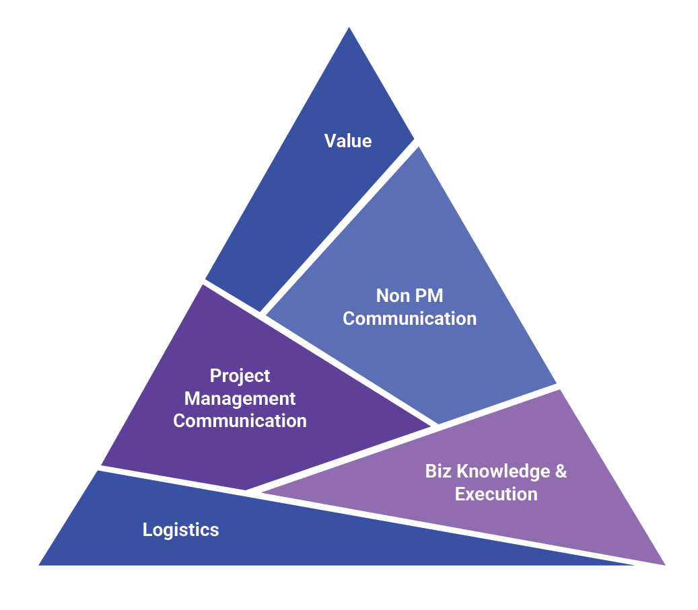

**Delivery Handbook**

[Introduction [2](#introduction)](#introduction)

[Project initiation [3](#project-initiation)](#project-initiation)

[Customer Deal Sign-Off
[9](#customer-deal-sign-off)](#customer-deal-sign-off)

[Transition Kick-Off [11](#transition-kick-off)](#transition-kick-off)

[EDC Project Kick Off
[15](#edc-project-kick-off)](#edc-project-kick-off)

[Transition [18](#transition)](#transition)

[Transition Planning Approach and Methodology
[19](#transition-planning-approach-and-methodology)](#transition-planning-approach-and-methodology)

[Sprint 0 [34](#sprint-0)](#sprint-0)

[Product Heatmap [35](#product-heatmap)](#product-heatmap)

[Delivery Execution [36](#delivery-execution)](#delivery-execution)

[Innovation Engineering Services (Architecture & Design)
[37](#innovation-engineering-services-architecture-design)](#innovation-engineering-services-architecture-design)

[SDLC - New Development
[48](#sdlc---new-development)](#sdlc---new-development)

[SDLC - Enhancements & Support
[57](#sdlc---enhancements-support)](#sdlc---enhancements-support)

[SDLC - Managed Services
[62](#sdlc---managed-services)](#sdlc---managed-services)

[Value Driven Delivery
[68](#value-driven-delivery)](#value-driven-delivery)

[Value Creation [70](#value-creation)](#value-creation)

[Myths around Value [72](#myths-around-value)](#myths-around-value)

[Accion Value Approach
[72](#accion-value-approach)](#accion-value-approach)

[AOOI [72](#aooi)](#aooi)

[Value mindset [73](#value-mindset)](#value-mindset)

[Gen AI Adoption [75](#gen-ai-adoption)](#gen-ai-adoption)

[KAPS Framework [76](#kaps-framework)](#kaps-framework)

[Generative AI (GenAI) in SDLC
[76](#generative-ai-genai-in-sdlc)](#generative-ai-genai-in-sdlc)

[Agile Methodologies [81](#agile-methodologies)](#agile-methodologies)

[Agile Terminologies [82](#agile-terminologies)](#agile-terminologies)

[Scrum [83](#scrum)](#scrum)

[LeSS (Large-Scale Scrum) Framework
[90](#less-large-scale-scrum-framework)](#less-large-scale-scrum-framework)

[Extreme Programming [91](#extreme-programming)](#extreme-programming)

[Kanban / Scrumban [93](#kanban-scrumban)](#kanban-scrumban)

[SAFe Agile Framework
[96](#safe-agile-framework)](#safe-agile-framework)

[Metrics & KPI Definitions
[99](#metrics-kpi-definitions)](#metrics-kpi-definitions)

[DORA Metrics [103](#dora-metrics)](#dora-metrics)

[Support Projects [104](#support-projects)](#support-projects)

[Delivery Governance [105](#delivery-governance)](#delivery-governance)

[Governance Activities
[106](#governance-activities)](#governance-activities)

[Accionlabs Value Board (AVB & PVB)
[109](#accionlabs-value-board-avb-pvb)](#accionlabs-value-board-avb-pvb)

[Governance Framework
[110](#governance-framework)](#governance-framework)

[Review Process [111](#review-process)](#review-process)

[Other Initiatives [113](#other-initiatives)](#other-initiatives)

[Best Practices & Guidelines
[115](#best-practices-guidelines)](#best-practices-guidelines)

[Requirements Gathering Best Practices
[115](#requirements-gathering-best-practices)](#requirements-gathering-best-practices)

[Architecture & Design Best Practices
[122](#architecture-design-best-practices)](#architecture-design-best-practices)

[Design Guidelines [127](#design-guidelines)](#design-guidelines)

[Development Best Practices
[139](#development-best-practices)](#development-best-practices)

[QA Best Practices [147](#qa-best-practices)](#qa-best-practices)

[Testing & QA Process Guidelines
[153](#testing-qa-process-guidelines)](#testing-qa-process-guidelines)

[Release Planning Best Practices
[155](#release-planning-best-practices)](#release-planning-best-practices)

[Appendix [160](#appendix)](#appendix)

[Why EDC? [161](#why-edc)](#why-edc)

[Accionlabs Induction Framework (5P Model)
[162](#accionlabs-induction-framework-5p-model)](#accionlabs-induction-framework-5p-model)

[Kick-Off Checklists [166](#kick-off-checklists)](#kick-off-checklists)

[Types of Projects [167](#types-of-projects)](#types-of-projects)

[Recruitment & Onboarding
[171](#recruitment-onboarding)](#recruitment-onboarding)

[Business HR [173](#business-hr)](#business-hr)

[SDLC Tools [174](#sdlc-tools)](#sdlc-tools)

[Playwright [176](#playwright)](#playwright)

[Quick Reference [189](#_Toc1981778430)](#_Toc1981778430)

# Introduction

The Accion Labs Delivery Handbook is a comprehensive guide designed to
streamline and enhance the delivery processes within our organization.
It provides detailed guidelines, best practices, and methodologies for
successful project execution and delivery. The handbook functions as a
living document providing practical reference and a source of
inspiration, outlining the tools, methodologies, and mindset needed to
drive meaningful innovation. It reflects collective experience and
learning, incorporating best practices from diverse engineering
disciplines while maintaining a unique approach to innovation.

The content within addresses practitioners at all levels, providing
methodological guidance through established processes and tools. It
outlines the initial project transition kick-off and project kick-off
processes, emphasizing collaboration between sales and delivery teams
for a seamless transition and a clear understanding of project scope,
milestones, and stakeholder expectations. The delivery execution section
details the Software Development Life Cycle (SDLC) stages, including
Requirements analysis, Design, Development, Testing, and Deployment,
with processes and templates for consistency and quality.

Delivery Execution also covers Agile and Scrum Roles, Agile
terminologies and Ceremonies, and Metrics and KPI definitions, fostering
a Collaborative and Adaptive Work Environment.

# Project initiation

Extended Delivery Center (EDC) Model

Our Extended Delivery Center is based on Accion’s core value
propositions of co-development, virtual teams, and a 100% white-box
approach. In an EDC engagement model, Accion owns the entire
responsibility of delivery. This is based on Accion’s strong operational
and governance models with a focus on value creation.

- [100% White-box Model - Approach](#white-box-model---approach)

- [EDC Models and Options](#edc-models)

- [Typical EDC Delivery
  Organization](#typical-edc-delivery-organization)

- [Customer Collaboration Models](#customer-collaboration-models)

- [EDC Phases](#edc-phases)

The delivery practices & processes are defined and streamlined between
the teams onsite and offshore. The team defines the process, governance,
and tools that will be used to plan, prioritize and execute defined
projects & programs.

Our EDC is powered by:

- Accion’s participation in the product roadmap, tools, and the
  selection of technology

- The whole team that participates in account growth, the creation of
  value, and innovation

- Influencing process best practices, checklists, templates, etc.

- An Engagement Manager who works closely with delivery, builds customer
  relationships, Handles escalations and new SOWs

- The team who can recommend sourcing and skill needs that provide
  maximum ROI

- A delivery team that runs projects also drives growth through
  delivery-driven sales

- An autonomous engineering team that can co-learn, measure performance,
  boost productivity and identify risks & pre-empt issues early.

#### 100% White-box Model - Approach

The White-box Model approach is based on the following principles.

- Philosophy of “co-development” & “virtual teams”

- Completely opposite to the traditional “black box” model of
  outsourcing

- Provides a range of services (New Dev, Sustenance, QA, Support, PS,
  etc.)

- Built on a Strong Operational framework and Mature Governance model

- Fosters true partnership and joint ownership through equal investments

- Offers a well-defined process with guidelines, checklists, tools,
  templates, etc

- Structured and Repeatable processes right from the start

#### EDC Models

The EDC models below are classified based on the level of involvement in
software development between Accionlabs and the customer.

### 

#### Typical EDC Delivery Organization

Below is a representation of a typical Accionlabs EDC delivery model:

##### Leadership team

The leadership team comprises the key decision-makers of both the client
and Accionlabs. This team will be involved in defining the strategic
goals, and delivery expectations. Delivery managers are spread to manage
a group of projects

##### Dedicated Teams

The teams are usually grouped based on the product/module they manage
for the client. The teams are a mix of lead developers, architects,
senior and junior engineers and QA teams, etc based on project
priorities, schedule, and project goals. Few resources can be shared
between projects like Ops, Design, BA, Architects, etc.

##### Support Teams

For any successful EDC model, it is important to have the HR, IT admin,
Ops support, and TA teams in sync with the functional and operations
expectations of the client

**Tech CoEs**

The core Center of Excellence team from Accionlabs with specialization
in specific areas is involved in this group. They support periodical
conversations with the team and provide the right guidance and
recommendations based on project needs.

#### Customer Collaboration Models

Based on the type of EDC model, the collaboration &
communication with the customers vary. Our Accion team org structure is
also defined based on the defined model.

#### EDC Phases

The Engagement Delivery Cycle (EDC) outlines four sequential phases for
successful project execution:

PLAN → INITIATE → RAMP UP → OPERATE

Each phase has distinct deliverables and involves specific stakeholders
from both client and delivery teams, progressing from initial planning
through full operational delivery. The visual below explains the key
deliverables and stakeholder involvement across phases, demonstrating
how the engagement scales from the core planning team to a complete
execution team.

This structured approach ensures organized transition from engagement
planning to operational delivery while maintaining clear ownership and
responsibilities throughout the project lifecycle.

## 

## 

## 

## 

## 

## Customer Deal Sign-Off

When a sales team closes a deal with a customer, they typically follow
the steps below and prepare related documents to ensure a smooth
hand-off to the delivery team. Below are the different types of
documents that are prepared by the sales team in collaboration with the
client stakeholders.

#### Statement of Work (SOW):

The sales team conducts multiple discussions with respective customer
stakeholders (Product owners, Analysts, Engineering Managers, etc.), and
a comprehensive SoW document is prepared that outlines the scope of the
project, including product scope, technology, expected deliverables,
milestones, timelines, and responsibilities.

#### Service Level Agreement (SLA):

This is more applicable to projects that involve managing support
services. An SLA defines the levels of service that the client can
expect, including response times, resolution times, and other
performance metrics. It sets expectations for the quality of service to
be provided.

Few customers define SLA thresholds to few metrics which attract a
penalty if not met. It is important to have the expectations written in
the SLA document.

#### Master Services Agreement (MSA):

The MSA is a legal document containing the overarching terms and
conditions that are applicable during the service period and at times
few conditions apply for a specific period even after the agreed service
contract period is over. It may cover issues such as payment terms,
confidentiality, intellectual property rights etc. These are very
important factors to be aware of in detail by both the sales and the
delivery team.

#### Non-Disclosure Agreement (NDA):

An NDA is a legal contract that ensures the confidentiality of the
information shared between the client and the service provider. This
contract helps protect the customer from any violation and it creates a
very severe impact on the engagement in case of any breach.

#### Client Sign-off:

Formal sign-off document to acknowledge that the client has reviewed the
deliverables, and agreements and approved them. This document can be
important for avoiding disputes later in the project. The sales team
details all assumptions and considerations that help in setting the
expectations right for the customer.

Presales Deal Closure Checklist

1.  Executed MSA & NDA

2.  Shared Work Order / SoW

3.  Engagement leader identified

4.  Delivery leader identified

5.  The seed team identified and assigned

6.  Architect coach identified

7.  Open positions identified and Recruitment initiated

8.  Project scope defined

9.  Roadmap understood

10. Product features understood

11. Technology and tools identified

12. Customer Success criteria defined

All the documents are reviewed, signed off, and approved by the customer
before handing them off from the sales team to the delivery team.

#### Glossary

NDA - Non-Disclosure Agreement

MSA - Master Service Agreement

SoW - Statement of Work

SLA - Service Level Agreement

## Transition Kick-Off

Both the sales and delivery teams need to work closely during the
handoff process to ensure a smooth transition and successful project
execution. Additionally, the specific documents used may vary depending
on the Scope, [Type of Project](#types-of-projects), Project complexity,
[EDC Model](#edc-models), and the preferences of the involved parties.

Right after the deal closure, the sales team and the delivery team for
the project initiate handover & pre-kickoff meetings. The handover
meetings are very crucial for the team to deliver successfully and
create a good first impression with the client.

#### Pre-Kickoff

The sales team shares all the relevant documents with complete
information on various project management activities and expectations
agreed upon with the client.

- SLA, MSA and SoW Agreed Upon

- Domain and Customer business information

- Product / Project Background and documents

- Requirements document

- Technology and required skills

#### Handover Meeting

The sales team gives a complete walk-through of the agreements with the
client while also preparing the Kick-Off deck for a meeting between the
client and the delivery team.

The delivery team must be completely aware of:

- The client stakeholders involved

  - The project scope

  - Engagement Model / Contract Type

  - Resource Requirement

  - Tech Landscape

  - Milestones

  - Team Composition

  - Accounting & Finance related

#### Project Transition Kickoff Meeting Preparation

After a deep discussion and understanding with the sales team, the
delivery team schedules the project transition kickoff meeting. This
meeting involves key stakeholders and identified SPOC from the customer
team along with Accionlabs' BUH, Sales team, Seed delivery team, CoE
team (optional), etc. The delivery team presents their understanding of
the product and project specifics, clarifies any questions, and ensures
everyone is on the same page regarding goals and expectations.

Activities that take place during transition Kickoff Meeting are:

- Delivery team to understand the project scope, contract type,
  resources requirement, tech landscape, milestones, and team
  composition.

- Collaborate with the Client stakeholders and define the roadmap.

- Discuss and document Critical success factors – reduce ambiguity,
  finalize decision points, and understand dependencies, collaboration
  plan, and documentation needs.

- Identify and introduce the core team with the client – DM, TL, BA to
  prepare for the project kick-off meeting.

- Plan for an *EDC Kick-off meeting* - send out the calendar invite to
  all stakeholders.

- Recommend and adapt to appropriate Agile scrum ceremonies and
  estimation. techniques – Ask for training sessions if required for the
  team.

- Plan for an EDC Kick-off meeting - send out the calendar invite to all
  stakeholders.

- Finalize the methodology - Scrum / Kanban.

- Set the expectations on the team ramp-up, Sprint 0 start date.

- List and discuss the open / action items and establish a baseline.

- Identify and define the KT plan (publish KT calendar).

Check the induction process and transition methodology
[here](#transition-planning-approach-and-methodology) to understand and
adopt a relevant transition approach and create a timeline based on
project complexity.

#### Glossary

SPOC - Single Point of Contact

DD - Delivery Director

DM - Delivery Manager

TL - Tech Lead

BA - Business Analyst

EDC - Extended Development Center

KT - Knowledge Transfer

## EDC Project Kick Off

The EDC project kick-off meeting marks the official start of project
implementation and the start date for invoicing the hours spent by the
team. The Delivery team takes over the ownership of the project from the
sales team and formally walks the stakeholders including the customer,
sales team, and the engineering team through the Project Execution plan.

**Entry Criteria**

- Executed MSA and SoW

- Technology, Team structure and Clear job description.

- Onboarding and Induction plan - 5P Induction

- Setup Checklist

- Project Execution Governance schedule

- Executive / Detailed Transition Plan

- Sprint 0 / Project Initiation schedule

#### Activities / Agenda

The meeting is set up by the delivery team and all the stakeholders
including the client, Accion sales, and Accion development team are
present in the meeting.

Activities performed as part of preparing for the meeting include:

- Gather all the required project/product documentation discussed during
  Handover

- Discuss specific Security requirements by the client to collaborate
  with the IT team

- Define Team roles & responsibilities (same can be applied to Goals &
  KRAs)

- Publish project Org chart (Accion & Client) and Escalation matrix

- Involve architect coach / AIC team for any consulting needs

- Notify the PMO team to create a new project in the AIW dashboard by
  filling out the [<u>Project Initiation
  Form</u>](https://forms.gle/qV24i82BBxRQKQSQ7)

- Share the executed SOW with the AR team

- Prepare and Schedule the formal Kick-Off meeting with all the
  stakeholders involved

#### Agenda

The team should have enough information covered to address the below
with the client, dev team and sales team along with the leadership of
both the customer and Accionlabs

- High-level scope

- High-level schedule & deliverables

- Security, Compliance and other concerns and considerations to be met

- Project Execution Methodology based on [project
  type](#types-of-projects).

- Key Milestones & Tentative dates of completing them \[For Eg., End of
  Q1, Before Winter holidays etc.\]

- Escalation Matrix

- QA approach and Key Metrics Identified

- Introductions: Key Team members

- Communication plan

- Approved list of receivables from the client

  1.  Access to repositories & Environments

  2.  OS and other pre-requisites (some clients want to provide only VPN
      access to vendors)

  3.  Access to relevant data documents

- Key assumptions & risks

#### Exit Criteria

- All learning materials, access to repositories, environments, process,
  SLAs etc. are documented and approved.

- Download and fill relevant checklists from

- [Kick-Off Checklists](#kick-off-checklists)

- Minutes of the Meeting confirming the concurrence on the next steps
  and schedule by all parties involved in the project execution

#### Glossary

MSA - Master Service Agreement

SoW - Statement of Work

5P Induction Guide - Accionlabs’ 5P induction framework - Product,
Platform, People, Project and Process

KRA - Key Result Areas

PMO - Project Management Office

|  |
|----|
| **References** |
| [Kick off meeting Template](https://docs.google.com/presentation/d/1DK1morlUqArPUokskVkQRKcpBXOhpkgJZA5iWUPVUfM/edit#slide=id.g82f103bc0f_0_2215) |
| [Technical points of contact](https://docs.google.com/spreadsheets/d/11EQCWp_62JhTpxxPldP0wY02WjnKt9Rp5YDfZTGzVeA/edit?gid=0#gid=0) |

# Transition

## Transition Planning Approach and Methodology

#### Transition Methodology Overview

This document describes Accion’s methodology and approach to
transitioning work from a range of customers’ internally managed and
vendor-managed teams to an integrated Accion-managed extended delivery
center (EDC) composed of product engineering teams at Accionlabs.

#### Transition Process Design Principles

Accion’s transition process for setting up an extended delivery center
(EDC) is primarily guided by the following key principles:

#### Low Touch Induction

Accion’s transition methodology emphasizes that delivery teams must
completely own the delivery process. The low touch approach minimizes
dependence on the existing vendor or the client's product
organization/technology teams. This is achieved by a combination of
training the trainer, self-managed and self-discovery, and progressive
induction.

#### Progressive Induction - Train the Trainer

The transition process is broken down into phases that incrementally
induct Accion’s teams. The process starts with a leadership team and a
transition team responsible for the overall program, followed by core
delivery teams for each work stream, which work closely with the
corresponding product owners and technical architects to create a
detailed induction guide and delivery plan. The core team then inducts
and trains the rest of the delivery team, ensures full ownership of the
delivery process, and minimizes the dependence on existing vendor
resources.

#### Think Ahead, Plan Ahead

The transition methodology is based on a proactive plan that outlines
the activities, outcomes, and participants for each transition phase.
The methodology also defines the checklists, benchmarks, and metrics
that provide the guardrails to highlight any deviations from the plan to
allow Accion as well as the client to respond with the requisite actions
and ensure a successful transition.

#### Seed Teams with Existing Accion Leaders

To ensure that Accion’s culture of outcome and action, rapid response,
and team spirit is ingrained into the transition process, Accion ensures
that a large part of the key leadership, including core delivery
leaders, consists of existing Accion engineers. These leaders are
experienced with Accion’s transition and delivery process and ensure
that the methodology is executed accurately and efficiently.

Accion executes the progressive induction by following

[Accionlabs Induction Framework (5P
Model)](#accionlabs-induction-framework-5p-model) This methodology
incorporates the five key aspects of induction: Product, Platform,
People, Process, and Program across four levels: Accion, Client,
Project, and Role. This tested and proven induction methodology ensures
that each incremental team member of the progressive induction process
works exactly as planned with minimal dependence on the individual’s
experience with the transition process. This also ensures adherence to
the think ahead, plan ahead principle.

#### Hypercare Governance Mode

For the first 90-120 days or until the last product completes the
monitored ramp-up phase, Accion will operate in a Hypercare governance
mode. Under this mode, there will be a daily leadership catch-up for 30
days and a weekly catchup for the remainder of 90 days. The goal of the
Hypercare phase is to review resource onboarding, induction/training,
progress of transition, and resolve any blockers or issues. Hypercare
meetings are held at the product level and partnership levels.

- Focus on controlling the downtime and dips

  - System uptime & critical SLAs

  - Focus on risks & impact areas for business

- Daily scrum for core product teams at the start and by the end of the
  day - Kanban

  - Key issues & resolution

  - Team ramp-up

  - Delivery metrics

  - Work intake process progress

  - Risk management

- Daily reporting to client & Accion leadership

  - Product level breakdown with status on transition, team ramp-up, and
    ongoing delivery

  - Highlight blockers/issues, risks & mitigation plans

- Weekly meeting with client & Accion leadership

  - Engagement review

  - Recruitment status review

  - schedule and financials review

  - Risk management

#### Phase-wise Transition Plan

Accion’s transition process comprises several detailed phases designed
to ensure a smooth and efficient transition. This comprehensive process
includes the following phases:

1.  Prepare

2.  Plan

3.  Initiate

4.  Monitored Ramp Up

5.  Independent Ramp Up

6.  Operationalize

##### 1. Prepare Phase

In this phase, Accion leadership and transition teams will collect and
collate information from the client’s product engineering team and
review the collated information around the products’ functional and
technical documentation from the client and/or its current partner.

**Activities:**

**Information Gathering**

- Gain access to non-production environments of the applications to the
  architects in the Transition team.

- Gain access to source code, product backlog, resource roster,
  performance benchmarks, and functional and technical knowledge
  repositories.

- Review current productivity benchmarks, SLAs, and metrics.

- Review the current roster.

- Review of product code and backlog.

- Review product/module-wise workload.

- Review scheduled releases and blackout calendar.

- Finalize infrastructure requirement.

- Support SOPs and SLAs (if applicable).

- SDLC Process, compliance process, current governance process, sample
  dashboards, metrics, and SLAs.

- Any existing available and applicable documentation around:

  - Functional areas

  - Architecture, technologies, integrations, and tools used

  - Data flow between systems

  - Database schema/design/indexes

  - Coding guidelines/best practices

  - Test cases and test scripts

  - Organization structures

**Participants:**

- Accion leadership team: Client Sponsor, Global Delivery Manager,
  Transition Leader

Accion transition team: Transition Manager, Application Architects,
HR,  
Recruitment, and Administration Team

- Client transition team, Product Directors, Program Sponsor

**Outcomes:**

- Core team induction package based on the 5P Induction Framework.

- Team-wise productivity benchmarks and SLAs.

- Product-wise skills matrix and draft job descriptions.

- Draft transition timelines and plans based on Accion’s understanding
  of the information provided.

- A detailed schedule for the planning phase (named participants,
  sessions, deliverable templates, etc.).

##### 2. Plan Phase

In this phase, the Accion transition team will hold joint sessions with
client executive leaders, product management, and engineering leaders to
review and finalize the outcomes from the preparation phase. The
transition timelines and a plan will also be finalized with client
product directors and sponsors.

**Activities:**

**Meetings / Joint Sessions:**

- Review and finalize team-wise productivity benchmarks and SLAs.

- Review and finalize product-wise skills matrix, Job Descriptions, and
  team allocations.

- Review and finalize the rebadging plan.

- Review and finalize the core team induction package.

- Review and finalize the SDLC process and governance structure.

- Review and finalize the compliance process.

- Review and finalize the transition plan.

**Participants:**

- Accion Transition Team: Transition Manager, Application Architects,
  HR, Recruitment and Administration Team.

- Client Transition Team: Program Manager, Infrastructure Lead,
  Architecture Lead, Product Owner, Technical Lead or QA Lead.

**Outcomes:**

The Accionlabs transition team will produce the following documents at
the end of

the planning phase:

- Final Transition Plan, Final performance benchmarks and SLAs, and
  Final resource plan with Job descriptions.

- Final rebadge plan

  - Skills/roles to retain

  - Cost benefits/savings

  - Identify potential re-badgeable associates

  - Grade/band Structure

  - Client-preferred candidates

  - Prepare employee communication

- EDC checklist that includes

  - Time zones and overlap

  - Team contacts

  - RACI matrices

  - Transition calendar and activities tracker

  - Access checklist

- Core team induction package

  - Products

  - Platform

  - People

  - Process

  - Projects

- Final Governance Model:

  - Quarterly business reviews (QBRs)

    - Planned vs actual budget

    - Resources/Effort planned vs Actual

    - Resource forecast

  - Monthly business updates

    - Resource allocations

    - Monthly budget variance

    - Dev metrics (velocity, burndown, story points carried forward,
      etc.) by workstreams

- Bi-weekly

  - Weekly Dev & QA metrics (velocity, burndown, story points carried
    forward, defects, etc.) by workstreams/products

  - All-is-well report (Accion internal)

- Daily

  - SDLC/Scrum ceremonies

- Transition progress reporting

  - Performance reporting vis-à-vis benchmarks

  - Timelines updates

- Final SDLC process

  - Setup cadences for scrum ceremonies

    - Sprint planning meeting

    - Daily scrum

    - Sprint review meeting

    - Sprint retrospective meeting

    - Backlog refinement meeting

##### 3. Initiate Phase

The core delivery team begins its work in this phase. They are initially
inducted using

the 5P-based induction package from the planning phase and will help
improve the

5Ps to induct the rest of the team. Core team members, including tech
leads,

architects, and senior developers, will work closely with client product
owners and

tech leads to learn about the products they are responsible for. They
will also

engage in self-study to use their counterparts' time efficiently.

**Activities:**

**Meetings / Joint Sessions**

- Functional walkthroughs

- Code walkthroughs

- Data model walkthroughs

- Architecture walkthroughs

- Product backlog / Roadmap walkthroughs

- Process walkthroughs

  - Code check-in process / Branching strategy

  - Deployment process

  - Testing process

  - Release process

  - Support SOPs

  - 

**Participants:**

- Accion: Core Team of all Products

- Client: Product Owner, Partner Tech Lead / Architect of all products

**Outcomes**:

The Accion core team will create the artifacts mentioned below as part
of the

outcome of the Initiate Phase. These documents will help the rest of the
delivery

teams with their induction.

- Enhancements to the 5P induction package

- Architecture diagrams

- Data flow diagrams

- Data model diagrams

- Process workflow diagrams

  - Deployment process

  - Branching strategy

  - Support workflow

The team will also go through the code and the product backlog
themselves to

optimize the time available from their client counterparts.

Parallelly, the HR team at Accion will perform the rebadging process
that will entail

below-mentioned activities:

- Engage with Personnel

  - Discussion with HR

  - Compensations

  - Benefits / Incentives

  - Rollout Offer letters

  - Legal Clearance (If Any)

  - Background Verification

- Onboarding

  - 5P Induction to Accion

  - Orientation to policies (grade/band, leave, promotion, HR)

  - Leadership Introduction and engagement with new employees

- Motivate

  - Innovation

  - Project progress

  - Performance management

  - Training & development

  - Tracking and publishing key metrics

  - Accomplishments

  - Accolades

  - Team Bonding

##### 4. Monitored Ramp-Up Phase

The rest of the delivery team gets onboarded at the beginning of the
monitored

ramp-up phase and undergoes a rapid induction/initiation for a couple of
days using

the Induction package created during the initiation phase.

In the monitored ramp-up phase, the delivery teams start contributing to
the code

base in a way that has minimal impact on the products/applications. The
team

members will be monitored for their deliverables. The client tech leads
will monitor

the core team; however, the Accion tech leads who are part of the core
team will

monitor the rest of the delivery team.

**Activities:**

**Meetings / Joint Sessions / Feedback**

- Sprint grooming/planning for non-time-critical work items

- Work plan review

- Peer code review

- Test case and test script reviews

- Merge / Pull request approvals

- Approvals on support tickets

- Validation of compliance requirements

**Information required**

- Non time-critical stories/defects/support tickets that the delivery
  team can take up

- Approvals on work plan reviews

- Approvals on peer code reviews

- Approvals on test case and test script reviews

- Approvals on merge/pull requests

- 

- Participants:

- Accion: Core Team, Senior Delivery Team of all Products

- Client: Product Owner of all Products

- 

**Outcomes:**

The Accion delivery team will take up and deliver the following
deliverables in the

**monitored ramp-up phase:**

- Minor defect fixes that are non-time-critical

- Very small and small user stories

- Simple test cases and test scripts

- Support tickets that are Low-priority and non-time-critical

- Weekly report

The monitored ramp-up phase is deemed complete when the team reaches 25%
of

benchmarked productivity. The team is then ready to move to the next
phase of

Transition.

##### 5. Independent Ramp-Up

After the monitored ramp-up phase is completed and team members are at
least

25% productive, they move to the independent ramp-up phase. In this
phase, they

gain more independence and handle progressively complex work. During
this

phase, the team members contribute independently to the code base and
take up

time-critical deliverables. This phase continues until they achieve at
least 80%

productivity.

**Activities:**

**Meetings / Joint Sessions**

In the Independent Ramp-Up phase, no additional meetings are required
except

for the regular team meetings/cadences and team collaboration.

**Participants:**

- Accion: Full Delivery Team of all Products, Foundation Team

- Client: Product Owner of all Products

**Outcomes:**

The Accion delivery team will take up and deliver the following
deliverables in the

independent ramp-up phase:

- Major defect fixes that are time-critical

- Time Critical / Complex (medium and large) stories and support tickets

- Peer code reviews

- Test case and test script reviews (by peers)

- Weekly / Bi-weekly review of merge / pull requests.

- Weekly / Bi-weekly review of test cases and test scripts

##### 6. Operationalize

After the Independent ramp-up phase is completed, Hypercare mode ends
and the

teams will follow the agreed-upon governance structure as they ramp up
to 100%

productivity. The main goal in this phase is to optimize team
productivity to meet the

benchmarked standards.

**Activities:**

- Continuous improvement of productivity and performance.

- Agreed upon SDLC processes will be followed.

- Agreed SLAs to be met and reported at regular intervals.

- Innovation projects will be kicked off and will be driven by a
  separate dedicated “foundation team” to improve developer productivity
  and efficiency using automation.

**Participants:**

- Accion: Full Delivery Team of all Products, Foundation Team

- Client: Product Owner of all Products

**Outcomes:**

- Steady State Operations

- Target Productivity: 100%

- Innovation Roadmap

####  

#### Key Stakeholder in Transition

Four distinct teams will play key roles in the transition process. Each
team is

described and composed in detail below.

##### Leadership Team

The leadership team, consisting of Accion's top management, will oversee
all

aspects of the company's engagement with the client. This team will work
diligently

to ensure the client's interests are well taken care of. The leadership
team includes

the following members:

<table>
<colgroup>
<col style="width: 32%" />
<col style="width: 67%" />
</colgroup>
<tbody>
<tr>
<td><strong>Member</strong></td>
<td><strong>Responsibilities</strong></td>
</tr>
<tr>
<td><mark>Client Partner</mark></td>
<td><ul>
<li>
Represents client’s interests at Accion.
</li>
<li>
Works with the client’s leadership team at a strategic
level.
</li>
</ul></td>
</tr>
<tr>
<td><mark>Engagement Director</mark></td>
<td><ul>
<li>
Responsible for managing all strategic and tactical processes
throughout the business engagement.
</li>
</ul></td>
</tr>
<tr>
<td><mark>Delivery Director</mark></td>
<td><ul>
<li>
Leads the team of delivery managers.
</li>
<li>
Reports and optimizes performance metrics.
</li>
</ul></td>
</tr>
<tr>
<td><mark>HR Director</mark></td>
<td><ul>
<li>
Responsible for all processes relating to employee
engagement.
</li>
</ul></td>
</tr>
<tr>
<td><mark>CDO - Chief Delivery Officer</mark></td>
<td><ul>
<li>
Heads up the delivery organization at Accion
</li>
</ul></td>
</tr>
<tr>
<td><mark>CTO - Chief Technology Officer</mark></td>
<td><ul>
<li>
Heads up all the innovation and technology initiatives.
</li>
</ul></td>
</tr>
</tbody>
</table>

##### Transition Team

The transition team is a specialized group that oversees the transition
process. They begin their work as soon as Project Belvedere is approved.
The transition team consists of the following members.

#####  

##### Transition Manager

- The transition manager is responsible for the overall transition
  process.

- The transition manager collaborates with client product owners and
  architects/tech leads to collect existing documentation around the
  application, resource rosters etc.

##### Application Architects

- An application architect will be assigned to each Product, and they
  will document the understanding of application features/functions,
  different architectural patterns, technologies used and their
  purposes, coding guidelines, APIs, current documentation etc.

- After the successful completion of the transition process, the
  application architects will join the foundation team which will be
  responsible for executing the innovation-driven transformation
  projects.

  - The application architects will involve Accion’s COE leaders (listed
    below) on a need basis:  
    DevOps / Cloud CoE architect

    1.  The DevOps/Cloud architect is responsible for mapping out the
        different deployment strategies for each product. They will also
        review the infrastructure (whether cloud or on-premise) and
        document their findings.

  - Data CoE Architect

    1.  The data architect documents the understanding of different data
        sources, flows, databases, structures, pipelines,
        transformations etc.

  - QA / Automation CoE Architect

    1.  The QA / Automation architect is responsible for analyzing the
        current test scripts, test cases, automation tools used, test
        processes etc.

##### Site Leader (one for each geo) 

- The site leader manages various locations where Accion resources are
  housed. Their job is to ensure the logistics and resources required
  are allocated promptly.

##### HR Team Lead (one for each geo) \*

- The HR leads’ responsibility is to conduct the rebadging process.

##### Recruitment Leads (one for each geo) \*

- The recruitment team hires and builds a delivery team.

##### Finance / Admin Lead\*

- Manages timesheets, billing, and invoicing.

- Provides special reports on logistics and operations.

- Provides periodic reports on SLAs and metrics

##### Infrastructure & Networking Lead(s)\*

- The networking Lead establishes the infrastructure necessary for the
  delivery teams to connect to the client's infrastructure successfully.

After the transition is complete, the key members of this group will
collaborate with

the client to form a dedicated operations team.

##### Core Delivery Team

The core delivery team is a subset of the overall delivery team that
will be assigned to different products. The objective of the core team
in the transition phase is to gain as much understanding of the products
as possible.

The delivery team includes the following members:

#####  

##### Product Tech Leads

Each product will have a dedicated tech lead assigned. The tech lead is
responsible

for understanding the code, modules, different workflows in the
application,

database and its structures, APIs, etc. The tech lead owns the technical
delivery and

product code.

##### Architects

The architects in the team will perform architectural analysis of
current

products, document the best practices, coding guidelines, development

process, code branching strategies, different development/test

environments etc. They work closely with the current architects at the
client /

vendors along with product tech leads.

##### Senior Developers

A select few senior developers will be assigned to each product. The
senior developers will work closely with the tech leads to understand
the code.

##### Delivery Managers

The delivery managers oversee the overall project delivery. Large
products will have a dedicated delivery manager, whereas smaller
products will have delivery managers with shared responsibility.

##### Scrum Masters

The scrum masters own the product backlog. They work with the product
owners to understand the products and their active backlog. The scrum
masters are responsible for removing any impediments for the
development/delivery teams.

##### Delivery Team

The rest of the delivery team is an extension of the core delivery team.
This team will be assembled and allocated during the ramp-up phases.
This team will primarily consist of:

- Sr. Developers

- Developers

- Sr. QA Engineers

- QA Engineers

## Sprint 0

Sprint 0 is typically planned and defined in projects where all the
above transition activities occur within 2-4 weeks. Sprint 0 is planned
for 2 weeks or longer depending on the project’s complexity, technical
understanding etc. For smaller projects, Sprint 0 can be completed in
3-5 days.

The following table shows a sample sprint 0
plan:

## Product Heatmap

The product heatmap method is an effective method to make the product
development landscape along with the knowledge of the individual modules
immediately understandable to both technical and non-technical
stakeholders. It also provides a standardized way to assess different
aspects of the product, ensuring consistency in evaluation across teams
and components. This approach also helps in maintaining transparency
across the organization and facilitates better decision-making at all
levels of product development.

Data Collection Methods:

1.  Component-wise Assessment: As shown in the image, break down the
    product into key dimensions like Feature, Functionality, Workflows,
    Architecture, Front End, Database, Interfaces, Integrations, and
    Automation. This granular approach ensures no aspect of the product
    is overlooked.

2.  Scoring System: Implement a clear 3-point scoring system (similar to
    the Red-Amber-Green system shown):

    - 3 (Green): Fully complete

    - 2 (Amber): Partially complete/needs clarification

    - 1 (Red): Not Started

3.  Priority Tagging: Mark features with priority indicators (like the
    'P' shown in the example) to help teams focus on critical components
    first.

# Delivery Execution

## Innovation Engineering Services (Architecture & Design)

This document outlines how Accion Labs' architecture and design group
collaborates with clients during these crucial steps of the Innovation
engineering lifecycle, translating strategic vision into concrete
technical solutions and actionable plans.

#### 

#### Introduction

The Innovation Engineering Lifecycle consists of seven key phases:

1.  Strategy & roadmap

2.  Enterprise architecture, solution architecture & experience design

3.  Program / Workstream planning

4.  EDC team setup

5.  Agile release planning & estimation

6.  Agile release execution

7.  Solution support & maintenance

#### Overview

Accion Labs' approach to the architecture, design, and program planning
phases emphasizes the parallel execution of architecture design and user
experience (UX) design streams, followed by comprehensive program
planning. This approach ensures that both technical robustness and
user-centricity are given equal importance in the solution development
process.

Key activities include enterprise architecture assessment, solution
architecture design, user experience design, technical feasibility
studies, and detailed program planning. The process involves close
collaboration with clients, leveraging Accion Labs' expertise across
various technology domains and methodologies.

#### Agile Approach to Architecture, Design, and Planning

While the architecture design and experience design streams, and program
planning are presented sequentially in this document, it's crucial to
understand that Accion Labs employs an agile and iterative approach
throughout the Innovation engineering lifecycle. This approach allows
flexibility, continuous refinement, and the ability to adapt to changing
requirements and emerging insights.

Key aspects of our agile approach include:

1.  **Iterative development**: While core
    architecture and design decisions are made upfront to avoid
    technical debt, many activities continue through the iterative agile
    execution phase.

2.  **Continuous refinement**: Architecture and design are continuously
    refined based on insights gained during development and changing
    business needs.

3.  **Parallel workstreams**: Different aspects of architecture, design,
    and development often progress in parallel, with frequent
    integration points.

4.  **Incremental delivery**: The solution is developed and delivered in
    increments, allowing for early value realization and frequent
    feedback.

5.  **Adaptive planning**: While high-level planning is done initially,
    detailed planning is performed iteratively, allowing for adaptation
    based on new information and changing priorities.

6.  **Ongoing activities**: Creation of reusable platforms, components,
    and design artifacts continues throughout the development process,
    not just in the initial phases.

> **Iterative development**: While core architecture and design
> decisions are made

This agile approach ensures that while we establish a solid foundation
through initial architecture and design work, we can evolve and adapt
the solution throughout the development process.

####  

#### Parallel Streams: Architecture Design and UX Design

Accion Labs recognizes that architecture design and UX design can and
should be executed in parallel. This approach allows for independent yet
collaborative work between technical consultants and design consultants
and ensures that both technical excellence and user-centricity are
achieved simultaneously.

#### Architecture Design Stream

**Key Activities:**

1.  Enterprise Architecture Assessment

    - Conduct a comprehensive assessment of the client's current
      enterprise architecture

    - Identify strengths, weaknesses, and areas for improvement

    - Evaluate alignment between current architecture and future
      business needs

    - Propose high-level recommendations for enterprise architecture
      evolution

2.  Solution Architecture Design

    - Develop multiple solution architecture options aligned with the
      innovation strategy

    - Evaluate and recommend appropriate technologies and platforms

    - Design integration approaches with existing systems and data
      sources

    - Consider scalability, performance, security, and maintainability
      in the design

3.  Front-end Application Architecture

    - Design the overall structure of the user interface layer

    - Determine appropriate frameworks and libraries (e.g., React,
      Angular, Vue.js)

    - Plan for responsive design and cross-platform compatibility

    - Design component hierarchies and state management strategies

    - Plan for accessibility and internationalization

4.  Backend Services Architecture

    - Design the structure of server-side components and services

    - Determine appropriate server-side technologies and frameworks

    - Design RESTful API structures or GraphQL schemas

    - Plan for microservices architecture if applicable

    - Design service discovery and inter-service communication patterns

5.  Data Model and Database Architecture

    - Design data models to support the application's needs

    - Determine appropriate database technologies (relational, NoSQL,
      NewSQL)

    - Plan for data partitioning and sharding strategies

    - Design data access patterns and optimization strategies

    - Plan for data migration and evolution

6.  Infrastructure Architecture

    - Design the overall cloud or on-premises infrastructure

    - Determine appropriate cloud services or on-premises technologies

    - Plan for scalability, high availability, and disaster recovery

    - Design network architecture and security groups

    - Plan for monitoring, logging, and alerting systems

7.  Deployment Architecture

    - Design the deployment pipeline and strategies

    - Plan for containerization and orchestration (e.g., Docker,
      Kubernetes)

    - Design strategies for blue-green deployments or canary releases

    - Plan for environment management (development, staging, production)

    - Design backup and recovery strategies

8.  Development Process Automation

    - Design Continuous Integration/Continuous Deployment (CI/CD)
      pipelines

    - Plan for automated testing strategies (unit, integration,
      end-to-end)

    - Design code quality and security scanning processes

    - Plan for infrastructure-as-code and configuration management

    - Design strategies for feature flags and A/B testing

9.  Security Architecture

    - Design overall security architecture and policies

    - Plan for identity and access management

    - Design encryption strategies for data at rest and in transit

    - Plan for security monitoring and incident response

    - Design compliance frameworks for relevant regulations (e.g., GDPR,
      HIPAA)

10. Performance and Scalability Architecture

    - Design caching strategies at various levels (CDN, application,
      database)

    - Plan for horizontal and vertical scaling of components

    - Design strategies for handling peak loads and traffic spikes

    - Plan for asynchronous processing and background jobs

    - Design performance monitoring and optimization strategies

11. Technical Feasibility Assessment

    - Conduct in-depth analysis of proposed technical solutions

    - Identify potential technical challenges and risks

    - Evaluate performance, scalability, and integration feasibility

    - Provide recommendations for risk mitigation and alternative
      approaches

12. Proof of Concept (PoC) Development

    - Implement small-scale PoCs to validate key technical concepts

    - Evaluate the feasibility and performance of proposed technologies

    - Gather insights to refine the architecture design

**Deliverables:**

1.  Enterprise Architecture Assessment Report

2.  Comprehensive Solution Architecture Document, including:

    - Overall system architecture diagram

    - Front-end application architecture design

    - Backend services architecture design

    - Data model and database architecture design

    - Infrastructure architecture design

    - Deployment architecture design

    - Development process automation design

    - Security architecture design

    - Performance and scalability architecture design

3.  Technical feasibility report

4.  Architecture decision log

5.  Technology stack recommendation

6.  PoC results and recommendations

**Accion Labs' Role:**

- Lead the architecture design process across all aspects of the system

- Provide expertise in emerging technologies and best practices for each
  architectural domain

- Conduct technical feasibility assessments and PoCs

- Present multiple architecture options with pros, cons, and
  implementation considerations for each aspect of the system

- Ensure integration and alignment between different architectural
  components

- Provide guidance on industry standards and best practices for each
  architectural domain

**Client's Role:**

- Provide access to current architecture documentation and key IT
  stakeholders

- Participate in architecture design workshops and reviews for each
  architectural domain

- Provide input on technology preferences, constraints, and existing
  standards

- Share insights on business requirements and future growth plans that
  may impact architecture decisions

- Make final decisions on the preferred architecture direction for each
  aspect of the system

- Collaborate on identifying and prioritizing key architectural
  requirements and constraints

#### UX Design Stream

**Key Activities:**

1.  User Research

    - Conduct interviews and surveys with end-users

    - Analyze user behavior and preferences

    - Identify pain points and opportunities for improvement

2.  User Experience Design

    - Develop user personas and journey maps

    - Create information architecture and user flows

    - Design wireframes and interactive prototypes for key user
      interactions

3.  Visual Design

    - Create visual design concepts aligned with the client's brand

    - Develop a consistent design system for the solution

4.  Usability Testing

    - Conduct usability testing sessions with representative users

    - Gather feedback and iterate on designs

**Deliverables:**

1.  User research report

2.  User personas and journey maps

3.  Information architecture and user flows

4.  Wireframes and interactive prototypes

5.  Visual design concepts and design system

6.  Usability testing results and recommendations

**Accion Labs' Role:**

- Lead the UX design process

- Conduct user research and usability testing

- Create user-centric designs and prototypes

- Provide expertise in latest UX trends and best practices

**Client's Role:**

- Provide access to end-users for research and testing

- Participate in design review sessions

- Provide brand guidelines and any existing design systems

- Approve final experience design direction

#### Architecture Support Teams

During the architecture and design streams, Accion Labs engages
additional teams to support the consultants to conduct detailed analyses
and create reusable assets. These teams may continue their work beyond
the initial phases and support the subsequent implementation stages.

**Activities of Support Teams:**

1.  Code and architecture analysis

2.  Technology comparison and evaluation

3.  Reusable asset development

4.  Proof of concept (PoC) development

5.  DevOps and infrastructure support

6.  Data migration and integration planning

7.  Performance engineering

8.  Security and compliance support

**Deliverables from Support Teams:**

1.  Code analysis reports

2.  Architecture evaluation documents

3.  Technology comparison matrices

4.  Reusable asset documentation and code repositories

5.  PoC results and recommendations

6.  DevOps pipeline designs and infrastructure templates

7.  Data migration and integration plans

8.  Performance test results and optimization recommendations

9.  Security assessment reports and compliance documentation

#### Illustrative Workflow for Architecture & Design Phase

The following diagram illustrates the workflow of the architecture and
design phase of the innovation engineering lifecycle. It is customized
to meet the specific client’s strategic objectives and primarily serves
as an example of the process.

#### Program Planning

While initial program planning follows the completion of core
architecture and design activities, it's important to note that planning
in Accion Labs' approach is an ongoing, iterative process that continues
throughout the project lifecycle.

**Key Activities:**

1.  Initial High-Level Planning

    - Develop an overall roadmap for the project

    - Identify major milestones and high-level deliverables

    - Establish initial timelines and resource estimates

2.  Iterative Detailed Planning

    - Break down the project into smaller, manageable increments or
      sprints

    - Conduct regular sprint planning sessions

    - Continuously refine and adjust plans based on progress and
      changing priorities

3.  Agile Work Management

    - Implement agile work management tools and processes

    - Maintain and groom the product backlog

    - Facilitate regular stand-ups, sprint reviews, and retrospectives

4.  Continuous Risk Assessment and Mitigation

    - Regularly identify and assess risks

    - Develop and update mitigation strategies

    - Incorporate risk management into sprint planning

5.  Adaptive Governance Structure

    - Establish flexible decision-making processes and implement agile
      reporting and communication structures

    - Ensure stakeholder engagement throughout the development process

**Deliverables:**

1.  High-Level project roadmap

2.  Initial release plan

3.  Continuously updated sprint plans

4.  Regularly updated risk register

5.  Agile project governance document

**Accion Labs' Role:**

- Facilitate agile planning processes

- Provide expertise in agile project management methodologies

- Guide the creation and maintenance of agile artifacts (e.g., product
  backlog, sprint backlogs)

- Advise on best practices for agile governance and risk management

**Client's Role:**

- Actively participate in agile planning sessions

- Provide ongoing input on priorities and business needs

- Engage in regular sprint reviews and provide feedback

- Collaborate in decision-making throughout the development process

#### Continuous Architecture and Design Activities

While core architecture and design decisions are made early in the
project to provide direction and avoid technical debt, many architecture
and design activities continue throughout the development process. This
approach enables refinement based on emerging insights and changing
requirements.

Ongoing activities include:

1.  Iterative refinement of architecture

2.  Continuous component development

3.  Evolution of design system

4.  Agile technical debt management

5.  Ongoing performance optimization

These ongoing activities ensure that the architecture and design remain
flexible and adaptable throughout the development process, while still
benefiting from the solid foundation established in the initial phases.

For a comprehensive checklist, see [Architecture, Design & Program
Planning Gap Analysis
Checklist.](https://accionglobal.sharepoint.com/:w:/r/sites/valueboard/_layouts/15/Doc.aspx?sourcedoc=%7B8F5E25F4-D797-4C6E-9EBC-B1682F4D4396%7D&file=Architecture%2C%20Design%20%26%20Program%20Planning%20Gap%20Analysis%20Checklist.docx&action=default&mobileredirect=true)

## SDLC - New Development

#### Requirements Gathering:

The requirements phase begins with structured engagement between client
teams and Accionlabs engineering teams. The client provides high-level
business objectives, product vision, and strategic goals for their
offshore development needs. This includes defining success metrics,
timeline expectations, and budget constraints. Regular steering
committee meetings ensure alignment between client expectations and
Accionlabs' delivery capabilities.

##### 1. Product Vision & Backlog Creation

- **Client Engagement & Vision Workshop:**  
  Initiate the project with a collaborative workshop where the client
  and team define the product vision, high-level business objectives,
  and strategic goals.

- **Establishing the Product Backlog:  **
  Capture initial requirements as user stories. Prioritize features
  based on business value, and outline success metrics, timelines, and
  budget considerations.

<!-- -->

- **Iterative Refinement:  **
  Document technical considerations in a dynamic, living document that
  is updated as new insights are gained during sprint reviews.

##### 3. Iterative Sprint Planning & Implementation

- **Sprint Planning Sessions:  **
  At the beginning of each sprint, the team selects prioritized user
  stories from the backlog, breaking them into tasks with clear
  acceptance criteria.

- **Adaptive Roadmapping:**  
  Create a high-level roadmap that is continuously refined. Adjust
  sprint goals based on emerging risks, client feedback, and changing
  priorities.

##### 4. Continuous Risk Management

- **Daily Stand-Ups & Retrospectives:  **
  Address potential risks and challenges in daily stand-ups. Use
  retrospectives at the end of each sprint to reflect on risks and
  update mitigation strategies.

- **Transparency & Adaptability:  **
  Ensure that risk information is shared with all stakeholders through
  regular reviews, enabling prompt course corrections.

##### 5. Lightweight Documentation & Communication

- **Living Documentation:**  
  The delivery team maintains essential documentation such as technical
  specifications and architecture documents, Development approach and
  methodology document, and Quality assurance plans and acceptance
  criteria.

- **Regular Communication:  **
  Use daily stand-ups, sprint reviews, and dedicated communication
  channels (like chat tools or collaboration software) to ensure all
  team members and stakeholders are aligned.

##### 6. Integrated Quality Assurance & Continuous Testing

- **Embedded Testing:  **
  Integrate quality assurance into every sprint with practices such as
  test-driven development, continuous integration, and automated
  testing.

- **Frequent Demos & Feedback Loops:  **
  Present working increments at the end of each sprint for client
  feedback, ensuring that the delivered functionality meets expectations
  and quality standards.

##### 7. Iterative Requirements Traceability

- **Backlog Traceability:**  
  Use agile backlog management tools to link user stories with
  acceptance tests and implementation tasks. This dynamic traceability
  allows for tracking scope changes and validating fulfillment
  continuously.

- **Client Involvement in Validation:  **
  Engage the client regularly to review the backlog and confirm that
  evolving requirements are met satisfactorily.

#### Design

Product lines, like cloud-native applications, data analytics, and
AI-augmented systems, demand a comprehensive architectural approach.
This phase creates a robust foundation to ensure scalability,
maintainability, and reliability while addressing traditional and
emerging technological requirements.

##### 1. Collaborative Vision and High-Level Planning

- **Initial Product Backlog Creation:  **
  Capture high-level design intents and requirements as user stories.
  Prioritize these stories in a flexible backlog that will drive the
  iterative design process (spike)

##### 2. Iterative Architectural Planning and Technical Exploration

- **High-Level Architectural Blueprint:  **
  Develop a lightweight, high-level architecture that outlines core
  components, integration points, and communication protocols.

  - **Flexible Patterns:  **
    Choose adaptable architectural patterns (e.g., Microservices,
    Serverless, Event-driven) that can evolve as requirements become
    clearer.

- **Technical Explorations (Spikes):**  
  Timebox early design explorations to test new technologies or
  approaches. These “technical explorations” provide insights that guide
  the architecture without over-committing to a single solution.

- **Incremental Technology Stack Evaluation:**  
  Make initial technology choices with the intent to revisit and refine
  them in later sprints as real-world constraints and performance data
  emerge.

##### 3. Detailed Design and Living Documentation

- **Incremental Component Design:  **
  Break the overall system into smaller, modular components. Develop
  detailed designs iteratively based on prioritized user stories.

- **Dynamic Diagrams and Prototypes:  **
  Create and update design diagrams (e.g., class diagrams, sequence
  diagrams, ER diagrams) and wireframes as living documents in a shared
  digital space. This ensures they reflect the most current design
  decisions.

- **Embedded Performance and Security Planning:  **
  Integrate performance considerations (response times, caching, load
  balancing) and security measures (authentication, encryption, threat
  modeling) into each sprint. Address potential bottlenecks and
  vulnerabilities through continuous, agile reviews.

##### 4. Continuous Review, Feedback, and Incremental Approval

- **Regular Design Reviews:  **
  Incorporate design reviews into sprint reviews and retrospectives.
  This regular cadence allows technical experts, architects, and
  stakeholders to provide ongoing feedback.

- **Iterative Validation:**  
  Validate design decisions in small, manageable increments rather than
  through a single, formal approval session. This continuous validation
  ensures the design remains aligned with business objectives, technical
  constraints, and emerging requirements.

- **Collaborative Sign-Off:  **
  Instead of a one-off formal sign-off, adopt a culture of continuous
  acceptance where the product owner and key stakeholders regularly
  affirm that design increments meet the project’s goals.

#### Development

The development phase of the SDLC transforms the detailed design
specifications into a functional software product. This phase is crucial
for ensuring that the software meets the specified requirements and
performs as expected. The development phase involves several key
activities, each with its own set of tasks and considerations.

##### 1. Coding

Coding in Agile is an iterative process where features are continuously
developed, tested, and refined. Key activities include:

- **Incremental Development:** Developers implement user stories in
  small, manageable increments within each sprint.

- **Adherence to Coding Standards:** Code quality is maintained through
  predefined coding guidelines and best practices.

- **Pair Programming:** Encourages collaboration and knowledge sharing
  by having two developers work together on the same code.

- **Version Control & Branching Strategy:** Utilize Git and branching
  techniques such as trunk-based development to support continuous
  integration

##### 2. Test-Driven Development (TDD) & Unit Testing

Agile emphasizes automated testing from the start to ensure code quality
and reduce defects.

- **Test-Driven Development (TDD):** Test cases are written before
  coding begins, guiding development and ensuring test coverage.

- **Continuous Unit Testing:** Automated unit tests run frequently to
  validate individual modules.

- **Acceptance Test-Driven Development (ATDD):** Test cases are written
  based on user acceptance criteria before implementation.

- **Defect Management:** Bugs are logged, prioritized, and fixed within
  the sprint to maintain quality.

##### 3. Continuous Integration & Continuous Deployment (CI/CD)

Integration and deployment are streamlined through automation, ensuring
rapid feedback and early detection of issues.

- **Automated Builds:** Code commits trigger automated builds using
  CI/CD tools like Jenkins, GitHub Actions, or GitLab CI.

- **Automated Testing Pipeline:** Unit tests, integration tests, and
  security scans are part of the pipeline to ensure stability.

- **Frequent Releases:** Small, incremental deployments are made
  possible through feature toggles and canary releases.

- **End-to-end Testing:** Automated UI and API tests validate overall
  system functionality.

##### 4. Code Reviews & Refactoring

Continuous feedback and code improvement are core to Agile development.

- **Peer Code Reviews:** Conducted via pull requests in tools like
  GitHub or Bitbucket to ensure adherence to coding standards.

- **Automated Code Analysis:** Automated tools analyze code for
  maintainability, complexity, and security vulnerabilities.

- **Refactoring:** Code is continuously refactored to improve
  readability, performance, and maintainability without altering
  functionality.

- **Collective Code Ownership:** The team shares responsibility for
  maintaining code quality, reducing knowledge silos.

##### 5. Documentation

Documentation in Agile is lightweight, focusing on value rather than
exhaustive reports.

- **Living Documentation:** Kept up to date through tools like
  Confluence, JIRA, and automated documentation tools.

- **User Stories & Acceptance Criteria:** Clearly define requirements in
  an understandable format for developers and testers.

- **Minimal Technical Documentation:** API documentation is generated
  using tools like Swagger, while architecture diagrams remain simple
  and adaptable.

##### 6. Collaboration & Communication

Frequent collaboration ensures alignment between development, business,
and stakeholders.

- **Daily Stand-ups:** Short team meetings to discuss progress,
  roadblocks, and next steps.

- **Sprint Planning & Reviews:** Sessions to define sprint goals, review
  completed work and gather feedback.

- **Retrospectives:** Post-sprint meetings to identify improvements in
  processes and teamwork.

- **Collaboration Tools:** Slack, Microsoft Teams, or Trello for
  real-time communication and task tracking.

#### Quality Assurance

In an Agile environment, quality assurance is an integral, continuous
process that runs alongside development. QA activities are embedded in
every sprint to ensure that the software meets evolving quality
standards and requirements. This approach emphasizes rapid feedback,
collaboration, and automation.

##### 1. Iterative Testing Strategies

- **Sprint-Level Test Planning:**  
  Instead of a one-time plan, create lightweight test plans at the
  beginning of each sprint. These plans outline the testing scope,
  objectives, and approaches for the current set of user stories.

- **Dynamic Test Case Design:  **
  Develop test cases collaboratively as user stories are refined. This
  ensures that tests evolve along with the requirements and design
  changes throughout the sprint.

- **Continuous Test Execution:**  
  Execute tests continuously within the sprint cycle. Automated test
  suites run with every build, and manual testing complements this to
  validate new functionality and catch edge cases.

##### 2. Agile Defect Management

- **Real-Time Defect Tracking:  **
  Utilize defect tracking tools integrated with your Agile board (e.g.,
  Jira) to log and manage bugs as they are discovered during daily
  stand-ups or sprint reviews.

- **Prioritization and Resolution in Sprints:**  
  Prioritize defects based on their impact on sprint goals and overall
  product quality. Resolve critical issues within the same sprint,
  leveraging daily collaboration to address blockers immediately.

- **Feedback Loops:  **
  Encourage open communication between developers, testers, and product
  owners to quickly discuss, re-prioritize, and resolve defects.

##### 3. Continuous Regression Testing

- **Automated Regression Suites:**  
  Integrate comprehensive automated regression tests into the CI/CD
  pipeline. This ensures that changes made in each sprint do not
  negatively impact existing functionality.

- **Broad Test Coverage:**  
  Regularly update and expand test coverage to encompass all critical
  areas of the application. This proactive approach helps maintain high
  quality as new features are introduced.

- **Continuous Integration of Testing:**  
  Embed regression testing into your CI/CD pipeline to provide immediate
  feedback on code changes, enabling the team to catch issues early and
  maintain a high level of product quality.

For detailed Testing & QA process, check

[Testing & QA Process Guidelines](#testing-qa-process-guidelines)

#### System Monitoring & Performance Optimization

- Performance optimization is essential for efficient software
  performance and meeting user expectations. This involves:

- Profiling and Benchmarking:

  - *Performance Metrics*: Measure performance metrics such as response
    time, throughput, and resource utilization.

  - *Benchmarking*: Compare the software's performance against industry
    benchmarks.

  - *Bottleneck Identification*: Identify performance bottlenecks and
    areas for improvement.

- Optimization Techniques:

  - *Code Optimization*: Optimize the code to improve its performance
    and efficiency.

  - *Database Optimization*: Optimize database queries and indexing to
    improve performance.

  - *Caching*: Implement caching mechanisms to reduce load times and
    improve performance.

- Load Testing:

  - *Simulated Load*: Simulate various load conditions to test the
    software's performance under stress.

  - *Scalability Testing*: Ensure that the software can scale to handle
    increased load.

  - *Performance Tuning*: Tune the software's performance based on the
    results of load testing.

#### Security Implementation

- Security is a critical consideration throughout the development phase,
  ensuring that the software is protected against vulnerabilities and
  threats. This involves:

- Secure Coding Practices:

  - *Input Validation*: Implementing input validation to prevent
    injection attacks.

  - *Error Handling*: Ensuring that error messages do not reveal
    sensitive information.

  - *Secure Libraries*: Using secure libraries and frameworks that are
    free from known vulnerabilities.

- Authentication and Authorization:

  - *User Authentication*: Implementing secure user authentication
    mechanisms.

  - *Access Control*: Ensuring that users have the appropriate access
    rights and permissions.

  - *Session Management*: Managing user sessions securely to prevent
    unauthorized access.

- Data Protection:

  - *Encryption*: Implementing encryption for data at rest and in
    transit.

  - *Secure Storage*: Storing sensitive data securely and protecting it
    from unauthorized access.

  - *Data Masking*: Masking sensitive data to prevent exposure during
    development and testing.

#### Compliance and Standards

Ensuring compliance with industry standards and regulations is essential
for the success of the software. This involves:

- Regulatory Compliance:

  - Industry Standards: Adhering to industry standards and best
    practices.

  - Legal Requirements: Ensuring that the software complies with legal
    requirements and regulations.

  - Certifications: Obtaining necessary certifications to demonstrate
    compliance.

- Quality Standards:

  - Adhering to standards for software quality and processes.

  - Agile Methodologies: Implementing Agile methodologies to ensure
    flexibility and responsiveness.

- Documentation and Audits:

  - Compliance Documentation: Maintaining comprehensive documentation to
    demonstrate compliance.

  - Internal Audits: Conducting internal audits to ensure compliance
    with standards and regulations.

  - External Audits: Preparing for external audits and inspections.

By focusing on these key activities, the development phase ensures that
the software is built to meet the specified requirements, performs
efficiently, and is secure and compliant with industry standards.
Regular reviews, testing, and optimization throughout the development
phase help to identify and address issues early, ensuring a high-quality
software product.

## SDLC - Enhancements & Support

In an agile environment, maintenance and enhancements are not
end-of-cycle activities but integral parts of every sprint. Teams work
iteratively to address bugs, implement new features, optimize
performance, and adapt to emerging technologies while maintaining a
tight feedback loop with users. The agile approach emphasizes
collaboration, rapid iteration, and continuous integration, ensuring
that software evolves alongside user needs and market demands.

#### Bug Fixing and Issue Resolution

**Iterative Backlog Refinement**

- Agile teams capture bug reports and user feedback as user stories or
  tasks in the product backlog.

- Regular backlog grooming and sprint planning sessions help prioritize
  these issues based on:

  - Severity

  - Frequency

  - Business impact

**Collaborative Debugging and Resolution**

- Teams collectively analyze the root causes of issues during daily
  stand-ups and sprint retrospectives.

- Pair programming and cross-functional collaboration enable the teams
  to resolve issues quickly.

- Teams develop, test, and verify fixes within the sprint cycle.

**Incremental Deployment and Monitoring**

- Teams merge and deploy fixes to production once they pass automated
  testing in CI/CD pipelines.

- Continuously monitor the application after deployment using agile
  metrics and real-time dashboards to ensure ongoing stability and
  performance.

#### Feature Enhancements and Upgrades

**User Story Collection and Prioritization**

- Product owners and agile teams collaborate to gather user feedback and
  feature requests and document the feedback and requests as user
  stories.

- Conduct regular sprint planning and backlog grooming to prioritize
  enhancements based on value and feasibility.

**Design, Implementation, and Iterative Testing**

- Design and develop features in short, iterative cycles.

- Teams use prototyping, spike solutions, and continuous testing to
  align new functionalities with user expectations.

- Hold demo sessions for each sprint to gather immediate stakeholder
  feedback.

**Continuous Integration and Seamless Deployment**

- Teams integrate new features continuously through automated pipelines.

- Release frequently in small increments to quickly validate
  enhancements in production.

- Refine and ensure smooth integration with existing functionality in
  subsequent sprints.

#### Performance Optimization

**Real-time Performance Monitoring**

- Agile teams integrate performance metrics and monitoring tools into
  their sprints.

- Identify bottlenecks and areas for improvement.

**Iterative Optimization of Code and Infrastructure**

- Teams refine their codebase and infrastructure with each sprint.

- They use automated tests and performance benchmarks to optimize code,
  database queries, and API responses.

- Implement caching strategies and infrastructure improvements
  incrementally.

#### Security Updates and Patching

**Continuous Vulnerability Assessment**

- Integrates security into every sprint.

- Regularly scan the system for security vulnerabilities to identify and
  prioritize potential threats alongside feature work.

**Iterative Patching and Security Enhancements**

- Teams incrementally apply security patches and update as part of
  sprint tasks.

- Conduct regular security audits and penetration tests.

- Feed findings back into the backlog for ongoing improvement.

#### Scalability and Load Management

**Dynamic Scalability Assessments**

- Agile teams continuously evaluate scalability requirements during
  sprint cycles.

- Use load testing and performance metrics to inform decisions about
  horizontal and vertical scaling strategies.

**DevOps and Auto-Scaling Collaboration**

- Agile teams collaborate closely with DevOps to leverage cloud-native
  technologies like Kubernetes, load balancers, and auto-scaling
  configurations.

- Refine these solutions through iterative feedback to ensure the system
  adapts efficiently to changing user demands.

#### Data Management and Integrity

**Continuous Data Backup and Recovery**

- Agile teams integrate backup and recovery processes into each sprint
  to ensure data integrity.

- Use automated tests to validate backup routines and recovery drills.

- Teams maintain data consistency without slowing down development
  cycles.

**Iterative Data Migration and Validation**

- Teams manage data migration tasks as part of sprint deliverables.

- implement continuous validation checks to maintain accuracy and
  consistency during transitions.

#### Documentation and Knowledge Transfer

#### **Iterative Data Migration and Validation**

- Teams manage data migration tasks as part of sprint deliverables.

- Implement continuous validation checks to maintain accuracy and
  consistency during transitions.

**Knowledge Transfer**:

- Conduct training sessions and workshops to transfer knowledge to new
  team members.

- Maintain a knowledge base and FAQs to assist users and developers.

#### Continuous Integration and Deployment (CI/CD)

Automate Testing and Deployment:

- Implement CI/CD pipelines to automate testing and deployment
  processes.

- Ensure that new features and fixes are tested and deployed
  efficiently.

Monitor CI/CD Pipelines:

- Continuously monitor the CI/CD pipelines to ensure smooth operation.

- Address any issues or failures in the pipeline promptly.

#### User Support and Feedback

Provide User Support:

- Offer timely and practical support to users.

- Address user queries and issues promptly.

Collect and Analyze Feedback:

- Gather user feedback and analyze it to identify areas for improvement.

- Use feedback to drive future enhancements and updates.

By following these agile practices in every phase of maintenance and
enhancement, teams can rapidly adapt to new challenges and continuously
deliver improvements. The agile methodology not only keeps the software
robust and secure but also ensures it remains responsive to the evolving
needs of its users.

## SDLC - Managed Services

This page briefly describes managed services and the process one needs
to follow.

Managed services refer to outsourcing specific IT functions or processes
to a third-party service provider. These services are typically provided
on a proactive, ongoing basis, and it is our responsibility to manage
and maintain the client's IT infrastructure, systems, and/or
applications.

#### Why is support needed?

The digital landscape is rapidly evolving, and at its helm is
technology, driving businesses towards innovative horizons. The
importance of robust support cannot be overstated, as it is instrumental
in steering businesses toward operational excellence and competitive
differentiation. The integration of agile solutions paves the way for
streamlined operations and provides a solid foundation for businesses to
adapt to market dynamics swiftly.

The intricacies of modern business operations necessitate a strong
backing of adept support to ensure seamless operational flows, data
integrity, and a user-friendly interface for employees and customers.

#### Key Reasons for Support

**Continuous Maintenance:**

Much like any operational facet, the application requires regular
maintenance to align with changing technological and business
landscapes. Maintenance ensures the Application remains resilient
against bugs, performance issues, and outdated functionalities, thereby
promoting a seamless operational flow.

**Bug Extermination:**

Bug Fixing entails identifying errors in the code, hardware, or
operating system, and rectifying them without affecting the existing
functionalities. This process is crucial to ensure the Application runs
seamlessly and delivers the intended value.

**Capability Enhancement:**

Upgrading the features and functions of the Application ensures its
compatibility with the evolving market environment. This includes
enhancing Application platforms, hardware, compilers, and other elements
influencing system workflow. Regular capability enhancement propels
businesses to stay ahead of the competitive curve.

**Outdated Functionality Removal:**

Over time, certain functionalities become obsolete and may hinder
Application efficiency. Removing such outdated functions and replacing
them with modern, efficient solutions using the latest tools and
technologies is crucial for maintaining Application relevance and
efficiency.

**Performance Augmentation:**

Regular testing and issue resolution encompassing data restructuring and
coding, are essential to safeguard the Application against
vulnerabilities and prevent detrimental activities like hacking.

**Cost Efficiency:**

Effective Application support helps reduce long-term costs by preventing
major issues that might require expensive fixes. Additionally,
well-maintained Application enhances operational efficiency, thereby
positively impacting the bottom line.

#### Different Types of Support:

- Application Support

- Infrastructure Support

- Managed IT Support

#### Levels of Support Provided

#### Communication Model:

The team shall prepare and submit the following weekly Governance
Reports.

- Activities of the week

- Work and deliverables completed during the period

- Status of ongoing activities

- Activities planned for the following period

- Problems or issues projected or identified and the potential ongoing
  time and cost impact they may have

- Alternatives and / or recommended solution(s) for identified or
  projected problems or issues

- Known or projected impacts

In addition to the status reports, the following is a list of key
meetings that will be organized:

|  |  |  |  |  |
|----|----|----|----|----|
| Frequency | Duration | Mode | Participants | Activities |
| Daily stand-up | 15 minutes | Zoom | Accion and Operating Teams | Discuss the Tasks completed, In- Progress, To-Do tasks and impediments, if any. |
| Bi-Weekly Executive Review | 30 minutes | Zoom | Executive Sponsor and Operating Teams | Presentation of status report, accomplishments, risks, key next steps, and needed actions. |
| Monthly Executive Touchpoint | 60 minutes | Zoom | Executive Sponsors and Key Leaders | Executive Sponsors and Key Leaders. |

#### Key Performance Indicators (KPI)

Key Performance Indicators (KPIs) for application support are essential
metrics used to measure the effectiveness, efficiency, and quality of
support services provided to users and the organization. These KPIs help
monitor performance, identify areas for improvement, and ensure that
support teams meet service level agreements (SLAs). Here are some key
KPIs for application support:

- First Contact Resolution Rate (FCR):

  - Percentage of support requests resolved without the need for
    escalation or follow-up. A high FCR indicates efficient
    problem-solving and customer satisfaction.

- Mean Time to Resolve (MTTR):

  - Average time taken to resolve support tickets or incidents from the
    time they are reported. A lower MTTR indicates faster issue
    resolution and minimized downtime.

- Ticket Backlog:

  - Number of open support tickets or incidents awaiting resolution.
    Monitoring ticket backlog helps ensure timely resolution and
    prevents a buildup of unresolved issues.

- Customer Satisfaction (CSAT) Score:

  - Measurement of customer satisfaction with the support services
    received. CSAT surveys can be conducted periodically to gather user
    feedback and identify areas for improvement.

- Service Level Agreement (SLA) Compliance:

  - Percentage of support tickets or incidents resolved within
    agreed-upon SLA timelines. SLA compliance ensures that support
    services meet performance expectations and contractual obligations.

- Incident Volume Trends:

  - Analysis of trends in support ticket or incident volumes over time.
    Identifying patterns and trends helps anticipate support needs,
    allocate resources efficiently, and proactively address recurring
    issues.

- Training Completion Rate:

  - Percentage of support team members who have completed required
    training or certifications. Monitoring training completion helps
    ensure that support staff have the necessary skills and knowledge to
    perform their roles effectively.

#### Best Practices

- **Proactive Monitoring and Maintenance:** Support teams monitor
  systems and networks proactively to detect potential issues before
  they escalate into major problems. Addressing issues early, minimizes
  downtime and prevents disruptions to business operations.

- **Process Improvement Recommendations:** Support teams often have
  insights into recurring issues or inefficiencies within existing
  processes. They can provide recommendations for process improvements
  or automation to streamline workflows, increase efficiency, and reduce
  the likelihood of future issues.

- **Product and Service Enhancement Suggestions:** Based on customer
  feedback and support interactions, support teams gather valuable
  insights into areas where products or services could be improved. They
  also relay this feedback to relevant teams within the organization,
  such as product development or quality assurance, to drive continuous
  improvement.

- **Cross-Functional Collaboration:** Support services act as a bridge
  between different departments within the organization, facilitating
  collaboration and knowledge sharing. For example, they coordinate with
  development teams to address bugs or with sales teams to provide
  technical insights during customer interactions.

- **Customization and Personalization:** Support teams offer
  personalized assistance tailored to individual customers' unique needs
  and preferences. This may involve configuring settings, providing
  custom solutions, or offering recommendations based on the customer's
  specific requirements.

- **Escalation Management:** Support services efficiently manage
  escalations to higher support tiers or specialized teams within the
  organization. By ensuring that issues are escalated promptly and with
  all relevant information, they help expedite resolution and improve
  customer satisfaction.

- **Proactive Communication:** Support teams keep customers informed
  about system updates, maintenance schedules, or known issues through
  proactive communication channels such as email newsletters, support
  portals, or social media. This transparency builds trust and reduces
  uncertainty among customers.

- **Customer Advocacy:** Support teams serve as advocates for customers
  within the organization, representing their interests and ensuring
  that their feedback and concerns are addressed promptly. This
  customer-centric approach fosters long-term relationships and enhances
  customer loyalty.

- **Knowledge Base and Self-Service Resources:** Support services
  maintain a comprehensive knowledge base and self-service resources,
  including FAQs, troubleshooting guides, and video tutorials. These
  resources empower customers to find answers to their questions
  independently, reducing reliance on direct support interactions.

- **Performance Metrics and Reporting:** Support services track key
  performance metrics such as response times, resolution rates, and
  customer satisfaction scores. Analyzing these metrics and providing
  regular reports help identify areas for improvement and demonstrate
  the value of support efforts to stakeholders.

##  

## Value Driven Delivery

Our Delivery Management approach is outlined to ensure our projects do
not just meet the defined milestones but deliver real value to our
customers on an ongoing basis. This can be achieved by building more
“empathy” towards the customer and their current and future interests.
It is paramount for every delivery leader to develop the capabilities
listed below:

- Understand the domain, business, and target market of the customers.

- Have meaningful conversations with customers and make every
  interaction count.

- Address customer concerns promptly and provide effective suggestions.

- Engage closely with customers and explore value opportunities.

- Build strong relationships with customers by introducing regular
  feedback loops & collaboration.

**Logistics**

The foundation of a value-oriented delivery is doing the basics right &
building effective communication channels - Meaningful Agenda, Minutes,
Regular calls, Global thinking, powerful templates & planning are a few
ways to ensure the logistics are in place

**Biz Knowledge & Execution**

Understand customer business, products, services; their market,
differentiating factors, and end users and their challenges. These
actions pave the way for identifying successful value opportunities. It
is also important to establish the trust of the customer with meticulous
implementation of Delivery Best Practices and ensuring all the
promises/commitments made during the project sign-off are met.

**Project Management Communication**

It is very critical to have effective communication with client
stakeholders periodically and with a very well-planned schedule, agenda,
and content. Multiple meetings and reports viz WSR, Biweekly meetings.
QBR etc. are important means to strengthen customer engagement. All
reports should call out any risks, blockers, etc. with remedial steps to
take as corrective and preventive actions. The RAG status is always
shared with the client. End-end Root cause analysis is performed
followed by clear action items that are tracked to closure.

**Non-PM Communication**

This involves establishing connections & creating further conversations
between customers and the core team of Accionlabs including the
Architecture Value Board, Program Value Board, Centers of Excellence,
etc. Typically, the core teams review the projects periodically from
various value-driven aspects and generate reports and recommendations
for improvements that are shared with customers to generate their
interest in further conversations. The core teams also steer and
actively contribute to various org-oriented initiatives viz Training
plans, Accathons, Innovation Summit, etc. that build the right platform
for deep dive conversations with customers.

### Value Creation

Value can be anything progressive done beyond the regular work assigned
to the team. The intention is to always strive to deliver value across
the 5Ps.

**People:** Getting the right people, providing the right training for
the skill required; and building a strong team and team bonding with the
objective that the value should be perceived on the team more than
individuals

**Process:** Constantly identify what's working & what can be improved
and recommended. e.g. include better estimation methods, Backlog
grooming methods; Sequence dependencies; agile reports, and performance
tracking of the team and individuals; etc.

**Product:** The team is always fully aware of the product knowledge,
the business of the customer, the competitor landscape, features planned
for the PI, and the roadmap, and empathizes with the end customer

**Platform:** Build reusables, look for tools, and frameworks, find
better ways to implement; improve coding best practices; checklists;
have architecture advisor involved regularly, AVB,

**Project:** By continuously identifying & implementing the best
practices across all stages of the project management life cycle,
various avenues of value creation can be realized. Below are a few value
areas that can be considered

- Tooling & Automation

  - Identify automatable development processes to increase throughput
    and reduce rework

- Shades of Green

  - Eliminate Red and Amber situations & ensure progress across all
    aspects of software development.

- Quality Documentation

  - Reduce clutter and generate meaningful and helpful content

- GenAI / new tech applicability

  - Stay on top of technology and modernization ideas and constantly
    strive to leverage them to scale a project

- Design and develop reusable code

- Initiate implementation of POCs for large-value projects

- Focus on NFRs - Security, Performance, Maintainability, Scalability,
  Availability, etc.

- Accessibility - Ensure UX / UI designs are accessibility compliant

- Process improvements - Constantly monitor project metrics and progress
  to identify areas of process improvements

- CICD - Automated CI/CD with continuous testing integrated is very
  critical to ensure smooth deployment of products

- Time to release - Optimize time to release by adopting automation at
  every stage of deployment

- UX - Design customer-focused experience workflow. Keep a close watch
  on user feedback and prioritize improvement areas

- Cost savings - Many value-driven initiatives can impact cost directly
  or indirectly. It is important to measure the cost savings viz hours
  reduced, increased velocity, reduced defects, etc.

### Myths around Value

There are various assumptions and myths about value: Only Delivery
Leaders can add Value

- We created value just last year

- I am a QA/Dev/how can I add value

- The customer doesn’t want us to add value

- We suggested values - customers don't listen to us

- We are only seen as a Staffing Partner

### Accion Value Approach

Cultivating a “value creation” mindset is essential across all roles and
functions of a delivery life cycle and should extend beyond individual
responsibilities, with an emphasis on limitless value addition. It
serves as a consistent driving force to make a meaningful impact in our
engagements.

###  

### AOOI

### Value mindset 

Here is the list of different value areas that are
driven at all levels & roles involved in software
delivery

**Scrum Team: Collaborative Execution**

Code quality, CI/CD, QA Automation, Accessibility, UX, Tools, NFR
Monitoring and improvements, Processes, and standards, etc.

**Engineering & PO Team: Delivery Excellence**

Standards and Best Practices, Metrics & KPIs. NFRs, Roadmap, Agile,
Stories, PI Plans etc.

**Delivery Team: Strategic Delivery**

New Tech applicability, Value reviews with AVB, PVB team, Stakeholder
management, Metrics & KPIs, Cost Savings, Shades of Green across 5Ps.

**Core Team: Drive Value & Innovation**

Technology Innovations, References, Summits, Strategic initiatives
through Architecture, and program value board.

## 

## 

## 

## 

## 

## Gen AI Adoption

### KAPS Framework

The KAPS framework provides a comprehensive approach to enterprise GenAI
transformation, integrating four key pillars: Knowledge, Analytics,
Process, and Systems. This holistic framework enables organizations to
leverage GenAI capabilities across their entire operational spectrum -
from transforming unstructured content into actionable insights, to
delivering data-driven analytics, optimizing business processes, and
modernizing legacy systems.

By addressing both technological and operational dimensions, KAPS helps
organizations systematically identify, implement, and scale GenAI
solutions that drive tangible business value. The framework's integrated
approach ensures that GenAI adoption aligns with enterprise objectives
while maintaining a balanced focus on innovation and practical
implementation.

### Generative AI (GenAI) in SDLC

Projects in Accionlabs have been gradually integrating GenAI across the
entire SDLC, focusing on key areas that consume developer time and
effort. Accionlabs has established a structured framework that guides
teams through systematic implementation while ensuring quality and
compliance.

This structured approach ensures that the engineering team delivers
consistent quality while leveraging GenAI effectively across projects.
The framework provides teams with clear guidelines while allowing
flexibility for project-specific adaptations, making it easier to scale
GenAI adoption across diverse client engagements while maintaining
high-quality standards and responsible usage of AI.

The implementation is supported by dedicated Centers of Excellence (CoE)
that provide technical guidance, quality assurance, and continuous
learning opportunities. This ensures that teams stay updated with the
latest GenAI developments while adhering to established quality and
security standards.

#### Implementation Framework 

1.  **Assessment & Planning**

    - Technology stack evaluation for GenAI compatibility

    - Team readiness assessment

    - Project-specific use case identification

    - Risk and compliance analysis

2.  **Tool Integration & Support**

    - Tool evaluation with consent and approval from client stakeholders

    - IDE-specific configurations and best practices

    - Security-validated development environments

    - Integration with existing SDLC tools

3.  **Capability Building**

    - Training on various tool usage and best practices

    - Role-specific training modules and workshops

    - Hands-on labs and proof-of-concept opportunities

    - Weekly knowledge-sharing sessions

    - Clear communication of Do’s and Dont’s

    - Strict review of code generated for quality and correctness

    - Shared prompts where common standards are expected

    - Documented success patterns and learnings

#### Key Focus Areas in SDLC

**Core Development**

- Developers utilize GitHub Copilot and Cursor AI within their IDEs for
  code generation and optimization

- Language-specific support for Java, Python, HTML/CSS, and SQL query
  generation

- AI-assisted code optimization and refactoring

- Smart API development and debugging support

**Testing & Quality Assurance**

- Automated test case generation from requirements

- AI-powered test data generation for comprehensive coverage

- Automated user data entry simulation

- Integration with testing frameworks like Playwright and Test Rigor

**Architecture & Design**

- AI-assisted system design and architecture recommendations

- Impact analysis automation

- Integration planning and system interaction mapping

- Performance optimization suggestions

**Requirements & Analysis**

- Automated parsing of requirement documents

- Test case generation from requirement specifications

- Traceability matrix automation

- Requirement validation and consistency checking

#### Responsible Usage Guidelines

1.  **Code Quality**

    - Mandatory code review for AI-generated code

    - Security validation of generated components

    - Performance testing of AI suggestions

    - Documentation requirements

2.  **Data Security**

    - No sensitive data in AI tool prompts

    - Regular security audits of AI integrations

    - Compliance with data protection regulations

    - Version control of AI-generated assets

3.  **Best Practices**

    - Clear documentation of AI usage

    - Regular validation of AI outputs

    - Maintaining human oversight

    - Ethical consideration in AI adoption

###  

#### GenAI in Automation

##### QA Automation 

Maintain a continuous focus on product optimization
and performance enhancement, strategically incorporating Generative AI
capabilities across our solutions.

This system demonstrates our ability to seamlessly
integrate GenAI with existing enterprise tools and workflows. Through
various test management integration (supporting platforms like Jira,
TestRail, XRAY, and PractiTest), middleware services, and LLM processing
pipeline, this automation framework can significantly enhance testing
efficiency and accuracy. The system processes test cases through
carefully engineered prompts, generates appropriate test scripts, and
manages the entire execution pipeline through to reporting.

####  

#### GenAI Use cases

Few of the solutions already implemented for various customers (as on 12
Feb 2025)

- Parsing documents in raw word format and generating a structured
  format with relevant Title, Headings tags. (2)

- AI-powered chatbot in multiple areas like self-assisted customer
  support, coding assistant, Incident classification etc. (1)

- Image & Text Attribution by extracting metadata from Images /
  documents respectively (2)

- Content data conversion from PDF to JSON and vice versa (3)

- On-the-fly Preparation of Press Release Content for Customers with
  in-flow recommendations (1)

- Product Selection Recommendations (1)

- Post-sale customer support with recommendation of nearest and shortest
  delivery options to customers (1)

- Ticker data recommendation from Market listing pages (1)

- Test Cases Generation for API/UI automation by scanning Requirements
  details and acceptance criteria (2)

- Generate EHR data and de-identify for building synthetic data for
  modeling (1)

- Error classification and workflow automation (1)

- API and UI testing Automation (3)

##  

## Agile Methodologies

Collaboration among stakeholders to deliver
value-driven services to customers in frequent increments with
consistent reflection and adaption.

Agile Manifesto

- Individuals & Interactions over Processes & Tools

- Working Software over Comprehensive Documentation

- Customer Collaboration over Contract Negotiations

- Responding & Embracing Change over Following a Plan

### Agile Terminologies

**Product**

Agile and Scrum begin with a Product. The Product can be anything that
offers value to a customer or group of customers. Products are dynamic
because customers are dynamic—ever-changing and evolving. What delighted
the customer a while ago is now standard and expected as the minimum
acceptable product today. This is where the Product Owner steps in. The
Product Owner maintains the product’s viability in the marketplace by
increasing its real or perceived value to the customer over time.

**Product Backlog**

The Product Backlog is a collection of all potential product
enhancements, fixes, and upgrades. Regardless of the source, the Product
Backlog contains all the features that are needed in the product.
Product owners, development team, and customers create the features as
part of the backlog to plan their next release work.

**User Stories**

Items in the Product Backlog are defined by their User Story. A User
Story is a statement about the product need from the requestor’s point
of view, usually the customer. When a new User Story enters the Product
Backlog, it may not be well-defined or may be too large to complete
within one sprint. The Product Owner, with the help of the Scrum Team,
progressively refines or grooms large User Stories in the backlog until
they are “ready.” A User Story is ready when it has enough detail and
refinement that the development team can understand it, and it is small
and manageable enough to be completed within one sprint.

**Priority**

Grooming the Product Backlog also includes prioritizing the User
Stories. User Stories are prioritized based on factors such as customer
need, market competition, mandate deadlines, corporate strategy, and
end-of-life technology. The Product Owner sets the User Story priority
but must solicit information from the Scrum Team and architecture
experts to ensure the priority is technically feasible. User Stories
with greater priority should have higher levels of detail and
refinement. This progressive elaboration of the Product Backlog in Agile
differs from waterfall, where all requirements must be fully detailed
before work can begin. In Agile, a User Story gains greater detail as
its priority increases. User Stories with the highest priority in the
Product Backlog should be fully elaborated, estimated, and small enough
to be completed within one sprint.

**Sprint Backlog**

Planned Sprint Backlog and final Sprint Backlog are subsets of the
Product Backlog. Product Owner identifies the User Stories he wants to
complete in the upcoming Sprint by assigning them to the Sprint Backlog.

From the Product Owner’s perspective, the Planned Sprint Backlog
contains User Stories that are:

1.  Highest order of priority

2.  Need to be completed to meet a deadline

3.  Is a prerequisite or related item for another Product Team to meet a
    deadline

The final Sprint Backlog is the responsibility of the Scrum Team. The
Scrum Team reviews each User Story in the Sprint Backlog and confirms
with the Product Owner:

1.  that they fully understand the customer’s intent.

2.  The estimated Points are accurate

3.  Select the User Stories they commit to completing

An effective Scrum Team will not have large gaps in the planned and
final Sprint Backlogs; only making adjustments to fit adjusted points
into Sprint velocity, or a technology impediment or prerequisite
dictates a change to the final Sprint Backlog. This will be a sign of
maturing Scrum Teams as we progress.

### Scrum

**Scrum Process Flow:**

- Scrum is a management framework for incremental product development
  using one or more cross-functional, self-organizing teams of about
  seven people each.

- It provides a structure of roles, meetings, rules, and artefacts.
  Teams are responsible for creating and adapting their processes within
  this framework.

- Scrum uses fixed-length iterations, called Sprints, which are
  typically two weeks or 30 days long.

- Scrum teams attempt to build a potentially shippable (properly tested)
  product increment every iteration.

**Scrum Roles**

<table>
<colgroup>
<col style="width: 21%" />
<col style="width: 78%" />
</colgroup>
<tbody>
<tr>
<td>Scrum Roles</td>
<td>Key Responsibilities</td>
</tr>
<tr>
<td><mark>Product Owner</mark></td>
<td><ul>
<li>
Responsible for creating the product vision and building the
product backlog
</li>
<li>
Constantly re-prioritizes the Product Backlog, adjusting any
long-term expectations such as release plans
</li>
<li>
Works closely with stakeholders (internal and external) to
understand &amp; prioritize product increments based on agreed
expectations from the product
</li>
<li>
Trained to ask the right questions that can extract clear and
complete requirements
</li>
<li>
Responsible for maximizing the return on investment (ROI) of the
development effort
</li>
<li>
Decides the deliverables in subsequent deployments
</li>
<li>
Accepts or rejects each product increment
</li>
<li>
Manages budgets and release plan &amp; schedule
</li>
<li>
Analyze dev team productivity progress and identify improvement
ideas
</li>
</ul></td>
</tr>
<tr>
<td><mark>Scrum Master</mark></td>
<td><ul>
<li>
Facilitates the Scrum process
</li>
<li>
Helps resolve impediments
</li>
<li>
Creates an environment conducive to team
self-organization
</li>
<li>
Captures empirical data to adjust forecasts

<ol type="a">
<li>
Shields the team from external interference and distractions to
keep it in group flow (a.k.a. the zone)
</li>
</ol></li>
<li>
Enforces time boxes
</li>
<li>
Keeps Scrum artefacts visible
</li>
<li>
Promotes improved engineering practices
</li>
<li>
Has no management authority over the team
</li>
</ul></td>
</tr>
<tr>
<td><mark>Development team</mark></td>
<td><ul>
<li>
Cross-functional
</li>
<li>
Self-organizing / self-managing, without externally assigned
roles
</li>
<li>
Negotiates commitments with the Product Owner, one Sprint at a
time
</li>
<li>
Has autonomy regarding how to reach commitments
</li>
<li>
Intensely collaborative
</li>
<li>
Responsible for completing all the tasks in a sprint
</li>
<li>
Owns the Process to do the work
</li>
</ul></td>
</tr>
</tbody>
</table>

**Team**

The Scrum Team consists of a Product Owner, the Development Team, and a
Scrum Master. Scrum Teams are self-organizing and cross-functional.
Self-organizing teams choose how best to accomplish their work, rather
than being directed by others outside the team. Cross-functional teams
possess all the competencies needed to accomplish the work without
depending on others who are not part of the team. The Scrum team model
optimizes flexibility, creativity, and productivity.

**Scrum ceremonies**

Scrum prescribes four formal events for inspection and adaptation, as
described in the Scrum document:

- Sprint Planning

- Daily Scrum

- Sprint Review

- Sprint Retrospective

This stage produces the source code, executables, and
test data. The programmers ensure that the coding standards are
followed.

Below are important Scrum ceremonies and activities performed. Apart
from the below depending on project complexity and priorities,
additional ceremonies like Backlog grooming, Backlog refinement, Scrum
of Scrum, etc. are planned.

<table>
<colgroup>
<col style="width: 41%" />
<col style="width: 18%" />
<col style="width: 39%" />
</colgroup>
<tbody>
<tr>
<td><strong>Frequency</strong></td>
<td><strong>Duration</strong></td>
<td><strong>Participants</strong></td>
</tr>
<tr>
<td><mark>Daily Scrum call</mark></td>
<td><mark>15 minutes</mark></td>
<td>
<mark>All</mark>

Dev Team main active participants 
+ Product Manager
</td>
</tr>
<tr>
<td><mark>Bi-Weekly Status</mark></td>
<td><mark>30 minutes</mark></td>
<td>
Engagement Owners

Product Manager

SM/BA
</td>
</tr>
<tr>
<td><mark>Backlog Refinement Meetings</mark></td>
<td><mark>60 minutes</mark></td>
<td>
Product Owner

Engineering Team

Engineering Managers

SM/BA
</td>
</tr>
<tr>
<td><mark>Sprint Planning (2-week sprints)</mark></td>
<td><mark>60 - 180 minutes</mark></td>
<td><mark>Development Team, Product Manager</mark></td>
</tr>
<tr>
<td><mark>Sprint Demo (2-week sprints)</mark></td>
<td><mark>60 minutes</mark></td>
<td>
All Involved in Current Sprint Invited

Dev Team and Product Manager Main active participants
</td>
</tr>
<tr>
<td><mark>Retrospective after every milestone</mark></td>
<td><mark>30 minutes</mark></td>
<td>
<mark>All Invited</mark>

Dev Team and Product Manager main active participants
</td>
</tr>
</tbody>
</table>

**Sprint Cycles**

We use 2-week sprints, with 4 sprints comprising one project phase.

Backlog Preparation

- Review the Product Backlog thoroughly.

- Conduct story grooming sessions to:

  - Deep dive into each feature

  - Estimate user stories using story points based on complexity

  - Determine which user stories will be included in upcoming sprints

**Sprint Goal Setting**

For each sprint, we focus on two key questions:

- What increment can we deliver in the upcoming sprint?

- How will we complete the work to achieve this increment?

**Scrum Meeting Objectives**

The Daily Scrum goes far beyond simple reporting. Its core purposes
include inspecting progress toward the Sprint Goal, evaluating work
completion trends in the Sprint Backlog, and collaboratively designing a
24-hour action plan. This approach eliminates the need for multiple
lengthy meetings, replacing them with a focused, efficient communication
strategy that drives project momentum.

**Daily Scrum Meeting Agenda**

Each team member contributes to the meeting with these three fundamental
elements:

- Previous day's accomplishments

- Current day's planned work

- Existing impediments or challenges.

**Scrum Master's Role**

Central to the Daily Scrum's success is the Scrum Master, who serves as
both facilitator and strategic overseer. Their responsibilities
encompass monitoring team velocity, tracking sprint burndown charts, and
maintaining a comprehensive impediments list. They define workflow
processes for epics, stories, and defects, establish clear "Done - Done"
criteria that provide a shared understanding of task completion.

**Sprint Review**

After the Sprint is complete, the team holds a Sprint Review Meeting to
demonstrate a working product increment to the Product Owner and any
other interested parties. This meeting includes a live demonstration,
not just a report.

**Key Activities During the Sprint Review Meeting**

- The Product Owner explains which Product Backlog items have been
  "Done" and which have not.

- The Development Team discusses what went well during the Sprint, the
  problems encountered, and how those problems were solved.

- The Development Team demonstrates the work completed and answers
  questions about the Increment.

- The Product Owner discusses the current state of the Product Backlog
  and projects likely completion dates based on progress to date, if
  needed.

- The entire group collaborates on what to do next, ensuring the Sprint
  Review provides valuable input for subsequent Sprint Planning.

- The team reviews how market conditions or potential use of the product
  might have changed what is most valuable to do next.

- The team reviews the timeline, budget, potential capabilities, and
  marketplace for the next anticipated release of the product.

**Sprint Burndown Chart**

The Sprint Burndown chart shows the velocity achieved versus what was
planned at the end of the Sprint.

**Backlog Refinement Meeting**

The Backlog Refinement Meeting is a critical collaborative session that
bridges the gap between product vision and development execution. It
brings together the development team and Product Owner to prepare,
analyze, and prioritize the Product Backlog with precision and strategic
insight.

It is common to write Product Backlog Items in User Story form. Large,
complex features are classified as "Epics" - comprehensive user stories
that require further breakdown. The art of agile development lies in the
team's ability to deconstruct these epics into smaller, more digestible
user stories that maintain the original feature's core value
proposition.

The Backlog Refinement Meeting lacks an official name and has also been
called “Backlog Grooming,” “Backlog Maintenance,” or “Story Time.”

**Sprint Retrospective**

Each Sprint ends with a retrospective. In this meeting, the team
reflects on its process. The team inspects its behavior and takes action
to adapt it for future Sprints. The Sprint Retrospective occurs after
the Sprint Review and before the next Sprint Planning.

**Purpose of the Sprint Retrospective**

The purpose of the Sprint Retrospective is to:

- Inspect how the last Sprint went with regard to people, relationships,
  processes, and tools.

- Identify and order the major items that went well and potential
  improvements.

- Create a plan for implementing improvements to the way the Scrum Team
  does its work.

**Activities during the Sprint Retrospective**

During each Sprint Retrospective, the Scrum Team plans ways to increase
product quality by adapting the definition of "Done" as appropriate. By
the end of the Sprint Retrospective, the Scrum Team identifies
improvements that it will implement in the next Sprint. The Sprint
Retrospective provides a formal opportunity to focus on inspection and
adaptation.

###  

### LeSS (Large-Scale Scrum) Framework

LeSS (Large-Scale Scrum) is an Agile framework designed to scale Scrum
for multiple teams working on the same product while keeping the
framework simple and lightweight. It extends Scrum principles to large
organizations without adding unnecessary complexity.

**Key Principles:**

1.  One Product, One Backlog: All teams work from a
    single Product Backlog managed by one Product Owner.

2.  Empirical Process Control: Frequent inspection,
    adaptation, and transparency.

3.  Minimal Roles & Artifacts: LeSS keeps the core
    Scrum structure with minimal additional roles.

4.  Customer-Centric Development: Focuses on
    delivering end-to-end product increments based on real user
    needs.

5.  Sprint Synchronization: All teams align their
    sprints, planning, and reviews for better coordination.

**LeSS Framework Structure:**

- Single Product Owner – Manages the backlog and
  prioritization.

- Multiple Scrum Teams – Self-organizing teams
  working on the same product.

- Shared Sprint Planning & Review – Teams collaborate
  on sprint goals and product demos.

- Retrospectives at Two Levels – Team-level and
  overall product-level retrospectives for continuous
  improvement.

- Two Main Configurations

  - LeSS (Basic LeSS) – For 2 to 8 teams (up to ~50
    people).

  - LeSS Huge – For more than 8 teams (with
    additional structure for large enterprises).

**When to Use LeSS?**

- When multiple teams (2–8) work on the same
  product.

- When an organization wants to scale Scrum while
  staying lean and flexible.

- When collaboration and knowledge-sharing between
  teams are critical.

### Extreme Programming

Extreme Programming (XP) is an agile software development methodology
that focuses on delivering high-quality software through simplified
engineering practices.

**XP is particularly effective for:**

- Projects with changing requirements

- Small to medium-sized teams

- Systems requiring high reliability

- Environments needing rapid feedback

- Teams focused on technical excellence

**Key Practices of XP**

**Pair Programming**

- Two developers work together at one
  workstation

- One writes code while the other reviews

- Roles switch frequently during the day

- Promotes knowledge sharing and reduces
  defects

**Test-Driven Development (TDD)**

- Write tests before writing code

- Ensure all code has corresponding tests

- Run tests continuously

- Maintain high test coverage

**Continuous Integration**

- Integrate code changes frequently (multiple times
  per day)

- Automated build and test processes

- Immediate feedback on integration issues

- Quick problem resolution

**Simple Design**

- Create the simplest solution that works

- Avoid over-engineering

- Focus on current requirements

- Refactor code regularly to improve design

**Small Releases**

- Frequent delivery of working software

- Short development cycles

- Regular customer feedback

- Incremental improvements

**Collective Code Ownership**

- Any developer can modify any code

- Shared responsibility for code quality

- Regular code reviews

- Consistent coding standards

### Kanban / Scrumban

#### Kanban

Kanban is a widely used framework for implementing Agile and DevOps
software development. It emphasizes real-time communication,
transparency, and efficiency in workflow management. Work items are
visually represented on a Kanban board, allowing teams to track progress
and optimize their processes effectively.

Here’s how you structure your kanban flow.

**Visualize workflow:** Start by mapping out your team’s workflow on a
Kanban board. Whether physical or digital, the board should clearly
depict each stage of the development process, from task initiation to
completion.

**Standardize workflow**: Define and standardize the stages of your
workflow to align with your team’s processes and requirements. Common
stages include **To Do**, **In Progress,** and **Done**, but you can
customize them to reflect your unique workflow.

**Identify blockers and dependencies**: Ensure that the Kanban board
highlights blockers and dependencies in real time. This transparency
enables quick resolution and prevents workflow disruptions.

**Set Work-in-progress (WIP) limits**: Establish WIP limits for each
workflow stage to prevent task overload and maintain a steady workflow.

**Encourage Collaboration**: Encourage teamwork by creating a
collaborative culture where members proactively address bottlenecks and
ensure smooth workflow progression.

**Utilize Kanban cards:** Represent tasks using Kanban cards, which
should include key details such as task description, assignee, and
estimated completion time. These cards facilitate visual task tracking
and promote transparency.

**Kanban Board**

The Kanban board is a central tool for Kanban teams, it provides a
visual representation of work progress. While some teams use physical
boards, digital Kanban boards offer better traceability, collaboration,
and accessibility across locations.

A typical Kanban board consists of three primary workflow stages:

- To-Do

- In Progress

- Done

**Kanban cards**

Kanban cards contain essential information about project tasks,
including assignee details, task descriptions, and estimated completion
times. Virtual Kanban boards may also include screenshots and technical
details relevant to the task.

**Benefits of the Kanban framework:**

1.  **Planning flexibility:** Kanban teams focus only on work currently
    in progress. When a task is completed, the team selects the next one
    from the backlog. The product owner can reprioritize backlog items
    without disrupting ongoing work.

2.  **Shortened time cycles:** Cycle time—the duration a task takes from
    start to completion—is a crucial metric in Kanban. By optimizing
    cycle time, teams can improve efficiency and accurately forecast
    future work deliveries.

3.  **Fewer bottlenecks:** WIP limits help highlight and eliminate
    bottlenecks caused by insufficient focus, staffing, or skill gaps.

4.  **Visual metrics for Continuous Improvement:** Kanban emphasizes
    continuous improvement through data-driven insights. Teams use
    visual reports, such as control charts and cumulative flow diagrams,
    to identify inefficiencies and streamline processes.

- Control charts track cycle time trends, helping teams improve
  consistency.

- Cumulative flow diagrams visualize work distribution, ensuring
  balanced workload management.

5.  **Continuous Delivery**: Continuous delivery (CD) involves frequent
    releases of work to customers, while continuous integration (CI)
    ensures automated building and testing of code throughout the day.
    Together, CI/CD pipelines enable DevOps teams to ship high-quality
    software faster.

Kanban and continuous delivery complement each other by emphasizing
just-in-time value delivery. The faster a team can innovate and release
products, the more competitive they become.

#### Scrumban

Scrumban is a hybrid Agile Project Management methodology that combines
the structured approach of Scrum with the continuous improvement and
flexibility of Kanban, allowing teams to benefit from Scrum's structured
approach while incorporating Kanban's flexibility and focus on
continuous improvement. This hybrid method helps teams adapt to changes
more efficiently and optimize their processes over time.

### 

### 

###  

### SAFe Agile Framework

The Scaled Agile Framework (SAFe) is a collection of organizational
workflow patterns designed to implement agile practices at the
enterprise level. SAFe fosters alignment, collaboration, and efficient
delivery across multiple agile teams.

Safe integrates Lean, Agile, and DevOps principles and provides a
comprehensive operating system that enables enterprises to thrive in the
digital age—delivering innovative products and services faster, more
predictably, and with higher quality.

#### Roles in SAFe

SAFe teams typically comprise several critical roles that work together
to drive success:

**Product Owner:** Manages the product backlog and oversees iteration
planning. They communicate high-level goals and the overall vision to
the agile team.

**Product Manager:** Articulates the program vision and upcoming
milestones, ensuring that business outcomes align with and deliver value
to customers.

**Engineering Director:** Leads the Agile Release Train and is
responsible for planning, managing, and facilitating the Program
Increment (PI) planning events.

**Scrum Master:** Facilitates team processes, ensures adherence to agile
best practices, and works to remove any impediments that hinder
progress.

**Developers:** Collaborate with the Product Owner to refine user
stories, identify potential risks, and finalize PI objectives.

#### SAFe Implementation Process

**Step 1. Requirement Gathering:**

The Product Owner collects customer requirements and transforms them
into epics. Effort for each epic is estimated using T-shirt sizing
(e.g., XL, L, M, S), and a VUCA rating (Volatility, Uncertainty,
Complexity, Ambiguity) is assigned to indicate the level of confidence
in each estimate.

**Step 2. Product Board:**

The Product Board serves as a visual workspace for innovation, enabling
teams to dream, design, and build their future together. In this phase,
Program Increment (PI) items planned for the quarter are distributed
across six sprints. The Product Owner organizes these items sprint by
sprint using a Miro board.

Tools Spotlight: JIRA and Confluence

- **JIRA:** Used for project management, JIRA allows teams to create
  user stories, tasks, log defects, and track progress through custom
  workflows.

- **Confluence:** Acts as a central hub for collaboration. With shared
  calendars and documentation, it offers transparency and helps the team
  track the sprint cadence and overall project progress.

**Step 3. PI Planning:**

The Product Owner leads the PI planning process by gathering customer
feedback, suggestions, and requirements. These inputs are prioritized,
transformed into epics, and then integrated into the Program Increment
(PI).

**Step 4. Product Backlog:**

After PI planning, the Product Owner breaks down epics into user stories
and tasks. These items are then organized in the product backlog in
order of priority.

**Step 5. Sprint Refinement:**

During sprint refinement, the entire team reviews and refines the
backlog items. The Product Owner explains each work item while the team
raises questions or highlights concerns, ensuring clarity and readiness
for development.

**Step 6. Sprint Planning:**

In sprint planning—facilitated by the Product Owner and Scrum Master—the
team determines which refined work items will be completed in the
upcoming sprint and outlines the approach to achieving these goals.
Effort estimates are finalized, and developers are assigned tasks
accordingly.

- **Sprint:** A sprint is a short, time-boxed period (typically two
  weeks) during which the team collaborates to achieve a specific sprint
  goal.

- **Daily Standup:** This is a 15-minute meeting involving the core team
  (Product Owner, developers, and Scrum Master). Each member briefly
  shares what they accomplished the previous day, what they plan to work
  on today, and any impediments they are facing.

**Step 7. Sprint Review:**

At the end of the sprint, the development team and stakeholders gather
for the sprint review. During this meeting, developers demonstrate the
completed work, gather feedback, and ensure that the output aligns with
the product vision and requirements.

**Step 8. Sprint Retrospective:**

Following the sprint review, the team holds a sprint retrospective. This
meeting provides an opportunity to reflect on what went well, identify
challenges, and discuss improvements for future sprints.

## Metrics & KPI Definitions

#### Development Projects

#### Velocity

Velocity variance (SCRUM): Actual Story Points completed over Planned
Story Points.

Benefits

- Improve Estimation of team velocity for a sprint.

- Identify areas of improvement that can boost velocity.

#### Team Capacity

Team Capacity is the measure of the total amount of work a team can
realistically complete during a sprint, based on the availability and
productivity of its members. It is typically determined by assessing
each team member's available working hours or effort for upcoming
sprints and aggregating these to form an overall capacity metric, often
expressed as a percentage of total potential output. This metric helps
teams plan and balance their workload to ensure that the sprint goals
are achievable.

#### Burndown

Progress of work completed (Scrum).

Graphical representation of completion of stories & tasks assigned.

Benefits:

- Understand estimation and planning efficiency.

- Predict spill over ahead of sprint closure.

- Improvements to effective planning, story writing and story pointing.

###  

#### Cycle Time

Time taken to deliver a task or ticket.

Cycle Time (In Days) = All the sprint tasks must qualify DoD within the
planned sprint duration.

#### Defect Density (QA)

Development Effectiveness (Scrum).

Number of high-severity defects found during QA testing per size (story
point) or per \# of test cases executed. Can also include weights for
each severity level to get more accurate measure.

Development Effectiveness (Scrum):

- Understand development quality.

- Identify areas of improvement in scope creation and development
  effectiveness.

#### Defect Density (UAT)

Number of high-severity defects found during UAT testing per size (story
point) or per \# of test cases executed.

Can also include weights for each severity level of defect identified.

QA & Development Effectiveness (Scrum):

- Understand development quality and QA effectiveness.

- Identify areas of improvement in scope creation, QA efficiency and
  development quality.

#### Escaped Defects (P1, P2)

Number of faults detected (Severity 1, Severity 2) in production during
the next two weeks after deployment into production.

Application Quality - Production Fault Density (Scrum):

- Immediate action to be taken, RCA to be developed and mitigation plans
  incorporated in the development process.

#### First-Time Right Ratio

(Total \# of deployments - Total \# of rollbacks) / Total \# of
deployments.

Deployment - First Time Right (Mandatory If we have the release
management in our scope):

- Quality of deliverables and SDLC process.

- Analyze rollbacks to identify areas of improvement during deployment
  readiness.

#### Rework Effort due to Code Churn

Total Hours / Days between “QA Failed” to “Ready for UAT” status.

Hours spent on rework due to bugs introduced in code.

- Developer quality of work.

- Measure of scope & product understanding of the developers.

#### Effort Variance

Effort Variance: Difference between the planned outlined effort and the
effort required to complete the task(s).

Effort variance = (Actual Effort – Planned Effort)/ Planned Effort x
100.

#### 

#### Requirement Stability Index

Provides visibility to the magnitude and impact of requirements changes.

RSI = 1- ((Number of changed + Number of deleted + Number of added) /
Total number of initial requirements) x100.

#### Residual defect density

Overall % of Customer defects across the defects found in the
Project-by-Project team.

Residual defect density = (total number of defects found by a customer)/
(Total number of defects including customer-found defects) x 100.

#### Defect Removal Efficiency (DRE)

DRE (%) = \[Total Defects Found in Testing / (Total Defects Found in
Testing + Total Defects Found in Production)\] x 100.

- DRE formula acts as a compass in determining and quantifying the
  quality of your software product.

- This efficiency metric isn’t just about numbers; it’s about foresight.

#### Test Coverage

Test coverage = line of code covered by test\*100/total lines of code.

- Test coverage acts as an indirect quality check method as it helps
  identify a quantitative measure of how much code you cover.

- Test Coverage helps identify gaps in test cases and requirements.

### DORA Metrics

A set of four key metrics that measure the performance of Software
Delivery.

- Deployment frequency: How often deployments are made.

- Lead time for changes: The time between acceptance and deployment.

- Change failure rate: The percentage of deployments that cause
  failures.

- Mean time to restore service: How long it takes to recover from a
  failure.

Benefits:

- Measure team performance: DORA metrics help in understanding how well
  engineering teams are performing.

- Identify improvement areas: They highlight areas that need attention
  and improvement.

- Set goals for SLAs: They help in setting realistic service-level
  agreements (SLAs).

- Establish SDLC baselines: They provide benchmarks for the software
  development lifecycle (SDLC).

- Data-driven decisions: They enable making informed decisions to
  improve processes, teams, and applications.

### Support Projects

Note: All metrics data is to be derived from the PM tool being used.

#### Cycle Time

Difference between the Planned date and Actual date of an assigned task.

Cycle Time (Kanban):

- Understand time taken to complete repeated tasks.

- Identify improvement areas like automation.

#### Avg Response Time

Average response time per customer ticket raised.

Performance of Support Team.

- Team understanding of the SOPs.

- Effective communication and Collaboration channels.

#### Avg Resolution time

Average Resolution time per customer ticket assigned.

Performance of Support Team.

- Troubleshooting efficiency.

- Helps in improving troubleshooting processes, documentation, team
  training and collaboration.

#### Mean Time to Resolution (MTTR)

The average amount of time it takes to respond to or resolve an
incident.

- MTTR can show how quickly your team is able to respond to or resolve
  issues as they arise.

#### Service Legal Agreement (SLA)

SLA=No. of Incidents Resolved/Total No of Incidents.

- The SLA outlines an agreement between you (the provider) and your
  clients regarding metrics such as uptime and/or responsiveness.

- The SLA should be constantly monitored and updated to reflect the
  current state of your service accurately.

## 

#  

# Delivery Governance

## Governance Activities

Below image shares a snapshot of Governance activities at different
stages and events and the owners involved

**Planning & Requirements Stage:**

- Understand the value chain and customer pain points for prioritizing
  blockers

- Perform periodic risk analysis
  ([<u>Template</u>](https://docs.google.com/spreadsheets/d/1Xt8Z9B98tkysk-kZotXQzzq3PTWVenxE/edit?usp=sharing&ouid=117351193828184376313&rtpof=true&sd=true),
  [<u>sample</u>](https://docs.google.com/spreadsheets/d/1VP7guOWm0adeJf6SHjDjPdDK2KSNOZ8I/edit?usp=sharing&ouid=117351193828184376313&rtpof=true&sd=true)).

- Establish Process Governance like Jira Discipline, Git Version
  Management etc.

- Plan Weekly/Bi-weekly/Monthly/QBR review cadence

- Establish preventive and corrective action processes

- Focus on delivery-led sales opportunities

- Monitor and plan team resource allocation

**Design & Development Stage:**

- Track velocity/productivity using Azure DevOps, JIRA

- Process checks – coding best practices, source control management

- Conduct Scrum/Kanban ceremonies including Sprint Planning, Refinement,
  Retrospective etc.

- Perform periodic quality checks

- Foster Agile mindset through regular training

- Timesheet submission/approvals

- Include security audits and software development surveys

**Testing & Deployment Stage:**

- Verify deployment process and CI/CD effectiveness

- Track and publish release schedule variance

- Benchmark productivity, quality, and process efficiency

- Document lessons learned for QBR

- Regular stakeholder updates (Weekly/Bi-weekly/Monthly/QBR)

**Team & Performance Management:**

- Identify talent and upskilling opportunities

- Team collaboration and recognition (Accion Ace awards, spotlight
  awards)

- Encourage hackathon participation

- Conduct regular one-on-ones and skip-level meetings

- Submit relevant Training Request Forms to L&D team regularly

- Identify non-performers and put them through PIP ([PIP
  Policy)](https://accionglobal.sharepoint.com/sites/valueboard/Shared%20Documents/Forms/AllItems.aspx?id=%2Fsites%2Fvalueboard%2FShared%20Documents%2FPIP%20Policy%2Epdf&parent=%2Fsites%2Fvalueboard%2FShared%20Documents).
  [Performance Management on
  Thrive](https://jam44.sapjam.com/groups/QKHdbl6kgKnZ6l5ou11Oo8/documents/vV9TUgq0GXEImQ1dX9bB2I/slide_viewer).

- Focus on billing optimization and gross margins

- Monitor CSAT scores and customer delight

- Interpersonal skill management: regular one-on-ones, business HR
  connecting with the team, skip-level meetings, and organizing fun and
  recreation activities.

- Monitor team movement and ensure the release of resources from the
  team is planned ahead.

- Track and publish the release schedule variance and take the necessary
  steps to bring it back on track in the bi-weekly or QBR reports.

**Delivery & Project Management**

- Updating the stakeholders - [Weekly /
  Bi-weekly](https://accionglobal.sharepoint.com/:p:/r/sites/valueboard/_layouts/15/Doc.aspx?sourcedoc=%7B1D785D87-8C1E-466E-9B2E-6DB1257B319C%7D&file=WSR%20Template%20V2.0.pptx&action=edit&mobileredirect=true)
  ([sample](https://accionglobal.sharepoint.com/sites/valueboard/Shared%20Documents/Forms/AllItems.aspx?id=%2Fsites%2Fvalueboard%2FShared%20Documents%2FWSR%20Sample%20V2%2E0%2Epdf&parent=%2Fsites%2Fvalueboard%2FShared%20Documents))
  / Monthly /
  [QBR](https://accionglobal.sharepoint.com/:p:/r/sites/valueboard/_layouts/15/Doc.aspx?sourcedoc=%7B51204C8D-07BE-43D1-A7AE-52661C504BF0%7D&file=QBR%20Template%20v0.5.pptx&action=edit&mobileredirect=true)

- Establish and maintain preventive and corrective actions and
  processes.

- Timesheet submission/approvals
  [template,](https://accionglobal.sharepoint.com/:x:/r/sites/valueboard/_layouts/15/Doc.aspx?sourcedoc=%7BB655CC44-C3D6-4197-9E41-F8EAC80A9F0A%7D&file=Timesheet%20March%2722%20Template.xlsx&action=default&mobileredirect=true)
  [User
  Guide](https://accionglobal.sharepoint.com/sites/valueboard/Shared%20Documents/Forms/AllItems.aspx?id=%2Fsites%2Fvalueboard%2FShared%20Documents%2FGeneral%2FTimesheet%20Documentation%2Epdf&viewid=031b3ff9%2Dcb72%2D4b9c%2D958b%2Df596f873ab68&parent=%2Fsites%2Fvalueboard%2FShared%20Documents%2FGeneral).

- Focus on delivery-led sales. Look for opportunities to expand the
  team, arrange emerging tech workshops with the client sponsors/ key
  stakeholders, and develop trust to improve the CSAT.

- Focus on billing loss/revenue leak to improve the project/account
  gross margins

##  

## Accionlabs Value Board (AVB & PVB)

### Governance Framework

The Accionlabs Governance Framework operates on a structured two-tier
model that defines clear focus areas at each level:

##### Tier 1: Operational Monitoring (Regular Project Management)

Project teams maintain continuous oversight of delivery metrics and
operational excellence through rigorous monitoring. This includes
tracking sprint velocity, defect density, and rework efficiency metrics.
Teams measure delivery maturity through DORA metrics - monitoring
deployment frequency, lead time for changes, change failure rate, and
time to restore service. Project health is assessed through team
collaboration indicators like PR review efficiency, merge frequency, and
QA automation coverage. Regular tracking of feature delivery and
milestone achievements ensures projects stay on course while maintaining
quality standards. This tier represents the fundamental day-to-day
project management activities essential for successful delivery.

##### Tier 2: Strategic Governance (Value Board)

The Value Board provides strategic oversight through two specialized
units:

The Architecture Value Board (AVB) focuses exclusively on technical
excellence through platform architecture assessment, design reviews, and
code quality governance. AVB ensures architectural standards and
innovation are consistently maintained across the organization's project
portfolio through rigorous technical oversight and maturity evaluation.
The review is conducted by the key architects and engineering heads of
Accionlabs who are part of the core [<u>AVB
Team</u>](https://docs.google.com/spreadsheets/d/11EQCWp_62JhTpxxPldP0wY02WjnKt9Rp5YDfZTGzVeA/edit?gid=0#gid=0)

The Program Value Board (PVB) oversees the broader aspects of delivery
capabilities including process maturity, project management excellence,
people capability development, and product knowledge management. PVB's
comprehensive oversight extends to customer satisfaction tracking and
continuous improvement initiatives, ensuring programmatic excellence
across all non-technical aspects of delivery. The review is conducted by
key delivery leaders along with the PMO team.

This two-tier model establishes a clear hierarchy - with operational
monitoring providing the foundation through day-to-day project
management, while the Value Board drives strategic direction and
governance at an organizational level. The framework enables Accionlabs
to maintain high delivery standards and drive continuous improvement
while keeping execution agile and efficient.

Through this structured governance approach, the organization ensures
consistent quality, innovation, and customer satisfaction across its
accounts.

### Review Process

Accionlabs Value Board operates as a comprehensive governance framework
where Program Value Board, Architecture Value Board, and CoE/LOB/AIC
teams collaborate with delivery teams to drive excellence and
innovation.

The Value Board reviews focus on multiple dimensions of delivery
effectiveness:

- Process and skill maturity assessment

- Customer and employee satisfaction tracking

- Product knowledge and backlog health

- Tools adoption and automation coverage

- Architecture maturity and technical debt

- ROI and business value metrics

Through regular program and technology reviews, the Value Board teams
work with delivery leaders to evaluate the current state and recommend
targeted improvements. These recommendations primarily focus on:

- Enhancing delivery productivity

- Improving quality metrics

- Optimizing delivery speed

- Driving automation adoption

- Exploring GenAI opportunities

- Streamlining processes

#### Review Outcome

The review outcomes generate specific action items at two levels:

**Team Level:**

- Remediation actions for identified gaps

- Process improvement initiatives

- Structured follow-up mechanisms

- Architecture and design guidance

- CoE mentoring support

- Program governance adherence

**Organization Level:**

- Expanding knowledge base

- Enhancing governance models

- Exploring Value Avenues

- Identifying Upskilling Opportunities

- Ideating Modern Solutions

This collaborative review mechanism helps identify and implement
initiatives that drive continuous improvement while exploring new value
avenues through emerging technologies. The focus remains on measurable
outcomes that boost productivity, quality, and customer value through
systematic adoption of automation and innovative technologies

### Other Initiatives

**Self-review Questionnaire**

Value board has also created a google form-based questionnaire for
accounts to review their program at project level

<https://docs.google.com/forms/d/1mAYZPyKyrQvZ0urwjWu7KRO7lv5m2HDkAbLAHqXRz9U/prefill>

This helps and supports individual delivery teams conduct a periodical
self-review and check their program governance maturity without waiting
for a comprehensive VB review.

**Unified Platform Data**

Value board also consolidates and identifies technologies, tools and
metrics that are used across the organization. This data is used by
different teams for various purposes.

1.  Value Board team uses the tech data to get the right review team for
    review

2.  CoEs identify projects and teams using a specific technology or tool
    for a deep-dive discussion

3.  Value Board team conducts survey on specific area based on metrics
    data

4.  Delivery team reach out to peers for panel, expert advice, specific
    need by looking up information in this repository

5.  Leadership gets instant information on Accion’s technology, tooling
    and measurement maturity across projects instantly

Sample Metrics and Tools Report is as seen below for the Top 30 accounts
and 108

projects of Accionlabs.

Link to the master report -
[https://lookerstudio.google.com/u/0/reporting/abd6444f-b303-4398-a204-fcaa62d393f1/page/p_yo18qdanid](https://lookerstudio.google.com/u/0/reporting/abd6444f-b303-4398-a204-fcaa62d393f1/page/p_yo18qdanid)

**On-demand Support**

Value board has been working closely with various accounts in
facilitating quick brainstorming and support for various critical
challenges

1.  Identify relevant metrics to track productivity

2.  Architecture reviews to identify areas for optimization and
    modernization

3.  Relevant Use cases implemented in other projects

4.  Tools used for specific use case and recommendations

5.  Ad hoc discussions on client asks on best practices, process
    improvements etc.

|  |
|----|
| **References** |
| [Value Board Review & Report Template](https://accionglobal.sharepoint.com/:x:/r/sites/valueboard/_layouts/15/Doc.aspx?sourcedoc=%7B9B2625EF-486D-4598-8809-824CD34CEE3A%7D&file=(Template%20v%203.0)%20_Account_%20-_Project(s)_%20-%20VB%20Review%20-%20_Month%2C%20Year_.xlsx&action=default&mobileredirect=true) |
| [Architecture Value Board Review Checklist](https://accionglobal.sharepoint.com/:x:/r/sites/valueboard/_layouts/15/Doc.aspx?sourcedoc=%7BF11F0B6D-F94A-4592-A182-F4C873A1F2D3%7D&file=VB003-VB%20Review%20Checklist%20-%201.0.xlsx&action=default&mobileredirect=true) |

# Best Practices & Guidelines

## Requirements Gathering Best Practices

This document aims to provide the best practices in the requirements
gathering phase of the Agile Software Development Life Cycle (SDLC) and
Stakeholder responsibilities to emphasize iterative development and
collaboration practices followed at Accion Labs.

#### Roles & Responsibilities

The below table provides actionable responsibilities for each
stakeholder during backlog refinement, paired with real-world examples
and references to ensure clarity and alignment with industry standards.

**Product Owner (PO)**

- Collaborate with Stakeholders, Customers, and end-users to gather
  functional and non-functional requirements in the form of wireframes,
  documents and PDFs.

- Create and maintain a prioritized product backlog that captures all
  identified requirements and ensures it remains up-to-date and reflects
  changing business priorities or Stakeholder inputs.

- Discuss with Stakeholders (internal/ external) to understand &
  prioritize product increments based on agreed expectations from the
  product.

- Facilitate brainstorming sessions, interviews, or workshops to
  identify pain points, desired features, and system constraints.

- Create Epics and User Stories, break down high-level business
  objectives into epics, User stories, and detailed acceptance criteria.
  Example: "As a user, I want to reset my password so that I can regain
  access to my account."

- Collaborate with System Architects to understand technical feasibility
  and constraints, validate and refine requirements with the Business
  Analyst.

- Set realistic expectations about deliverables, timelines, and scope
  limitations. Set priority for User Stories by soliciting information
  from the Scrum Team and the Architecture experts to ensure technical
  feasibility.

- Address blockers or dependencies by coordinating with Architects or
  external teams. Example: Finalizing API contracts for a dependent
  feature.

**Business Analyst (BA)**

- Work with Stakeholders and Product Owners to gather requirements
  translating them into backlog items as Epics, User stories, or Tasks.

- Review Customer requirements Wireframes / Documents/PDFs.

- Detailed functional requirements using industry-standard templates
  (e.g., BRD, FRD). Example: Include wireframes for a feature request
  involving a complex user interface.

- Conduct User interviews / Surveys and present results to the team.
  Example: A survey reveals the need for multi-language support for the
  application.

- Validate and refine user stories to ensure alignment with business
  goals. Example: Confirm that the "export report" functionality meets
  client compliance standards.

**Project Manager (PM)**

- Review wireframes, clickable mockups and identify issues with
  requirements. Track the team's progress in gathering and documenting
  requirements to ensure alignment with the project schedule.

- Define activities, timelines, and allocate resources, assign team
  members, including Business Analysts to the phase.

- Organize and lead meetings between Stakeholders, Business Analysts,
  and technical teams to gather requirements.

- Identify and document expected outputs of the requirements phase, such
  as finalized requirement documents, user stories, or use cases.

- Define, and track milestones for completion of key deliverables,
  Organize and facilitate backlog refinement sessions weekly. Example:
  Use a 1-hour session to refine 10 top-priority stories.

- Document dependencies and escalate risks to Stakeholders. Example:
  Flag a delay in API delivery affecting the current sprint.

- Align Backlog scope with Sprint Capacity. Example: Ensure the team
  commits to a feasible number of stories during Sprint Planning.

**Architect**

- Review and evaluate the requirements gathered by the Product Owner or
  Business Analyst to ensure technical feasibility.

- Participate in the review process to help understand the project and
  discover value opportunities for the customer.

- Review user stories for technical feasibility. Highlight technical,
  infrastructural, or resource constraints that might impact the
  delivery of requirements. Example: Highlight if the proposed feature
  increases database load beyond capacity.

- Suggest splitting stories based on architectural complexity. Example:
  Break "Build Analytics Dashboard" into "Create Data Pipeline" and
  "Build Frontend Dashboard."

- Ensure non-functional requirements are addressed. Example: Add
  performance requirements like "API latency should not exceed 300ms
  under peak load."

**Developer / QA**

- Work closely with the Product Owner to understand requirements.

- Coordinate with other team members to ensure seamless integration of
  features.

- Review, estimate User stories, estimate and plan tasks for each
  sprint.

- Commit to delivering increments that meet the definition of done
  (DoD).

- Collaborate intensely, and own responsibility of completing all the
  tasks in a Sprint.

- Identify and raise potential blockers. Example: Flagging the need for
  a new library to handle image processing in a story.

- Define QA acceptance criteria. Example: "Login should work across all
  browsers, including Chrome, Edge, and Firefox."

**Engineering Manager**

- Management of requirements throughout the project life cycle (SDLC).

- Validate proposed technical solutions for compatibility with existing
  systems. Example: Approve integration with the client’s internal CRM
  tool.

- Identify external dependencies early. Example: Notify the team of a
  third-party API's expected downtime during integration testing.

**End Customer**

- Provide feedback on requirements. Example: Request "Download Invoice"
  functionality based on business operation's needs.

- Highlight any compliance or business-specific constraints. Example:
  Specify adherence to GDPR regulations for data handling features.

####  

#### Best Practices in Requirements Gathering

Here are the **best practices** for the requirements gathering phase in
Agile SDLC.

#### 1. Continuous Stakeholder Engagement

- Continuously engage stakeholders throughout the project lifecycle to
  ensure alignment on goals.

- Involve product owners, end-users, and developers early in the process
  to gather valuable feedback.

- Conduct regular backlog refinement sessions to incorporate evolving
  needs and priorities.

- Use stakeholder personas and mapping to ensure all key participants
  are identified and involved.

- Hold iterative discussions to adapt and refine requirements as new
  insights emerge during sprints.

#### 2. Incremental Elicitation of Requirements

- Elicit requirements iteratively, refining them over multiple sprints
  rather than a single, upfront process.

- Break down high-level features into smaller, manageable user stories
  that can be developed and delivered in short iterations.

- Use techniques like user story mapping, workshops, and interviews to
  gather detailed requirements over time.

- Focus on immediate sprint goals while maintaining a flexible backlog
  for future iterations.

- Encourage stakeholders to prioritize features based on business value
  and technical feasibility.

#### 3. Writing Agile User Stories

- Capture requirements as **user stories** that reflect the user’s
  perspective and intended value (e.g., "As a \[user\], I want
  \[feature\] so that \[benefit\]").

- Ensure that user stories are concise, clear, and focus on delivering
  business value.

- Prioritize user stories with the product owner and stakeholders using
  techniques such as MoSCoW ( (Must Have, Should Have, Could Have, Won't
  Have this time) or Story mapping.

- Define **acceptance criteria** for each user story to ensure it is
  testable and meets the definition of done.

- Keep stories small enough to fit within a sprint but ensure they still
  deliver value incrementally.

#### 4. Evolving Functional and Non-Functional Requirements

- Capture functional requirements iteratively, focusing on delivering
  small increments of working functionality each sprint.

- Continuously refine and evolve non-functional requirements (e.g.,
  performance, security, scalability) as development progresses.

- Ensure non-functional requirements are integrated into the definition
  of done for relevant user stories.

- Address non-functional aspects such as system performance, usability,
  and compliance within specific user stories or as independent tasks.

- Maintain flexibility to adjust non-functional requirements based on
  changing technical constraints or stakeholder feedback.

#### 5. Agile Documentation of Requirements

- Use lightweight and dynamic documentation that evolves throughout the
  project (e.g., user stories, backlogs, acceptance criteria).

- Maintain a **living backlog** that reflects the evolving needs of the
  product, capturing both new stories and changes to existing ones.

- Document requirements in collaborative tools (e.g., JIRA, Confluence)
  that facilitate easy updates and real-time visibility.

- Focus on creating “just enough” documentation to communicate the
  requirements effectively, avoiding excessive detail that may become
  outdated.

- Visual aids such as wireframes or process flows should be used as
  necessary, but they should remain adaptable to future changes.

#### 6. Prioritization and Backlog Management

- Use Agile prioritization techniques such as **MoSCoW**, **Kano
  model**, or **story mapping** to continuously prioritize and
  re-prioritize the backlog.

- Collaborate with the product owner regularly to ensure the backlog
  reflects the most current business needs.

- Keep the backlog organized with high-priority stories ready for the
  next sprint and lower-priority stories further down for future
  sprints.

- Ensure that dependencies between user stories are managed effectively
  so critical stories are delivered in the right sequence.

- Use backlog grooming sessions to refine and re-estimate user stories,
  adding new details based on feedback and insights from previous
  sprints.

#### 7. Validation Through Iterative Feedback

- Validate requirements continuously by reviewing working software with
  stakeholders at the end of each sprint.

- Use sprint reviews and demonstrations as opportunities to gather
  feedback and adjust requirements before the next sprint.

- Collaborate with the development team to ensure that requirements are
  understood and can be realistically delivered within the sprint.

- Use prototypes, wireframes, or early versions of the product to gather
  feedback early and avoid misalignment on expectations.

- Focus on incremental delivery to validate assumptions and adjust based
  on stakeholder feedback.

#### 8. Managing Changes to Requirements

- Adapt requirements based on stakeholder feedback, market changes, or
  evolving business needs at any point in the project.

- Maintain flexibility in the backlog to incorporate changes without
  disrupting the current sprint.

- Use sprint planning and retrospective sessions to reassess priorities
  and refine user stories.

- Document and communicate all changes clearly to avoid confusion within
  the development team or stakeholders.

- Encourage transparency with stakeholders regarding how changes impact
  the scope, timeline, and priorities.

#### 9. Collaboration and Communication

- Foster continuous collaboration between business stakeholders,
  development teams, and product owners.

- Use daily stand-ups, sprint reviews, and retrospectives to keep
  communication flowing and ensure alignment.

- Encourage face-to-face or real-time communication whenever possible,
  using tools like Zoom, Slack, or Microsoft Teams.

- Collaborate on user stories, backlog refinement, and sprint planning
  to ensure shared understanding.

- Document all key decisions, assumptions, and requirements in a
  central, easily accessible location (e.g., Confluence, JIRA).

##  

## Architecture & Design Best Practices

This document aims to provide the best practices in the Design and
Architecture phase of the Agile Software Development Life Cycle (SDLC)
and Stakeholder responsibilities to emphasize iterative development and
collaboration practices and flexibility followed at Accion Labs.

#### Stakeholder’s Responsibilities

Below table provides actionable responsibilities for each stakeholder
during backlog refinement, paired with real-world examples and
references to ensure clarity and alignment with industry standards.

**Product Owner**

- Ensure that design aligns with the product vision and stakeholder
  expectations.

- Provide clarification on functional requirements to inform
  architectural decisions.

- Prioritize design elements that directly impact user value or business
  outcomes.

- Validate that proposed designs support scalability, usability, and
  maintainability goals.

**Business Analyst (BA)**

- Ensure architectural and design choices align with requirements and
  business processes.

- Validate workflows and user journeys in the context of the proposed
  architecture.

- Provide insights on the business impact of technical decisions.

- Collaborate with stakeholders to identify gaps between design and
  business goals.

**Architects**

- Define the system's high-level architecture, including frameworks,
  technologies, and integration points.

- Ensure the design adheres to scalability, reliability, and performance
  standards.

- Create architectural blueprints and diagrams for development and
  testing teams.

- Address technical trade-offs and select optimal solutions for critical
  design challenges.

**Development Team**

- Collaborate with architects to create detailed technical designs.

- Provide insights on practical implementation feasibility for proposed
  designs.

- Develop prototypes or proof-of-concepts for critical components.

- Identify technical risks and dependencies associated with
  architectural choices.

- Ensure the design supports clean coding practices and future
  maintainability.

**Quality Assurance (QA) Engineers**

- Define test strategies based on architectural choices, focusing on
  integration and performance testing.

- Identify potential risks in design that may introduce defects or
  complexity in testing.

- Ensure test environments align with the architectural setup.

- Collaborate with developers to ensure designs support automated
  testing and quality assurance needs.

Here are the best practices for the Design and Architecture phase in the
Agile SDLC process.

#### 1. Frontend Architecture

- Choose a front-end architectural pattern (e.g., MVC) that fits the
  project’s requirements.

- Follow modular and maintainable front-end architecture for better
  scalability.

- Utilize state management libraries (e.g., Redux, Context API) to
  efficiently manage application state.

- Ensure compliance with Web Content Accessibility Guidelines (WCAG) for
  accessibility.

- Design a responsive UI that works seamlessly across devices.

- Maintain consistency in UI/UX design elements throughout the
  application.

- Optimize the UI for performance, reducing load times and improving
  interactions.

- Use well-defined API integration patterns (e.g., REST, GraphQL) for
  efficient data exchange.

- Provide clear feedback to users during data fetching and error
  handling (e.g., loading states).

- Implement secure input validation, authentication mechanisms (e.g.,
  JWT, OAuth), and authorization.

- Safeguard the frontend from common security vulnerabilities (e.g.,
  XSS).

- Ensure secure session management and safe storage of sensitive data.

- Follow secure practices when integrating third-party APIs.

#### 2. Application & Database Architecture

- Ensure clear separation of layers within the application architecture
  (e.g., presentation, business, data).

- Apply scalable design patterns (e.g., MVC, Observer, Factory) that
  enable future growth.

- For microservices, ensure that distributed transactions and workflows
  are effectively managed.

- Design the system for fault tolerance, enabling error recovery and
  resilience.

- Implement data security strategies, including encryption, data access
  controls, and caching sensitive data.

- Follow database design best practices, including normalization (1NF,
  2NF, 3NF) to avoid redundancy.

- Use indexing and caching strategies to improve database query
  performance.

- Ensure the database is hosted and structured to meet performance,
  stability, and accessibility requirements.

#### 3. Non-Functional Requirements (NFR)

- Design the system to handle high throughput and optimize response
  times.

- Apply patterns to ensure scalability (horizontal and vertical) and
  availability.

- Build resilience into the architecture to manage increased load and
  handle failures.

- Implement disaster recovery strategies to minimize downtime during
  unforeseen events.

- Ensure security best practices are applied for authentication,
  authorization, and data protection.

- Design the system to comply with regulatory standards (e.g., GDPR,
  HIPAA).

- Incorporate maintainability and usability considerations into the
  architecture to ensure long-term sustainability.

### 

#### 4. Cloud Infrastructure Management

- Manage infrastructure as code to ensure versioning, scalability, and
  reproducibility (e.g., Terraform).

- Configure auto-scaling to dynamically handle resource workloads and
  decommission unused resources.

- Monitor and optimize cloud usage costs based on resource consumption
  patterns.

- Apply cloud migration best practices, validating cloud patterns and
  infrastructure design during migration.

#### 5. Identity & Access Management

- Implement robust authentication mechanisms such as multi-factor
  authentication (MFA) and secure password storage.

- Use Role-Based Access Control (RBAC) to manage user access
  effectively.

- Employ the principle of least privilege and review access controls
  periodically to ensure security.

#### 6. Database Architecture

- Design database schemas using normalization principles (1NF, 2NF, 3NF)
  to ensure data integrity and avoid redundancy.

- Apply indexing techniques to enhance database query performance.

- Ensure the database architecture supports performance, stability, and
  accessibility needs.

#### 7. API Integration

- Define APIs clearly with well-structured documentation and versioning
  strategies.

- Implement secure API authentication and authorization methods (e.g.,
  OAuth 2.0, API keys).

- Use rate limiting and throttling to control API access based on usage
  patterns.

- Ensure detailed error handling and logging for APIs, providing
  informative feedback for failures.

- Validate incoming data and handle data in standard formats (e.g.,
  JSON, XML).

- Apply security best practices such as HTTPS for secure data
  transmission and compliance with security regulations.

#### 8. UX/UI Design

- Adhere to established design principles like simplicity, clarity, and
  consistency in UI design.

- Clearly define and document user personas to guide design decisions
  and improve user experience.

- Ensure that users can navigate and complete tasks easily with
  intuitive design and interactions.

- Create a clear information architecture (e.g., navigation flow, menu
  structure) to enhance usability.

- Use design systems to standardize UI components and styling across the
  application.

- Develop static and interactive prototypes (e.g., Figma) to validate
  designs before implementation.

- Test prototypes with users to gather early feedback on usability and
  user acceptance.

#### 9. DataOps

- Define and structure data sources clearly, assessing data quality and
  reliability.

- Implement scalable and reliable data ingestion processes for seamless
  data handling.

- Ensure the data transformation process generates the expected data
  model and is consistent.

- Use appropriate data storage systems based on data volume and
  retrieval needs.

- Optimize data storage with indexing, partitioning, and caching for
  better performance.

- Ensure data processing workflows are fault-tolerant, scalable, and
  optimized for parallel processing.

- Use appropriate tools for end-to-end data orchestration, managing
  dependencies, retries, and failures.

- Implement data governance and security, including encryption and
  access controls, to comply with policies.

- Use relevant tools for data processing, analytics, and reporting
  (e.g., business intelligence frameworks).

|  |
|----|
| **Reference** |
| [Architecture, Design & Program Planning Gap Analysis Checklist](https://accionglobal.sharepoint.com/:w:/r/sites/valueboard/_layouts/15/Doc.aspx?sourcedoc=%7B8F5E25F4-D797-4C6E-9EBC-B1682F4D4396%7D&file=Architecture%2C%20Design%20%26%20Program%20Planning%20Gap%20Analysis%20Checklist.docx&action=default&mobileredirect=true) |

## Design Guidelines

#### System Architecture Design

#### Cloud-Native Applications

Technical architects define the interaction between microservices,
containerization, and orchestration components. They specify:

- Microservices Design:

  - Service Boundaries: Clear delineation of responsibilities for each
    microservice.

  - Communication Patterns: Use of REST, gRPC, or message queues for
    inter-service communication.

  - Data Consistency Strategies: Implementation of eventual consistency
    models and transaction management.

- Containerization Strategies:

  - Docker Usage: Packaging applications into containers for portability
    and scalability.

  - Image Management: Versioning and storage of Docker images in
    registries.

- Orchestration with Kubernetes:

  - Deployment: Automated deployment of containerized applications.

  - Scaling: Horizontal and vertical scaling based on load.

  - Management: Health checks, self-healing, and rolling updates.

- API Gateway Implementations:

  - Centralized Management: Single entry point for all API requests.

  - Security: Authentication, authorization, and rate limiting.

  - Routing: Request routing to appropriate
    microservices.

#### Cloud Computing and Infrastructure

Cloud computing and infrastructure design
include:

- Cloud Architecture:

  - Deployment Plans: Detailed strategies for deploying applications on
    AWS, Azure, or GCP.

  - Resource Management: Efficient use of cloud resources like VMs,
    storage, and databases.

- Scaling Mechanisms:

  - Auto-Scaling: Automatic adjustment of resources based on demand.

  - Load Balancing: Distribution of traffic across multiple servers.

- Load Balancing Configurations:

  - Traffic Distribution: Even distribution of incoming traffic.

  - Health Checks: Monitoring the health of backend servers.

- Disaster Recovery Procedures:

  - Backup Strategies: Regular backups of data and configurations.

  - Recovery Plans: Steps to restore services in case of failure.

- Infrastructure as Code (IaC):

  - Tools: Use of Terraform or CloudFormation for programmatic
    management.

  - Version Control: Storing IaC scripts in version control systems.

#### Cloud App Development and Management

Cloud app development and management require:

- CI/CD Pipelines:

  - Pipeline Establishment: Automated workflows for building, testing,
    and deploying applications.

- Automated Testing Strategies:

  - Unit Tests: Testing individual components.

  - Integration Tests: Testing interactions between components.

  - End-to-End Tests: Testing the entire application flow.

- Deployment Workflows:

  - Staging Environments: Deployment to staging for final testing.

  - Production Deployment: Rolling updates and blue-green deployments.

- Monitoring and Logging:

  - Alerts: Setting up alerts for critical issues.

#### Full Stack Development

Full stack development includes:

- Frontend and Backend Integration:

  - API Design: RESTful or GraphQL APIs for communication.

  - Data Exchange: JSON or XML for data exchange.

- Database Design:

  - Schema Design: Normalized or denormalized schemas based on
    requirements.

  - Indexing: Strategies for optimizing query performance.

- API Design:

  - Endpoints: Definition of API endpoints and their functionality.

  - Security: Implementation of authentication and authorization.

- State Management:

  - Libraries: Use of Redux, Context API, or other state management
    libraries.

  - State Persistence: Strategies for persisting state across sessions.

#### Microservices

Microservices architecture includes:

- Service Boundaries:

  - Domain-Driven Design: Aligning services with business domains.

  - Single Responsibility: Each service has a single responsibility.

- Communication Patterns:

  - Synchronous Communication: REST or gRPC for real-time communication.

  - Asynchronous Communication: Message queues like RabbitMQ or Kafka.

- Data Consistency Strategies:

  - Eventual Consistency: Using event sourcing and CQRS.

  - Transaction Management: Distributed transactions using Saga pattern.

- Service Discovery Mechanisms:

  - Tools: Use of Consul, Eureka, or Kubernetes service discovery.

  - Registration: Automatic registration and
    deregistration of services.

- Circuit Breaker Patterns:

  - Implementation: Use of libraries like Hystrix or Polly.

  - Fallback Mechanisms: Graceful degradation of services.

#### Data Architecture and Analytics

Data architecture and analytics include:

- Data Pipeline Design:

  - Ingestion: Collection of data from various sources.

  - Preprocessing: Cleaning and transforming data.

  - Feature Engineering: Creating meaningful features from raw data.

- Data Storage Solutions:

  - Databases: Use of relational databases like PostgreSQL or NoSQL
    databases like MongoDB.

  - Data Lakes: Storage of large volumes of raw data.

- Data Validation:

  - Tools: Use of tools like Great Expectations or Deequ.

  - Automation: Automated validation of data quality.

- Analytics Platforms:

  - Tools: Implementation of platforms like Tableau, Power BI, or
    Looker.

  - Visualization: Creation of dashboards and reports.

#### Big Data and Data Ops

Big Data and Data Ops include:

- Data Ingestion Patterns:

  - Batch Processing: Periodic ingestion of large data sets.

  - Stream Processing: Real-time ingestion using tools like Apache
    Kafka.

- Preprocessing Workflows:

  - ETL Processes: Extract, Transform, Load workflows.

  - Data Cleaning: Removal of duplicates and correction of errors.

- Feature Engineering Approaches:

  - Techniques: Creation of derived features from raw data.

  - Tools: Use of libraries like Pandas or Spark MLlib.

- Data Validation:

  - Tools: Use of tools like Great Expectations or Deequ.

  - Automation: Automated validation of data quality.

- Transformation and Storage Strategies:

  - Data Warehouses: Use of data warehouses like Amazon Redshift or
    Google BigQuery.

  - Data Lakes: Storage of large volumes of raw data.

#### Generative AI and Knowledge Assistant

Generative AI and Knowledge Assistant include:

- Model Architectures:

  - Design: Specification of neural network architectures.

  - Frameworks: Use of frameworks like TensorFlow or PyTorch.

- Training Pipelines:

  - Workflows: Definition of workflows for training models.

  - Tools: Use of tools like Kubeflow or MLflow.

- Deployment Strategies:

  - Inference APIs: Creation of APIs for model inference.

  - Scaling: Horizontal scaling of model serving.

- Model Versioning:

  - Systems: Use of systems like MLflow for versioning.

  - Management: Tracking of model versions and their performance.

- A/B Testing Mechanisms:

  - Strategies: Testing different models or features.

  - Tools: Use of tools like Optimizely or VWO.

- Monitoring Systems:

  - Tools: Use of tools like Prometheus or Grafana.

  - Metrics: Tracking of model performance metrics.

#### Intelligent Data Analytics and AI-Augmented System Engineering

Intelligent Data Analytics and AI-Augmented System
Engineering include:

- Data Pipeline Design:

  - Ingestion: Collection of data from various sources.

  - Preprocessing: Cleaning and transforming data.

  - Feature Engineering: Creating meaningful features from raw data.

- Model Training Infrastructure:

  - Environments: Creation of environments for training models.

  - Tools: Use of tools like Kubeflow or MLflow.

- Deployment Strategies:

  - Inference APIs: Creation of APIs for model inference.

  - Scaling: Horizontal scaling of model serving.

- Scaling Strategies:

  - Data Processing: Handling of large-scale data processing.

  - Model Training: Management of large-scale model training workloads.

####  

#### Cognitive Process Automation

Cognitive Process Automation includes:

- Process Mapping:

  - Definition: Clear definition of processes to automate.

  - Tools: Use of tools like BPMN or UML.

- AI Integration:

  - Models: Integration of AI models to enhance automation.

  - Frameworks: Use of frameworks like TensorFlow or PyTorch.

- Monitoring and Control:

  - Mechanisms: Implementation of mechanisms to ensure smooth operation.

  - Tools: Use of tools like Prometheus or Grafana.

- Error Handling Strategies:

  - Robust Handling: Ensuring robust error handling for automated
    processes.

  - Fallback Mechanisms: Graceful degradation of services.

#### Technical Specification Development

#### API Design

- RESTful API Design:

  - Specifications: Follows OpenAPI specifications.

  - Endpoints: Definition of endpoint structures.

  - Formats: Specification of request/response formats.

  - Authentication: Implementation of authentication mechanisms.

- GraphQL Implementations:

  - Schema Design: Definition of schema.

  - Resolver Patterns: Implementation of resolver patterns.

  - Caching Strategies: Implementation of caching strategies.

  - Versioning: API versioning strategies.

  - Documentation: Use of tools like Swagger or GraphQL Playground.

Database Architecture

- MongoDB Implementations:

  - Collection Structures: Definition of collection structures.

  - Indexing Strategies: Implementation of indexing strategies.

  - Sharding Considerations: Addressing data relationships.

  - Aggregation Pipelines: Implementation of aggregation pipelines.

  - Optimization Strategies: Strategies for optimization.

  - Caching Mechanisms: Use of Redis for caching.

#### Security Architecture

#### Authentication and Authorization

- JWT-Based Authentication:

  - Implementation: Use of JSON Web Tokens for secure authentication.

  - Libraries: Use of libraries like jsonwebtoken.

- OAuth2 Integration:

  - Specifications: Definitions to integrate OAuth2 for secure
    authorization.

  - Tools: Use of tools like Auth0 or Okta.

- Role-Based Access Control:

  - Systems: Implementation of systems to manage user roles and
    permissions.

  - Tools: Use of tools like Keycloak or Azure AD.

- Session Management:

  - Strategies: Implementation of strategies to manage user sessions
    securely.

  - Tools: Use of tools like Spring Session or Redis.

- Token Refresh Mechanisms:

  - Procedures: Definition of procedures to refresh authentication
    tokens.

  - Tools: Use of tools like Auth0 or Okta.

- Secure Password Handling:

  - Best Practices: Implementation of best practices to handle and store
    user passwords securely.

  - Tools: Use of tools like bcrypt or Argon2.

#### Data Protection

- Encryption Strategies:

  - Implementation: Use of encryption for data at rest and in transit.

  - Tools: Use of tools like AES or TLS.

- HTTPS Protocols:

  - Ensures: Secure communication channels.

  - Tools: Use of tools like Let's Encrypt or Cloudflare.

- CORS Policies:

  - Addresses: Cross-Origin Resource Sharing to prevent unauthorized
    access.

  - Tools: Use of tools like CORS middleware.

- XSS Prevention:

  - Measures: Implementation of measures to prevent Cross-Site Scripting
    attacks.

  - Tools: Use of tools like Content Security Policy (CSP).

- SQL Injection Protection:

  - Strategies: Implementation of strategies to protect against SQL
    injection vulnerabilities.

  - Tools: Use of tools like prepared statements or ORM frameworks.

#### Infrastructure Design

#### Cloud Architecture

- Deployment Strategies:

  - Plans: Detailed plans to deploy applications on AWS, Azure, or GCP.

  - Tools: Use of tools like Terraform or CloudFormation.

- Scaling Mechanisms:

  - Strategies: Definition of strategies to handle increased load.

  - Tools: Use of tools like AWS Auto Scaling or Kubernetes Horizontal
    Pod Autoscaler.

- Load Balancing Configurations:

  - Ensures: Even distribution of traffic.

  - Tools: Use of tools like AWS ELB or NGINX.

- Disaster Recovery Procedures:

  - Plans: Definition of plans to recover from failures.

  - Tools: Use of tools like AWS Backup or Azure Site Recovery.

- Kubernetes Cluster Configurations:

  - Implementations: For containerized applications, including service
    mesh implementations.

  - Tools: Use of tools like Istio or Linkerd.

####  

#### DevOps Integration

- CI/CD Pipelines:

  - Establishment: Creation of pipelines for automated testing and
    deployment.

  - Tools: Use of tools like Jenkins, GitLab CI, or CircleCI.

- Automated Testing Strategies:

  - Definitions: Definition of approaches for automated testing to
    ensure code quality.

  - Tools: Use of tools like Selenium, JUnit, or PyTest.

- Deployment Workflows:

  - Creation: Development of efficient deployment processes.

  - Tools: Use of tools like Argo CD or Spinnaker.

- Infrastructure as Code (IaC):

  - Tools: Use of tools like Terraform or CloudFormation for
    programmatic management.

  - Version Control: Storing IaC scripts in version control systems.

#### Performance Optimization

#### Frontend Optimization

- Bundle Optimization Strategies:

  - Techniques: Implementation of techniques to optimize front-end
    bundles and improve load times.

  - Tools: Use of tools like Webpack or Rollup.

- Lazy Loading Implementations:

  - Efficient Loading: Implementation of efficient loading of resources
    to enhance performance.

  - Tools: Use of tools like React.lazy or Vue's async components.

- Caching Mechanisms:

  - Strategies: Implementation of strategies to cache frontend assets
    and reduce load times.

  - Tools: Use of tools like Service Workers or HTTP caching.

- Performance Metrics:

  - Addresses: Metrics like First Contentful Paint and Time to
    Interactive.

  - Strategies: Definition of strategies to meet these performance
    targets.

  - Tools: Use of tools like Lighthouse or WebPageTest.

#### Backend Optimization

- Caching Strategies:

  - Implementation: Use of caching to improve backend performance.

  - Tools: Use of tools like Redis or Memcached.

- Database Query Optimization:

  - Techniques: Implementation of techniques to optimize database
    queries and enhance performance.

  - Tools: Use of tools like EXPLAIN plans or query analyzers.

- API Response Optimization:

  - Ensures: Efficient and fast API responses.

  - Tools: Use of tools like gzip compression or content negotiation.

- Load Balancing Strategies:

  - Distribution: Distribution of load across backend servers.

  - Tools: Use of tools like HAProxy or NGINX.

- Horizontal Scaling Mechanisms:

  - Adds: More servers to handle increased load.

  - Tools: Use of tools like Kubernetes or Docker Swarm.

#### AI and Machine Learning Specific Design

#### Model Architecture

- Model Architectures:

  - Specification: Definition of the structure of machine learning
    models.

  - Frameworks: Use of frameworks like TensorFlow or PyTorch.

- Training Pipelines:

  - Definition: Definition of workflows to train models.

  - Tools: Use of tools like Kubeflow or MLflow.

- Deployment Strategies:

  - Plans: Definition of plans to deploy models into production.

  - Tools: Use of tools like TensorFlow Serving or TorchServe.

- Model Versioning:

  - Systems: Implementation of systems to manage different model
    versions.

  - Tools: Use of tools like MLflow or DVC.

- A/B Testing Mechanisms:

  - Strategies: Definition of strategies to test different models or
    features.

  - Tools: Use of tools like Optimizely or VWO.

- Monitoring Systems:

  - Tools: Implementation of tools to monitor model performance.

  - Metrics: Tracking of model performance metrics.

  - Tools: Use of tools like Prometheus or Grafana.

#### Data Pipeline Design

- Data Ingestion Patterns:

  - Definition: Definition of how data is collected and ingested.

  - Tools: Use of tools like Apache Kafka or Apache NiFi.

- Preprocessing Workflows:

  - Steps: Definition of steps to prepare data for analysis.

  - Tools: Use of tools like Apache Beam or Apache Spark.

- Feature Engineering Approaches:

  - Techniques: Implementation of techniques to create meaningful
    features from raw data.

  - Tools: Use of tools like Pandas or Scikit-learn.

- Data Validation:

  - Ensures: Data accuracy and integrity.

  - Tools: Use of tools like Great Expectations or Deequ.

- Transformation and Storage Strategies:

  - Definition: Definition of how data is transformed and stored.

  - Tools: Use of tools like Apache Hadoop or Apache Hive.

#### Integration Patterns

#### Microservices Architecture

- Service Boundaries:

  - Definition: Clear definition of boundaries between services.

  - Tools: Use of tools like Domain-Driven Design (DDD).

- Communication Patterns:

  - Establishment: Definition of communication methods.

  - Tools: Use of tools like REST, gRPC, or message queues.

- Data Consistency Strategies:

  - Ensures: Data consistency across services.

  - Tools: Use of tools like event sourcing or CQRS.

- Service Discovery Mechanisms:

  - Tools: Implementation of tools to discover available services.

  - Tools: Use of tools like Consul, Eureka, or Kubernetes service
    discovery.

- Circuit Breaker Patterns:

  - Strategies: Definition of strategies to handle failures gracefully.

  - Tools: Use of tools like Hystrix or Polly.

- API Gateway Implementations:

  - Centralized Points: Creation of centralized points to manage API
    requests.

  - Tools: Use of tools like Kong or Apigee.

#### Third-Party Integration

- External Services Integration:

  - Specifications: Definition of specifications to integrate with
    external services.

  - Tools: Use of tools like API management platforms.

- Webhook Architectures:

  - Definition: Definition of how webhooks are used for real-time
    updates.

  - Tools: Use of tools like Zapier or IFTTT.

- Error Handling Strategies:

  - Ensures: Robust error handling for external dependencies.

  - Tools: Use of tools like retry mechanisms or circuit breakers.

# 

# 

#### 

#### 

##  

## Development Best Practices

This document provides the best practices involved in the Development
phase of the Agile Software Development Life Cycle (SDLC) followed at
Accion Labs that emphasizes iterative development, collaboration and
flexibility.

#### Roles & Responsibilities

Below table provides a clear outline of each stakeholder's role in the
Development phase, ensuring alignment and collaboration to deliver
high-quality, value-driven solutions.

**Product Owner**

- Provide continuous clarification and feedback on requirements during
  development.

- Prioritize features and tasks to ensure alignment with business goals.

- Participate in sprint reviews to validate that deliverables meet the
  acceptance criteria.

- Address changes in requirements and prioritize adjustments with
  minimal disruption to progress.

- As a part of Scrum, it facilitates daily stand-ups to track progress
  and identify blockers.

- Ensure that the team adheres to Agile principles during development.

**Business Analyst (BA)**

- Act as a liaison between the development team and Stakeholders to
  clarify requirements.

- Validate that the developed features align with the business
  requirements and workflows.

- Update documentation to reflect any changes or refinements in
  requirements.

- Collaborate with the Product Owner to address scope changes
  effectively.

**Architects**

- Guide the development team in adhering to the approved system
  architecture.

- Provide technical oversight for complex development tasks or
  integrations.

- Address technical challenges that arise and propose scalable
  solutions.

- Ensure that the codebase aligns with the overall architectural vision
  and best practices.

**Development Team**

- Write, test, and deploy high-quality code to meet user stories and
  acceptance criteria.

- Collaborate with other team members to integrate components into the
  larger system.

- Perform code reviews to ensure best practices, maintainability, and
  adherence to standards.

- Debug and resolve issues as they arise.

- Document the codebase and provide technical support to testers.

**Quality Assurance (QA) Engineers**

- Conduct functional, regression, and performance testing to identify
  defects.

- Collaborate with developers to ensure smooth integration of fixes.

- Develop and execute automated test scripts to accelerate the testing
  process.

- Validate that delivered features meet the agreed-upon quality
  standards and acceptance criteria.

- Report bugs and track their resolution.

Below are the best practices to be followed in the Development phase of
Agile SDLC process.

#### 1. Coding

- Follow consistent naming conventions (e.g., camelCase for variables,
  PascalCase for classes).

- Use clear and descriptive names for functions, variables, and classes
  that convey their purpose.

- Avoid hardcoding values; instead, use configuration files or
  environment variables.

- Write clean, readable code that prioritizes simplicity and avoids
  over-engineering.

- Adhere to the DRY (Don’t Repeat Yourself) principle by avoiding
  duplicate code and reusing common functions.

- Ensure all code is modular, allowing functions or classes to be reused
  across multiple components.

- Comment the code wisely, focusing on why the code is written rather
  than what it does.

- Ensure that all code is formatted correctly using a standardized code
  formatter (e.g., Prettier, ESLint, Black).

- Use TDD (Test-Driven Development) practices, when possible, to ensure
  that code is testable from the start.

- Avoid hardcoding values; use constants or configuration values.

- Group similar values using enumerations (enum).

- Document hacks, workarounds, and temporary fixes; mention pending
  tasks in to-do comments.

- Avoid multiple if/else blocks, use switch statements where
  appropriate.

- Utilize framework features (e.g., Spring Boot for Java) instead of
  custom code to save development time.

- Ensure good code formatting with proper indentation and use of white
  spaces.

- Ensure the code fits within a 14-inch laptop screen without horizontal
  scrolling.

- Remove commented-out code; it can be retrieved from source control if
  necessary.

#### 2. Code Coverage

<table>
<colgroup>
<col style="width: 35%" />
<col style="width: 64%" />
</colgroup>
<tbody>
<tr>
<td><strong>Rule/ Guidelines</strong></td>
<td><strong>Description</strong></td>
</tr>
<tr>
<td><strong><mark>Set Realistic Code Coverage
Goals:</mark></strong></td>
<td><mark>Aim for a reasonable target, such as 80% or higher, depending
on the project's complexity and criticality. Avoid aiming for 100%
coverage unless it is mission-critical, as this can result in
unnecessary tests.</mark></td>
</tr>
<tr>
<td><strong><mark>Focus on Critical Code Paths:</mark></strong></td>
<td><mark>Ensure that the most critical paths of the application, such
as business logic, security layers, and error handling, are thoroughly
covered by tests. Prioritize high-risk areas over trivial
code.</mark></td>
</tr>
<tr>
<td><strong><mark>Measure Different Coverage Types:</mark></strong></td>
<td>
<mark>Use multiple types of coverage to gain a better
understanding of code coverage quality:</mark>

<ul>
<li>
<mark>Line Coverage: Measures how many lines of code have been
executed.</mark>
</li>
<li>
<mark>Branch Coverage: Ensures that all branches in decision
structures (e.g., if/else, switch) are covered.</mark>
</li>
<li>
<mark>Path Coverage: Measures whether all possible execution
paths through the application have been covered.</mark>
</li>
<li>
<mark>Function Coverage: Measures how many functions have been
tested.</mark>
</li>
</ul></td>
</tr>
<tr>
<td><strong><mark>Set Realistic Code Coverage
Goals:</mark></strong></td>
<td><mark>Aim for a reasonable target, such as 80% or higher, depending
on the project's complexity and criticality. Avoid aiming for 100%
coverage unless it is mission-critical, as this can result in
unnecessary tests.</mark></td>
</tr>
<tr>
<td><strong><mark>Focus on Critical Code Paths:</mark></strong></td>
<td><mark>Ensure that the most critical paths of the application, such
as business logic, security layers, and error handling, are thoroughly
covered by tests. Prioritize high-risk areas over trivial
code.</mark></td>
</tr>
<tr>
<td><strong><mark>Measure Different Coverage Types:</mark></strong></td>
<td>
<mark>Use multiple types of coverage to gain a better
understanding of code coverage quality:</mark>

<ul>
<li>
<mark>Line Coverage: Measures how many lines of code have been
executed.</mark>
</li>
<li>
<mark>Branch Coverage: Ensures that all branches in decision
structures (e.g., if/else, switch) are covered.</mark>
</li>
<li>
<mark>Path Coverage: Measures whether all possible execution
paths through the application have been covered.</mark>
</li>
<li>
<mark>Function Coverage: Measures how many functions have been
tested.</mark>
</li>
</ul></td>
</tr>
<tr>
<td><strong><mark>Test Edge Cases and Boundary
Conditions:</mark></strong></td>
<td><mark>Include tests for edge cases, boundary conditions, and
exception scenarios to ensure robustness. High code coverage is
meaningless if critical scenarios are not tested.</mark></td>
</tr>
<tr>
<td><strong><mark>Automate Code Coverage Reports:</mark></strong></td>
<td><mark>Integrate automated code coverage reports into the CI/CD
pipeline. Tools like SonarQube, Codecov, and Coveralls can generate
real-time code coverage reports after every code commit or pull
request.</mark></td>
</tr>
<tr>
<td><strong><mark>Ensure Unit and Integration Tests Contribute to
Coverage:</mark></strong></td>
<td><mark>Write unit tests that cover individual functions or methods
and integration tests that validate interactions between components.
Both types of tests should contribute to overall coverage.</mark></td>
</tr>
<tr>
<td><strong><mark>Refactor Code with Low Coverage:</mark></strong></td>
<td><mark>Periodically review areas of the codebase with low or zero
coverage and refactor them to improve testability. Legacy code or
tightly coupled code should be broken down into more modular components
to increase coverage.</mark></td>
</tr>
<tr>
<td><strong><mark>Avoid Testing Simple Getters/Setters or Boilerplate
Code:</mark></strong></td>
<td><mark>Exclude trivial code, such as getters, setters, or simple
boilerplate code, from test coverage metrics, as this can inflate the
coverage percentage without adding value.</mark></td>
</tr>
<tr>
<td><strong><mark>Enforce Minimum Coverage
Thresholds:</mark></strong></td>
<td><mark>Set minimum code coverage thresholds (e.g., 80%) in the CI/CD
pipeline to ensure that the application meets quality standards. PRs
that do not meet the threshold should be flagged for review.</mark></td>
</tr>
<tr>
<td><strong><mark>Track Coverage Changes Over Time:</mark></strong></td>
<td><mark>Use tools like SonarQube, Codecov, or Jenkins to track
coverage trends over time. Regularly monitor how code coverage improves
or decreases with each release and adjust test strategies
accordingly.</mark></td>
</tr>
<tr>
<td><strong><mark>Focus on Meaningful Coverage:</mark></strong></td>
<td><mark>Prioritize quality over quantity. High code coverage numbers
are meaningless if the tests are superficial. Ensure that tests are
well-written, assert meaningful outcomes, and contribute to catching
bugs.</mark></td>
</tr>
<tr>
<td><strong><mark>Review Code Coverage During Code
Reviews:</mark></strong></td>
<td><mark>Incorporate code coverage discussions into code reviews.
Ensure that developers are not only writing tests but also covering
critical paths effectively.</mark></td>
</tr>
<tr>
<td><strong><mark>Maintain Coverage for Refactored
Code:</mark></strong></td>
<td><mark>Whenever refactoring is performed, ensure that existing test
coverage is preserved or improved. Any new code introduced during
refactoring should be accompanied by appropriate tests.</mark></td>
</tr>
</tbody>
</table>

####  

#### Tools for Code Coverage

|  |  |
|----|----|
| **Tool** | **Description** |
| **SonarQube** | For generating comprehensive reports on code quality, including test coverage, bugs, and vulnerabilities. |
| **Codecov** | For visualizing code coverage reports and integrating them into CI/CD pipelines. |
| **Coveralls** | For tracking code coverage over time and integrating with version control systems like GitHub or GitLab. |
| **JUnit, pytest, NUnit, Jest** | For unit testing with built-in coverage tools. |

#### 3. Pull Requests (PRs)

- Keep pull requests (PRs) small and focused on specific features or bug
  fixes to facilitate easier review.

- Include clear and descriptive titles and PR descriptions that
  summarize the purpose and scope of changes.

- Ensure that all commit messages are meaningful and follow a consistent
  convention (e.g., "fix: \[issue\]" or "feat: \[feature\]").

- Ensure that code is fully tested before submitting a PR (unit tests,
  integration tests, etc.).

- Provide context or reasoning behind architectural decisions or changes
  in the PR description.

- Use code review checklists to ensure code quality and alignment with
  coding standards during the review process.

- Encourage peer review by at least two developers to catch bugs,
  optimize performance, and ensure code quality.

- Respond promptly to feedback from code reviews and make necessary
  adjustments.

- Merge the PR only after all checks, tests, and approvals have been
  completed successfully.

#### 4. Source Control Management (SCM)

- Use a branching strategy (e.g., GitFlow, GitHub Flow) to maintain
  structured source control management.

- Ensure that all changes are committed to the correct feature, release,
  or bugfix branch.

- Use feature branches for new features, hotfix branches for critical
  fixes, and release branches for final testing.

- Regularly merge latest changes from the main branch into feature
  branches to avoid large merge conflicts later.

- Make frequent commits to your local branch to maintain a clear history
  of changes.

- Follow semantic versioning in commit messages (e.g., fix:, feat:,
  chore:) to indicate the nature of changes.

- Use tools like GitHub, GitLab, or Bitbucket to manage PRs, review
  code, and track progress.

- Ensure that all code changes are pushed to a remote repository and
  reviewed before merging into the main branch.

#### 5. Continuous Integration / Continuous Deployment (CI/CD)

- Set up a CI pipeline to automatically run unit tests, integration
  tests, and other checks (e.g., linting) on every code push or pull
  request.

- Ensure the CI pipeline runs static code analysis tools (e.g.,
  SonarQube, ESLint) to catch code quality issues.

- Use a continuous deployment (CD) pipeline to automatically deploy
  successful builds to staging environments.

- Implement automated rollback mechanisms to revert changes if a
  deployment fails.

- Set up pre-production environments that mirror production for final
  testing before deployment to production.

- Use Docker and Kubernetes for containerization and orchestration of
  microservices for consistency across environments.

- Monitor deployments to ensure they are successful and free from
  errors, using monitoring tools like New Relic, Datadog, or Prometheus.

- Ensure version control and tagging for every deployment to track what
  changes are included in each release.

#### 6. Deployment

- Ensure the use of blue-green deployments or canary releases to reduce
  downtime and minimize risk.

- Automate deployment processes using tools such as Jenkins, CircleCI,
  GitLab CI, or Azure DevOps.

- Ensure that deployments are idempotent, meaning they can be run
  multiple times without causing side effects.

- Use feature toggles or flags to deploy code into production without
  exposing new functionality until it is fully ready.

- Ensure environment variables and configuration settings are
  externalized, so they can be updated without modifying the code.

- Establish a clear rollback process for reverting deployments quickly
  in case of failures.

- Ensure that post-deployment tests are conducted to validate that the
  new features or fixes are working as expected.

#### 7. Monitoring and Post-Deployment

- Implement real-time monitoring for production environments using tools
  like New Relic, Datadog, Prometheus, or ELK Stack.

- Ensure that logs are centralized, using tools like Logstash and Kibana
  for easier tracking and debugging of issues.

- Set up automated alerts and notifications for critical issues such as
  downtime, performance degradation, or security vulnerabilities.

- Conduct post-deployment review meetings to analyze the success of the
  deployment, and document lessons learned for future releases.

- Ensure that any bugs or issues that arise post-deployment are
  documented, tracked, and scheduled for future releases.

##  

## QA Best Practices

This document provides the best practices involved in Quality Analysis
of the Agile Software Development Life Cycle (SDLC) followed at Accion
Labs to emphasize analyzing the software functionality as soon as it is
pushed to the repository.

**StakeHolders Responsibilities**

Below table provides a clear outline of each stakeholder's role in the
Quality Analysis phase, ensuring alignment and collaboration to deliver
high-quality, value-driven solutions.

**Product Owner**

- Validate that the tested features meet the acceptance criteria and
  business requirements.

- Provide clarification on requirements for resolving discrepancies or
  defects.

- Prioritize bug fixes based on business impact and urgency.

- Collaborate with QA team to ensure proper test coverage for critical
  features.

- As a part of Scrum, it facilitates discussions between QA,
  development, and other stakeholders to address blockers.

- Ensure QA activities align with sprint timelines and Agile practices.

- Promote collaboration and effective communication among team members

**Business Analyst (BA)**

- Validate that the tested features align with documented business
  requirements.

- Collaborate with QA to define test scenarios and ensure comprehensive
  test coverage.

- Provide input on edge cases or scenarios based on business processes.

- Act as a liaison to clarify discrepancies between testing results and
  business expectations.

**Architects**

- Validate that system architecture supports robust testing frameworks
  and tools.

- Address issues in design that may lead to defects or testing
  inefficiencies.

- Provide technical insights to resolve complex bugs or integration
  issues.

- Ensure that architectural decisions enable seamless testability across
  components.

**Development Team**

- Resolve defects identified during testing promptly.

- Collaborate with QA engineers to reproduce and debug issues.

- Ensure unit tests and code-level validations are implemented.

- Provide technical support to QA for testing complex scenarios.

- Participate in peer reviews for test cases and scripts to validate
  technical accuracy.

**Quality Assurance (QA) Engineers)**

- Create, execute, and maintain test plans, test cases, and automated
  test scripts.

- Conduct functional, integration, system, regression, and performance
  testing.

- Identify, log, and track defects to closure using defect-tracking
  tools.

- Ensure proper documentation of test results and generate QA reports
  for stakeholders.

- Validate bug fixes and perform re-testing as needed.

**Customer / StakeHolder**

- Participate in user acceptance testing (UAT) to validate the system
  against real-world scenarios.

- Provide feedback on the quality of the deliverables based on testing
  outcomes.

- Approve final testing results before moving to the release phase.

- Ensure alignment between tested deliverables and business objectives.

Below are the best practices to be followed in the Quality Analysis
phase of Agile SDLC process.

#### 1. Test Case Management Optimization

<table>
<colgroup>
<col style="width: 29%" />
<col style="width: 70%" />
</colgroup>
<tbody>
<tr>
<td><strong>Functionality</strong></td>
<td><strong>Description</strong></td>
</tr>
<tr>
<td><strong><mark>Use Test Management Tools:</mark></strong></td>
<td><ul>
<li>
Implement a dedicated test case management tool (e.g.,
<strong>TestRail</strong>, <strong>qTest</strong>,
<strong>Zephyr</strong>, <strong>Azure Test Plans</strong>) to organize,
document, and track test cases.
</li>
<li>
Ensure that the test management tool is integrated with your
<strong>CI/CD pipeline</strong> and version control systems (e.g.,
<strong>JIRA</strong>, <strong>GitLab</strong>) to streamline workflows
and ensure transparency between development and QA.
</li>
</ul></td>
</tr>
<tr>
<td><mark><strong>Create Modular and Reusable Test
Cases</strong>:</mark></td>
<td><ul>
<li>
Write modular test cases that can be reused across different
features or scenarios. Modularization reduces redundancy and simplifies
maintenance as test suites evolve.
</li>
<li>
Break down large, complex test cases into smaller, atomic tests
that are easier to manage and automate.
</li>
</ul></td>
</tr>
<tr>
<td><mark><strong>Tagging and Categorization</strong>:</mark></td>
<td><ul>
<li>
Categorize and tag test cases based on their
<strong>type</strong> (e.g., functional, regression, integration,
security) and <strong>priority</strong> (high, medium, low) to easily
identify critical tests.
</li>
<li>
Use <strong>filters</strong> or <strong>custom fields</strong> in
test management tools to organize test cases for easier retrieval and
prioritization during sprint planning.
</li>
</ul></td>
</tr>
<tr>
<td><mark><strong>Leverage Test Suites and Test
Runs</strong>:</mark></td>
<td><ul>
<li>
Group related test cases into <strong>test suites</strong> (e.g.,
regression, smoke, UAT) and organize them based on their execution
frequency or criticality.
</li>
<li>
Schedule <strong>test runs</strong> that align with the sprint
cycles or releases to streamline execution and avoid testing
delays.
</li>
</ul></td>
</tr>
<tr>
<td><mark><strong>Version Control for Test Cases</strong>:</mark></td>
<td><ul>
<li>
Ensure test cases are version-controlled, so changes to test
cases are tracked, and historical versions are accessible.
</li>
<li>
Use <strong>branching</strong> for test cases where applicable to
maintain separate suites for ongoing development and production
testing.
</li>
</ul></td>
</tr>
</tbody>
</table>

### 

#### 2. Prioritizing Automation Scenarios

<table>
<colgroup>
<col style="width: 30%" />
<col style="width: 69%" />
</colgroup>
<tbody>
<tr>
<td><strong>Functionality/ Feature</strong></td>
<td><strong>Description</strong></td>
</tr>
<tr>
<td><mark><strong>Focus on Repetitive and High-Risk
Scenarios</strong>:</mark></td>
<td><ul>
<li>
Prioritize automating <strong>highly repetitive</strong> test
cases that are executed frequently, such as smoke tests, regression
tests, and critical functional tests.
</li>
<li>
Focus automation efforts on <strong>high-risk areas</strong>,
including core business logic, complex workflows, and security-related
functionality.
</li>
</ul></td>
</tr>
<tr>
<td><mark><strong>Automate High-Value Test Cases</strong>:</mark></td>
<td><ul>
<li>
Prioritize automating tests that provide the most value, such as
<strong>end-to-end tests</strong> for critical workflows,
<strong>integration tests</strong> for key APIs, and <strong>performance
tests</strong> for mission-critical features.
</li>
</ul></td>
</tr>
<tr>
<td><mark><strong>Start with Stable Features</strong>:</mark></td>
<td><ul>
<li>
Automate tests for features that are <strong>stable</strong> and
not undergoing frequent changes. Automating unstable or rapidly changing
features results in constant updates to automation scripts, leading to
inefficiency.
</li>
</ul></td>
</tr>
<tr>
<td><mark><strong>Regression and Smoke Testing</strong>:</mark></td>
<td><ul>
<li>
Prioritize <strong>regression test cases</strong> for automation
to ensure that new code changes do not break existing
functionality.
</li>
<li>
Automate <strong>smoke tests</strong> to provide quick feedback
on the health of key functionalities after a build is deployed.
</li>
</ul></td>
</tr>
<tr>
<td><mark><strong>Balance between UI and API
Automation</strong>:</mark></td>
<td><ul>
<li>
<strong>API tests</strong> are faster and less brittle than UI
tests, so prioritize automating API-level tests where
applicable.
</li>
<li>
Use <strong>UI automation</strong> for scenarios that must be
validated from the user’s perspective, ensuring critical paths through
the UI are tested.
</li>
</ul></td>
</tr>
<tr>
<td><mark><strong>Optimize Automation Scope</strong>:</mark></td>
<td><ul>
<li>
Focus automation on <strong>core business
functionalities</strong> and <strong>integration points</strong>,
ensuring that these critical areas are well-tested.
</li>
<li>
Avoid over-automation of minor or low-priority test cases, which
can lead to maintenance overhead without significant ROI.
</li>
</ul></td>
</tr>
<tr>
<td><mark><strong>Use Data-Driven and Keyword-Driven
Approaches</strong>:</mark></td>
<td><ul>
<li>
Implement <strong>data-driven testing</strong> to automate tests
with multiple input sets, making automation more scalable and
comprehensive.
</li>
<li>
Leverage <strong>keyword-driven testing</strong> to simplify
automation script creation and enhance reusability across test
suites.
</li>
</ul></td>
</tr>
</tbody>
</table>

#### 3. Defect Classification and Rationale

<table>
<colgroup>
<col style="width: 14%" />
<col style="width: 20%" />
<col style="width: 64%" />
</colgroup>
<tbody>
<tr>
<td colspan="3"><strong>Classify Defects Based on Severity and
Priority:</strong></td>
</tr>
<tr>
<td rowspan="4"><strong><mark>Severity</mark></strong></td>
<td><strong><mark>Critical (Blocker)</mark></strong></td>
<td><mark>Defects that cause complete system failure or prevent further
testing (e.g., crashes, data corruption)</mark></td>
</tr>
<tr>
<td><strong><mark>Major</mark></strong></td>
<td><mark>Defects that significantly impact core functionality, but
workarounds exist.</mark></td>
</tr>
<tr>
<td><strong><mark>Minor</mark></strong></td>
<td><mark>Defects that cause minor disruptions, but functionality is
still intact (e.g., UI alignment issues, text formatting
errors).</mark></td>
</tr>
<tr>
<td><strong><mark>Trivial</mark></strong></td>
<td><mark>Cosmetic or low-impact defects that do not affect
functionality.</mark></td>
</tr>
<tr>
<td rowspan="4"><strong><mark>Priority</mark></strong></td>
<td colspan="2"><mark>Refers to how soon the defect needs to be fixed
based on business needs:</mark></td>
</tr>
<tr>
<td><strong><mark>High</mark></strong></td>
<td><mark>Defects that must be fixed immediately and should be addressed
in the current sprint or release.</mark></td>
</tr>
<tr>
<td><strong><mark>Medium</mark></strong></td>
<td><mark>Defects that should be fixed soon but do not block progress or
critical workflows.</mark></td>
</tr>
<tr>
<td><strong><mark>Low</mark></strong></td>
<td><mark>Defects that can be fixed in future releases or when time
permits.</mark></td>
</tr>
</tbody>
</table>

<table>
<colgroup>
<col style="width: 30%" />
<col style="width: 69%" />
</colgroup>
<tbody>
<tr>
<td colspan="2"><strong>Rationale for Classification:</strong></td>
</tr>
<tr>
<td><strong><mark>Critical and Major Defects</mark></strong></td>
<td><mark>Defects are tied to business-critical workflows or features
that affect customer experience, data integrity, or system
availability.</mark></td>
</tr>
<tr>
<td><mark><strong>Minor and Trivial Defects</strong></mark></td>
<td><mark>Are related to non-functional areas such as UI, content, or
usability, where functionality is not impacted but overall experience
may be degraded.</mark></td>
</tr>
<tr>
<td><strong><mark>Classifying Defects</mark></strong></td>
<td><mark>Are based on severity and priority ensures efficient use of
development resources, focusing on resolving the most impactful issues
first.</mark></td>
</tr>
<tr>
<td><mark><strong>Use Defect Tracking Tools</strong>:</mark></td>
<td><ul>
<li>
Track defects using tools such as <strong>JIRA</strong>,
<strong>Bugzilla</strong>, <strong>Azure DevOps</strong>, or
<strong>Trello</strong>. Ensure that defects are logged with sufficient
detail (steps to reproduce, expected vs. actual behavior,
screenshots/logs).
</li>
<li>
Use <strong>labels</strong> or <strong>tags</strong> to
categorize defects by feature, module, or release cycle, making it
easier to prioritize and assign them.
</li>
</ul></td>
</tr>
<tr>
<td><strong><mark>Collaborate for Defect
Resolution:</mark></strong></td>
<td><ul>
<li>
Ensure active collaboration between QA, developers, and product
owners to resolve critical defects efficiently.
</li>
<li>
Hold <strong>defect triage meetings</strong> to regularly review
open defects, adjust priorities, and assign resources
accordingly.
</li>
</ul></td>
</tr>
</tbody>
</table>

### Testing & QA Process Guidelines

The Testing/QA phase of the SDLC is crucial for ensuring that the
developed software meets quality standards, performs as expected, and is
free of defects. This phase involves systematic validation of the
software against specified requirements and identification of any issues
or defects. Here are the consolidated key activities and best tools for
each step:

#### 1. Planning and Preparation

- **Define Test Scope:** Identify areas to test and prioritize based on
  criticality.

- **Develop Test Strategies:** Outline the approach, including manual
  and automated testing.

- **Allocate Resources**: Assign tasks, select tools, and create a
  testing schedule.

- **Configure Test Environment:** Set up test servers, databases, and
  network configurations. Install and configure testing, monitoring, and
  automation tools.

#### 2. Test Design and Implementation

- **Identify Test Cases:** Analyze requirements to define test scenarios
  and prepare test data.

- **Create Test Scripts:** Write manual and automated test scripts.

- **Review and Approve:** Conduct peer reviews and get stakeholder
  approval.

- **Execute Tests:** Run manual and automated test scripts, document
  results, and report defects. Integrate automated testing into the
  CI/CD pipeline for continuous testing.

#### 3. Defect Management and Performance Testing

- **Track Defects:** Document and manage defects using defect tracking
  tools.

- **Resolve Defects:** Ensure defects are fixed and verified. Conduct
  retesting and regression testing to ensure fixes do not introduce new
  defects.

- **Load Testing:** Simulate load conditions to test performance under
  stress.

- **Stress Testing:** Test the software to determine its breaking point
  under extreme conditions.

- **Scalability Testing:** Ensure the software can scale horizontally
  and vertically.

#### 4. Security and Usability Testing

- **Vulnerability Assessment**: Identify vulnerabilities using security
  scanning tools.

- **Penetration Testing:** Simulate real-world attacks to identify
  security weaknesses.

- **Data Protection:** Ensure data is encrypted and securely stored.

- **UI Testing:** Ensure the user interface is intuitive and easy to
  use.

- **User Experience**: Map user journeys and gather feedback for
  improvements.

- **A/B Testing**: Test different features or designs to optimize the
  software.

#### 5. Compatibility and Acceptance Testing

- **Browser Compatibility:** Test the software's compatibility with
  different web browsers.

- **OS Compatibility**: Ensure the software works with different
  operating systems and versions.

- **Mobile Compatibility:** Test the software's compatibility with
  different mobile devices and OS versions.

- **User Acceptance Testing (UAT)**: Conduct tests with end-users to
  ensure the software meets their needs.

- **Operational Acceptance Testing (OAT):** Ensure the software is
  operationally ready for deployment.

- **Regulation Acceptance Testing (RAT):** Verify compliance with
  regulations and standards.

#### 6. Test Automation and Reporting

- **Develop Automated Test Scripts**: Create and maintain automated test
  scripts.

- **CI/CD Integration**: Integrate automated testing into the CI/CD
  pipeline.

- **Regression Testing**: Run automated regression tests to ensure new
  changes do not introduce defects.

- **Generate Test Reports**: Document test results, coverage, and
  performance metrics.

- **Create Defect Reports**: Log all defects found during testing.

- Provide Test Summary: Summarize testing activities, results, and
  recommendations.

By focusing on these consolidated key activities and utilizing the best
tools, the Testing/QA phase ensures that the software is thoroughly
tested, meets quality standards, and is free of defects. Regular
testing, defect management, and performance optimization help identify
and address issues early, ensuring a high-quality software product.

## Release Planning Best Practices

This document provides the best practices followed at Accion Labs for
deployment and release planning in the Software Development Life Cycle
(SDLC) considering the parameters that contribute to a smooth and
successful release.

**Product Owner**

- Define and prioritize release goals to align with
  business objectives.

- Collaborate with stakeholders to finalize the
  release timeline.

- Ensure features in the release meet business and
  user needs.

- Approve final deliverables before
  deployment.

- Communicate release content and impact to
  stakeholders and end-users.

**Business Analyst**

- Confirm that the final product meets documented
  business requirements and workflows.

- Collaborate with the Product Owner to ensure
  business stakeholders are aligned on release expectations.

- Document release-specific business impacts or
  changes.

- Participate in release planning to identify
  potential risks and mitigation strategies.

**Architect**

- Ensure that the deployment strategy aligns with the
  system’s architecture and scalability goals.

- Validate that integrations with third-party systems
  or modules are functioning as expected.

- Provide input on technical challenges that could
  arise during deployment.

- Support in finalizing documentation for system
  configuration and setup.

**Developer**

- Prepare the application for deployment by
  finalizing and testing code integrations.

- Provide support during deployment to resolve
  technical issues.

- Conduct final code reviews to ensure production
  readiness.

- Assist in generating release documentation and
  technical notes.

- Collaborate with DevOps to ensure the deployment
  process runs smoothly.

**Quality Assurance (QA)**

- Validate that all testing (functional, performance,
  regression, etc.) has been completed successfully.

- Perform testing in staging environments to ensure
  readiness for deployment.

- Review and sign off on release notes and test
  reports.

- Validate the deployed application in production
  (post-deployment testing).

- Log and report any post-release issues.

**Customer/ Stakeholder**

- Approve the release plan and timeline.

- Validate the final product during User acceptance
  testing (UAT).

- Provide feedback on readiness for
  deployment.

- Communicate business-level impacts of the release
  to relevant teams or end-users.

- Participate in launch activities such as product
  demonstrations or customer rollouts.

The best practices for deployment and release
planning with required parameters is as below.

#### 1. Code Freeze

**Definition**

Code freeze is a point in the development cycle where
no new code changes are allowed in the preparation of a stable
release.

**Best Practices**

- Clearly communicate the code freeze date well in
  advance.

- Complete all feature development before the code
  freeze.

- Allow time for code reviews and testing during the
  code freeze period.

- Implement version control mechanisms to enforce
  code freeze.

#### 2. Software Hardening

**Definition**

Software hardening involves making the software
robust, stable, and ready for release by addressing defects and
performance issues.

**Best Practices**

- Schedule a dedicated phase for software hardening
  after code freeze.

- Focus on fixing critical bugs and issues reported
  during testing.

- Conduct thorough regression testing to ensure new
  changes do not introduce new defects.

- Optimize performance and address
  bottlenecks.

#### 3. Pre-Release Checklist

**Definition**

A pre-release checklist is a set of tasks and
validations performed before deploying a release to ensure
readiness.

**Best Practices**

- Create a comprehensive pre-release checklist
  covering all aspects of deployment.

- Include items such as database schema updates,
  configuration changes, and third-party integrations.

- Conduct a thorough code review and ensure coding
  standards are followed.

- Validate that all documentation is
  up-to-date.

- Should have insight into major release schedules
  and customer deadlines.

#### 4. Release Planning and Deployment Readiness

**Definition**

Release planning involves scheduling and coordinating
activities to deploy a software release.

**Best Practices**

- Develop a detailed release plan with milestones and
  timelines.

- Identify and communicate roles and responsibilities
  for deployment.

- Conduct deployment dry runs or staging deployments
  to validate the process.

- Ensure that rollback procedures are in place in
  case of issues during deployment.

- Communicate the deployment plan to all
  stakeholders.

#### 5. Communication

**Definition**

Release planning involves scheduling and coordinating
activities to deploy a software release.

**Best Practices**

- Maintain open and transparent communication
  channels with the development, QA, and operations teams.

- Notify stakeholders about the code freeze,
  hardening phase, and release dates well in advance.

- Establish a communication plan for deployment,
  including updates and potential issues.

- Consider using collaboration tools for real-time
  communication.

#### 6. Automated Testing

**Definition**

A software testing technique that uses specialized tools and scripts to
execute tests on the software application automatically, without human
intervention.

**Best Practices**

- Automate regression testing to quickly validate
  changes and catch potential issues.

- Implement continuous integration and continuous
  deployment (CI/CD) pipelines.

- Use automated deployment scripts to streamline the
  release process.

- Include security and performance testing in the
  automated testing pipeline.

#### 

#### 7. Rollback Plan

**Definition**

A structured set of procedures to revert system,
application, or process to previous state in the event of
failure/unforeseen issues following an update, deployment, or
change.

**Best Practices**

- Have a well-defined rollback plan in case issues
  are detected after deployment.

- Test the rollback procedure in a staging
  environment.

- Communicate the rollback plan to all team members
  involved in the release.

- Monitor for early signs of issues and be prepared
  to take quick action.

#### 8. Post-release Monitoring

**Best Practices**

- Set up monitoring tools to track system performance
  and user interactions post-release.

- Establish a process for collecting and analyzing
  user feedback.

- Be proactive in addressing any post-release issues
  promptly.

#### 9. Documentation

**Best Practices**

- Keep all documentation
  up-to-date, including release notes and user
  guides.

- Provide documentation on known issues and
  workarounds.

- Ensure that any changes to configurations or APIs
  are well-documented.

#### 10. User Training and Support

**Best Practices**

- Provide training to end-users on new features or
  changes introduced in the release.

- Have a support plan in place to handle user
  inquiries and issues post-release.

- Monitor support channels for feedback and potential
  issues.

# Appendix

## Why EDC?

<table>
<colgroup>
<col style="width: 22%" />
<col style="width: 35%" />
<col style="width: 41%" />
</colgroup>
<tbody>
<tr>
<td><strong>Area of Impact</strong></td>
<td><strong>Traditional Outsourcing</strong></td>
<td><strong>Extended Delivery Centers (EDC)</strong></td>
</tr>
<tr>
<td>Control of Delivery</td>
<td>
Vendor Controlled

Client provides requirements and vendor executes and controls the
delivery. Client has little or no control of delivery
</td>
<td>
Client Controlled

Client has 100% control of requirements as well as delivery,
including prioritization, allocation of work and resources
</td>
</tr>
<tr>
<td>Transparency</td>
<td>
Black Box

Client has no visibility into the delivery process and performance
metrics
</td>
<td>
White Box

Client has full visibility into the delivery process and performance
metrics
</td>
</tr>
<tr>
<td>Team Structure</td>
<td>
Vendor driven

Team structure is aligned to the convenience and structure followed
by vendor’s internal process
</td>
<td>
Client driven

Team structure is aligned to Client’s organizational structure,
allowing vendor teams to tightly couple with the client’s
organization
</td>
</tr>
<tr>
<td>Resource Allocation</td>
<td>
Dynamic Allocation

Resources allocated are not guaranteed to be fully dedicated to
Client’s work streams
</td>
<td>
Dedicated Allocation

Resources allocated are full time and exclusively dedicated to
Client’s work streams
</td>
</tr>
<tr>
<td>Knowledge Transfer &amp; Management</td>
<td>
Disjointed and Deprioritized

Knowledge transfer and management is not part of the conventional
outsourcing process
</td>
<td>
Integrated and Upfront

Knowledge Transfer and management is a crucial part of the EDC and an
enabler for the success of the collaborative model
</td>
</tr>
<tr>
<td>Governance</td>
<td>
Limited to Status Reporting

Due to the black box model of execution, Clients are only provided
status updates
</td>
<td>
Metrics Driven Dashboards and Insights

Performance metrics form a core part of governance of the EDC, and
provides the Client and the Vendor early signs of any potential
performance issue for appropriate corrective action
</td>
</tr>
<tr>
<td>Team Ownership</td>
<td>
Vendor Owned

The team is owned and managed by the vendor with no possibility for
Client ownership
</td>
<td>
Flexible Ownership Models

Clients have options to co-own and transfer ownership of
teams
</td>
</tr>
<tr>
<td>IP Protection</td>
<td>
Contract Driven

Clients have limited access to IP developed during the execution
based on contractual terms
</td>
<td>
Full IP Protection

IP protection is a core element of the EDC with private subnets,
secure KM tools, dedicated infrastructure, back-to-back NDAs and
co-badging
</td>
</tr>
</tbody>
</table>

##  

## Accionlabs Induction Framework (5P Model)

5P - The 5 Pillars of Induction Framework defined are Products,
Platforms, People, Process, and Projects

CI/CD - Continuous Improvement / Continuous
Deployment

During the initial onboarding and induction phase, it is important for
every project to have an induction guide that covers all the above
areas. This document is expected to be updated periodically and kept
current. A common repository is maintained for all relevant documents
and links and made available and accessible to the teams.

The 5P model has been defined as an induction framework to simplify the
process and maximize the outcome of development work from the team and
leadership of the organization.

**Products**

Product information should cover every aspect of the client
product/platform the team is inducted into.

Key areas covered are

- Company Overview

- Product portfolio / Business values

- Clients

- Product overview/demo/journey

- Domain model

- Review of User roles/ documentation

- Self-Review / Walkthrough of the Demo environment

**Platform**

Understanding the platform involves thorough study and discussions on
the tech stack, architecture, design, and coding process along with the
review and testing framework followed currently. For new projects, the
initial KT & Discovery stage will be focused on deeper discussions and
understanding of expected platform behavior

Key areas covered are

- Environments setup

- Architecture review/discussion

- Code Walkthroughs - Collaborative

- Code Review - Self Paced

- Review API Documentation

- Programming Guidelines/Best Practices

- Self-review of all technical documents/code, etc

- Test framework review

- Test cases/Test plans review

- Infrastructure and CI/CD Review

**People**

Acquiring and forming the right group of People is the most critical
stage and team value and team strength determine the potential success
of the project. It is very important to have a complete understanding of
the team org, connected teams, and dependencies of the existing setup to
define effective engagement plans, new team structure etc.

Key discussions involved with regard to People are

- Intro meetings:

  - Existing product team

  - Peripheral teams (security, networking, providers etc.)

  - Product management team & Process

  - Business Team

  - Communication Plans

- Org Chart Review

- Culture Introduction and Initiation

**Process**

It is very important for every team member to understand the Agile
Manifesto and the Agile process is defined and agreed upon collectively.

Key Process areas to cover are:

- Agile SDLC process - changes, bugs, enhancements

- QA process - manual

- QA process - automation

- Version control process

- Build process

- Deployment/release process

- Status/Time Reporting process

- Tools training

- Project Repository - review

**Project**

A project involves a complete or a part of a larger product/project. The
goal of the project team should be to deliver quality product increments
quickly. The team’s understanding of the given project in its entirety
plays a very important role in meeting delivery expectations.

Key areas to focus on are:

- The Big Picture

- Application-Specific Domain Knowledge

- Workstreams

- Key Initiatives

- Past and Current Projects

- Project roadmap

Please see the [Sample Induction Checklist](#_yrjgzl9k1f24).

## Kick-Off Checklists

This checklist aims to help cover all areas to be considered while
setting up and managing EDC projects. It has been compiled based on the
best practices gathered from various projects running successfully in
the EDC engagement model.

|  |
|----|
| **Reference** |
| [EDC Checklist Template](https://accionglobal.sharepoint.com/:x:/r/sites/valueboard/_layouts/15/Doc.aspx?sourcedoc=%7BF60C30F4-8CCA-489F-A2A4-FF27DAAF3E07%7D&file=EDC%20-%20Checklist%20-%20Template.xlsx&action=default&mobileredirect=true) |

## Types of Projects

**Overview**

This guide outlines the primary project types in software services
delivery, including key processes, methodologies, and best practices for
each engagement model.

**New Product Development**

**Overview**

New Product Development focuses on creating innovative software
solutions from concept to market launch, emphasizing user experience and
market fit.

**Key Phases**

**Discovery**

- Product vision workshops

- Market analysis

- User research and personas

- Competitive analysis

- MVP scope definition

**Design**

- Architecture design

- UX/UI design

- Technical design finalization

- Security architecture

- Performance considerations

**Development**

- Iterative development cycles

- Continuous integration/deployment

- Feature prioritization

- User feedback incorporation

- Performance optimization

**Launch**

- Beta testing

- Market validation

- Production deployment

- Support process setup

**Best Practices**

- User-centric design approach

- Agile development methodology

- Regular stakeholder reviews

- Continuous user feedback

- Scalable architecture

**Managed Services**

**Overview**

Managed Services focus on ongoing application support and maintenance,
ensuring system stability and continuous improvement.

**Key Components**

**Service Transition**

- Knowledge acquisition

- Process documentation

- Tool setup

- Team training

- Service level definition

**Operations**

- Incident management

- Problem resolution

- Change implementation

- Performance monitoring

- Capacity management

**Continuous Improvement**

- Process optimization

- Automation implementation

- Technical debt reduction

- Innovation incorporation

- Service level enhancement

**Best Practices**

- ITIL alignment

- Strong SLA management

- Automation focus

- Proactive maintenance

- Regular service reviews

**Innovation Engineering**

**Overview**

Innovation Engineering focuses on exploring and implementing emerging
technologies to create business value through experimentation and rapid
prototyping.

**Key Components**

**Research & Discovery**

- Technology trend analysis

- Innovation workshops

- Use case identification

- Feasibility studies

- Value proposition definition

**Implementation**

- Proof of concept development

- Technical validation

- User testing

- Integration planning

- Scalability assessment

**Scale & Adoption**

- Production implementation

- Knowledge transfer

- Adoption monitoring

- Performance optimization

- Value tracking

**Best Practices**

- Rapid experimentation

- Value-focused approach

- Technical feasibility validation

- User feedback incorporation

- Scalable solutions

##  

## Recruitment & Onboarding

The recruitment process at Accionlabs follows a structured three-phase
approach: Establish, Execute, and Engage. This comprehensive workflow
ensures efficient talent acquisition while maintaining quality
standards.

This recruitment process is specifically designed for software delivery
services, **emphasizing:**

- Technical competency validation

- Quick deployment capability

- Quality assurance

- Client Alignment

- Candidate authenticity, attitude and engagement

The workflow above demonstrates a balance between thorough assessment
and efficient processing, crucial for maintaining a steady pipeline of
qualified technical talent while meeting urgent project staffing needs
in the software delivery industry. The process also ensures candidates
are not just technically qualified but also aligned with both
organizational and client culture through multiple assessment
touchpoints.

**Background Verification Process**

- Shortlisted candidates after the screening process must complete a
  background check authorization form and return it to Human Resources.

> *\[Note: In countries/states that require an employment offer before
> conducting a background check, employers should require the completion
> of a background check authorization form at the time the offer of
> employment is extended.\]*

- The following are verified as part of the background verification:

  - Criminal

  - Address

  - Education

  - Employment

  - Reference

- Human Resources will order the background check upon receipt of the
  signed release form, and either internal HR staff or an employment
  screening service will conduct the checks. A designated HR
  representative will review all results.

- The HR representative will notify the hiring manager regarding the
  results of the check. In instances where negative or incomplete
  information is obtained, the appropriate management and the director
  of Human Resources will assess the potential risks and liabilities
  related to the job's requirements and determine whether the individual
  should be hired.

- Background check information will be maintained in a file separate
  from employees' personnel files

- Accion Labs reserves the right to modify this policy at any time
  without notice.

##  

## Business HR

Accionlabs' HR department maintains a comprehensive approach to
workforce management and development.

Key activities include:

- Structured processes and regular interactions to ensure every
  employee's voice is heard and their professional journey is supported.

- Regular one-on-one meetings between managers and team members

- Team meetings, town halls, and leadership connects to create
  networking and socializing opportunities to team and managers

- Facilitate meaningful conversations across all levels of the
  organization

- Performance monitoring and talent development remain crucial focus
  areas

- Skip-level meetings for direct senior leadership access

- Anonymous feedback channels and suggestion systems

Performance Management & Development

- Regular performance assessments and reviews

- Skill gap analysis and training needs identification

- Performance Improvement Plan (PIP) management

- Comprehensive training calendar maintenance

Team Dynamics & Culture

- Team building activities and cultural initiatives

- Employee engagement surveys and pulse checks

- Cross-functional collaboration facilitation

- Recognition and celebration of achievements

Risk Management & Retention

- Regular workforce analytics and attrition risk assessment

- Preventive measures for key talent retention

- Action plans for team challenges

- Career progression planning

Recognition & Growth

- Documentation of achievements and accolades

- Growth opportunity identification

- Skill development program management

- Fair recognition practices across level

## SDLC Tools

|  |  |
|----|----|
| **Functionality** | **Tools used** |
| **Version Control** | Git, GitHub, GitLab, Bitbucket. |
| **CI/CD** | Jenkins, CircleCI, TravisCI, GitLab CI, Azure DevOps. |
| **Static Code Analysis** | SonarQube, ESLint, TSLint, Stylelint. |
| **Issue Tracking** | JIRA, Trello, Azure DevOps, Asana. |
| **Communication** | Slack, Microsoft Teams, Zoom. |
| **QA Automation** | Playwright |
| **GenAI Tools** | GitHub Copilot, Cursor AI, Codeium, Msty, Azure AI, Vertex AI, Gamma, Erasor.io, Cody, CrewAI, Groq, Ollama, n8n, Mistral, Rubrik AI, OpenWebUI, C |

#### ESLint

ESLint is an essential tool in React to maintain code quality,
consistency, and reduce potential bugs in the application.

ESLint can:

- Search for syntax errors, potential bugs, and issues in the code
  before they become problematic.

- Enforces consistent code style across the entire project and team,
  making the code easier to read

- Defines rules for indentation, semicolons, quotes, line length, and
  other stylistic elements.

- Adopt plugins like eslint-plugin-react and eslint-plugin-react-hooks
  to enforce best practices specifically for React application.

- Adhere to rules and configurations to find issues like unused
  variables, unreachable code, or console statements that are overlooked
  during development.

- Use destructuring props, avoiding inline styles, and managing
  dependencies properly.

- Integrate with code editors like Visual Studio Code, providing
  real-time linting feedback making it easier to fix issues immediately,
  reducing the need to run manual checks frequently.

- Automate Code Fixing of certain issues (e.g., formatting, simple
  stylistic errors) with the --fix option saves time and ensures
  consistent formatting without manual intervention.

- Improve team collaboration when working with a team by ensuring
  everyone adheres to the same standards, making code reviews and
  collaboration smoother.

- Integrate with other tools (e.g., Prettier) for code formatting while
  ESLint focuses on code quality and potential errors.

- Configuring eslint-config-prettier makes ESLint and Prettier work
  together without conflicts, ensuring code is free of errors.

###  

### Playwright

This document is intended to provide an overview of the Playwright tool
of its capabilities in automatic test case generation and code
generation.

Note: At Accion, QA Automation with Playwright is being implemented for
Cision, OMC project. For any queries related to Playwright, write to
<pmo@accionlabs.com>.

**Introduction**

Playwright is a powerful open-source automation framework that
simplifies web application testing with its robust features like
cross-browser support, parallel execution, and code generation.

It allows automating and testing web pages across multiple browsers -
Chromium, Firefox, and WebKit.

By following the steps outlined below, user can set up, test, and
automate complex workflows efficiently.

Software & System
Requirements[<u>​</u>](https://playwright.dev/docs/intro#system-requirements)

- Node.js version 18 or higher and Visual Studio Code

- Windows 10+, Windows Server 2016+ or Windows Subsystem for Linux
  (WSL).

- macOS 13 Ventura, or macOS 14 Sonoma.

- Debian 11, Debian 12, Ubuntu 20.04 or Ubuntu 22.04, Ubuntu 24.04, on
  x86-64 and arm64 architecture.

**Getting Started**

This involves setting up Playwright by installing test playwright for QA
automation and code generation.

**Setting up Playwright**

This involves installing the Playwright library and setting up a basic
configuration of Playwright in a JavaScript /TypeScript environment.

**Installing Playwright**

Playwright can be installed using either the Command line or VScode
extension.

**A. Using Command line**:

1.  Create a New Node.js Project: Create a new directory for the
    playwright project and navigate to it using the terminal.

> mkdir my-playwright-project
>
> cd my-playwright-project
>
> npm init -y
>
> This will create a new Node.js project with a \`package.json\` file.

2.  Use npm/yarn/ pnpm to install playwright in the project.

> bash
>
> npm install playwright

Playwright automatically downloads the required browser binaries
(Chromium, Firefox, WebKit) during installation.

**B. Using** **[VS Code
Extension](https://playwright.dev/docs/getting-started-vscode).**

Alternatively, Playwright can also get started to run tests.

1.  Launch VSCode Editor, Install Playwright from the marketplace or the
    extensions tab.

2.  To set up Playwright, paste **Install Playwright** in the command
    panel.

3.  Choose the browsers to run the tests which are configured in the
    [playwright.config](https://playwright.dev/docs/test-configuration)
    file.

4.  Choose GitHub Actions setup to run tests on CI.

5\. The Playwright UI will show the test explorer with all the files in
the project.

6.  The **Playwright Configuration file** (playwright.config.js or .ts)
    defines the test options: Test directory, Browser settings,
    Timeouts, Base URL, Parallelism, Test retries and Reporters.

> // playwright.config.js
>
> module.exports = {
>
> use: {
>
> baseURL: 'https://example.com',
>
> browserName: 'chromium',
>
> headless: true,
>
> viewport: { width: 1280, height: 720 },
>
> },
>
> retries: 2, // Retry failed tests
>
> };

7.  To **check Playwright setup,** create and run a test script in VS
    code as shown below.

8.  In VScode, open my-playwright-project directory and create a sample
    test script in test.js

> const { chromium } = require('playwright');
>
> (async () =\> {
>
> const browser = await chromium.launch();
>
> const page = await browser.newPage();
>
> await page.goto('https://example.com');
>
> console.log(await page.title());
>
> await browser.close();
>
> })();

9.  Save and run it using Node.js with the command:

node test.js

10. This script launches Chromium, navigates to
    “[https://example.com](https://example.com/)“, prints the page title
    and closes the browser. If the webpage title is printed in the
    console, it indicates that the playwright is set up correctly.

**Testing with Playwright**

Playwright is capable of testing web applications. Below is a
step-by-step guide to creating and running tests.

**Writing Tests**

Playwright supports writing tests using a variety of programming
languages, including TypeScript/JavaScript, Python, .NET, and Java. The
examples in this document are written using TypeScript/JavaScript.

1.  **Create a Test File:** Create a .js or .ts file in the test
    directory.

> const { test, expect } = require('@playwright/test');
>
> test('example test', async ({ page }) =\> {
>
> // Navigate to the page
>
> await page.goto('https://example.com');
>
> // Interact with elements
>
> await page.click('button#login');
>
> await page.fill('input#username', 'user');
>
> await page.fill('input#password', 'password');
>
> await page.click('button#submit');
>
> // Assert expected outcomes
>
> const welcomeMessage = await page.locator('h1').textContent();
>
> expect(welcomeMessage).toContain('Welcome');
>
> });

2.  **Actions and Assertions:** Playwright provides methods to interact
    with:

    1.  Page and assert outcomes: Interactions: click(), fill(),
        hover(), type(), etc.

    2.  Assertions: expect() with matchers like toContainText,
        toBeVisible, etc.

3.  **Running Tests :**

    1.  Navigate to the tests folder in the playwright project.

    2.  Within the “tests” folder, view all the test scripts in the
        project.

4.  Run tests using the Playwright CLI:

> bash
>
> npx playwright test

- We can filter tests, run specific files, or debug:

  - Run a specific test: npx playwright test example.spec.js

  - Debug mode: npx playwright test --debug

  - Headed mode: npx playwright test --headed

**Test Execution**

This tool helps in creating tests by recording user interactions with
the application. We can manually navigate and interact with the app in a
browser, Playwright CLI automatically generates the corresponding test
scripts without manual coding.

1.  To view and run all the test cases in VS code, click the Testing
    icon on the sidebar. or on the command line (CI), run the command.

npx playwright test

2.  To execute test cases with Playwright UI tool, run the command to
    open the playwright UI

npx playwright test --ui

3.  On the Playwright UI, scroll over a test case and click execute. The
    test case results will appear in the right panel.

>  style="width:5.98438in;height:2.04274in" />

**Code Generation**

Playwright's codegen tool simplifies test creation by recording browser
actions and generating the equivalent code.

1.  Open VS Code editor, scroll-down to Playwright menu, click on Record
    new. A default browser window opens on screen.

2.  Access applications by entering Https address links. Perform user
    interactions / actions like Click, adding text and pressing the
    Enter button.

>  style="width:5.92188in;height:2.20172in" />

3.  In the back end, the user interactions will be captured as a test
    case as below. The test cases for login and other user interactions
    can be grouped & organized into folders to avoid re-running of test
    cases.

>  style="width:5.99611in;height:2.18229in" />

4. The configuration for execution of the test is
available in the playwright.config.js file as below.

>  style="width:5.98969in;height:2.22693in" />

4.  In the config file, file name, parallel testing,
    number of retries, work process environment, and report format can
    be reconfigured.

**Generating Reports**

- By default, Playwright provides a test report after
  execution. A detailed reports is generated using:

1.  **bash**

2.  **npx playwright show-report**

**Case Study: QA Automation using Playwright**

**Scenario:**

A web application built with React.js as the front end, GraphQL (GQL)
and .NET Core Web API as the backend required robust QA automation to
streamline its testing processes. Playwright was chosen to automate key
functionalities, including the user login process and other workflows.

**Implementation:**  
QA automation was implemented by creating separate projects across the
three layers:

1.  UI Automation: For validating the frontend built
    with React.js.

2.  GraphQL Automation: For querying and validating
    API responses.

3.  API Automation: For testing backend endpoints
    exposed by the .NET Core Web API.

>  style="width:5.99479in;height:3.80439in" />

**CI/CD Integration:**

- **GitHub Actions** were used to integrate QA
  automation into the **CI/CD pipeline**, ensuring seamless execution of
  test cases during builds and deployments.

- The pipeline triggers the Playwright tests in two
  ways:

  1.  **Manual Execution:**

      - Test cases are manually triggered in the
        required environments via the CI/CD pipeline.

      - Results are sent to a **Slack channel** to
        notify the team.

  2.  **Automated Execution on Deployment:**

      - When the main application is deployed, the
        pipeline automatically triggers the execution of key test
        cases.

      - Test results are shared via Slack for quick
        visibility and resolution.

**Playwright Configuration:  **
The **Playwright Config file** was customized to include the following
configurations:

- Multiple environment
  support (e.g., staging, production).

- Parallel test execution to optimize test
  runtimes.

- Integration of custom reporters for detailed logs
  and Slack notifications.

- Environment-specific test data and authentication
  setups.

**Outcome:  **
This implementation of Playwright QA automation helped achieve:

1.  Faster feedback cycles during development and
    deployment.

2.  Reduced manual testing efforts with reliable and
    repeatable automated tests.

3.  Improved collaboration with team notifications
    through Slack.

**Pros & Cons of Playwright**

Below are the disadvantages of using
Playwright.

**Pros**

1.  **Cross-Browser Support:** It supports Chromium,
    Firefox, and WebKit, providing comprehensive testing across all
    major browsers.

2.  Supports web-based applications with code-based
    framework approach.

3.  **Multi-Language Support:** It offers SDKs for
    JavaScript, TypeScript, Python, Java, and C#, making it accessible
    to a broad range of developers**.**

4.  **Isolation via Browser Contexts:** Allows
    isolated testing environments within a single browser instance,
    reducing cross-test interference.

5.  **Network Interception & Mocking:** Provides
    powerful network control features, allowing the interception and
    mocking of requests to simulate various scenarios.

6.  **Efficient Automation:** The auto-waiting
    mechanism reduces flakiness by waiting for elements to reach the
    correct state before interactions, enhancing test
    reliability.

7.  **Robust Mobile Testing:** Supports mobile
    emulation, enabling testing on various screen sizes and devices
    within desktop environment.

8.  **Parallel Execution:** It reduces test execution
    time, making it ideal for CI/CD pipelines.

9.  **Headless and Headful Modes:** The headless mode
    ideal for CI and headful for debugging, providing flexibility for
    different stages of development.

**Cons**

1.  **Resource Intensive:** It is resource-heavy when
    running multiple browser instances simultaneously, which affects
    system performance.

2.  Does not support Mobile and desktop applications
    and low / no-code solutions.

3.  **Learning Curve:** Despite its modern APIs, new
    users might face a learning curve due to its extensive feature set
    and configuration options.

4.  **Limited Built-in Integrations:** Compared to
    Cypress, Playwright has fewer out-of-the-box integrations with
    third-party services (e.g., dashboards).

5.  **Debugging Complexity:** Debugging headless
    tests can be challenging, though Playwright provides \`

6.  **Larger Installation Size:** The installation
    package includes multiple browser binaries, which increases disk
    usage and setup time.

7.  **Community and Ecosystem:** The Playwright
    ecosystem and community are smaller compared to more established
    tools like Selenium, which can affect the availability of plugins
    and extensions.

8.  **Browser Compatibility Issues:** Though
    Playwright supports multiple browsers, certain advanced features or
    behaviours may still differ slightly between browsers, requiring
    additional handling.

9.  **Maintenance Overhead:** Keeping up with the
    latest updates and managing browser versions can add to the
    maintenance effort, particularly in larger projects.

<table>
<colgroup>
<col style="width: 100%" />
</colgroup>
<tbody>
<tr>
<td><strong>References</strong></td>
</tr>
<tr>
<td><ul>
<li>
<mark>Refer Playwright Official Documentation:</mark>

<ul>
<li>
<mark>For Node.js:</mark> <a
href="https://playwright.dev/docs/intro"><mark></mark><mark>Installation |
Playwright</mark></a>
</li>
<li>
<mark>For Python:</mark> <a
href="https://playwright.dev/python/docs/intro"><mark></mark><mark>Installation | Playwright
Python</mark></a>
</li>
<li>
<mark>For Java:</mark> <a
href="https://playwright.dev/java/docs/intro"><mark></mark><mark>Installation | Playwright
Java</mark></a>
</li>
</ul></li>
</ul></td>
</tr>
<tr>
<td><ul>
<li>
<mark>Playwright with Docker support:</mark> <a
href="https://playwright.dev/docs/docker"><mark></mark><mark>Docker |
Playwright</mark></a>
</li>
</ul></td>
</tr>
<tr>
<td><ul>
<li>
<mark>Testing using Playwright: Visual Studio:
marketplace:</mark> <a
href="https://marketplace.visualstudio.com/items?itemName=ms-playwright.playwright&amp;ssr=false#overview"><mark>https://marketplace.visualstudio.com/items?itemName=ms-playwright.playwright&amp;ssr=false#overview</mark></a>
</li>
</ul></td>
</tr>
<tr>
<td><ul>
<li>
<mark>Debugging in VS Code:</mark> <a
href="https://code.visualstudio.com/docs/editor/debugging"><mark>Debugging
in Visual Studio Code</mark></a>
</li>
</ul></td>
</tr>
<tr>
<td><ul>
<li>
<mark>Cheat-Sheet of PlayWright: <a href="#playwright">Playwright
for QA Automation | Cheat Sheet of PlayWright</a></mark>
</li>
</ul></td>
</tr>
<tr>
<td><ul>
<li>
<mark>Playwright with AI testing using Zerosteps:</mark>
<mark></mark><a
href="https://dev.to/lucgagan/introducing-auto-playwright-transforming-playwright-tests-with-ai-e0p"><mark>Introducing
Auto Playwright: Transforming Playwright Tests with AIIntroducing Auto
Playwright: Transforming Playwright Tests with AI</mark></a>
</li>
</ul></td>
</tr>
<tr>
<td><ul>
<li>
<a
href="https://accionglobal.sharepoint.com/sites/valueboard/Shared%20Documents/Forms/AllItems.aspx?id=%2Fsites%2Fvalueboard%2FShared%20Documents%2FGeneral%2F54%2E%20QA%20Automation%20using%20Playwright&amp;viewid=031b3ff9%2Dcb72%2D4b9c%2D958b%2Df596f873ab68"><mark>Demo
Recording link</mark></a>
</li>
</ul></td>
</tr>
</tbody>
</table>

##  Quick Reference

1.  [EDC & Sprint 0
    checklists](https://accionglobal.sharepoint.com/:x:/r/sites/valueboard/_layouts/15/Doc.aspx?sourcedoc=%7BA306598F-7E00-4B42-A551-1FECF12A8194%7D&file=EDC%20Checklist%20-%20Template.xlsx&action=default&mobileredirect=true),
    [sample](https://accionglobal.sharepoint.com/:x:/r/sites/valueboard/_layouts/15/Doc.aspx?sourcedoc=%7B7FED80D0-DBC6-462D-8CF5-EBBD00D109EC%7D&file=EDC%20Checklist%20-%20Sample.xlsx&action=default&mobileredirect=true)

2.  [Kick-off
    Template](https://accionglobal.sharepoint.com/:p:/r/sites/valueboard/_layouts/15/Doc.aspx?sourcedoc=%7B08DED708-94AB-441A-BAE4-A60DE60C7BDF%7D&file=Project%20Kick-off%20Template.pptx&action=edit&mobileredirect=true)
    <u>(</u>[sample<u>)</u>](https://accionglobal.sharepoint.com/sites/valueboard/Shared%20Documents/Forms/AllItems.aspx?id=%2Fsites%2Fvalueboard%2FShared%20Documents%2FGeneral%2FProject%20%20Kick%2Doff%20%2D%20Sample%2Epdf&viewid=031b3ff9%2Dcb72%2D4b9c%2D958b%2Df596f873ab68&parent=%2Fsites%2Fvalueboard%2FShared%20Documents%2FGeneral)

3.  [Project Initiation Form](https://forms.gle/qV24i82BBxRQKQSQ7)
    ([sample](https://docs.google.com/document/d/1rZ_7JN0j01rQn2XQZVE2DSNXDhF-Mw6jZtybAVfefdU/edit?usp=sharing))

4.  [Interview Evaluation
    Sheet](https://accionglobal.sharepoint.com/:w:/r/sites/valueboard/_layouts/15/Doc.aspx?sourcedoc=%7B67D73D78-EA93-4E20-BFCA-944934999149%7D&file=8%20-%20Interview%20Evaluation%20Sheet%20v1.1.docx&action=default&mobileredirect=true)
    template,
    [sample](https://accionglobal.sharepoint.com/sites/valueboard/Shared%20Documents/Forms/AllItems.aspx?id=%2Fsites%2Fvalueboard%2FShared%20Documents%2FGeneral%2FInterview%20Evaluation%20Sheet%20%2D%20SAMPLE%2Epdf&viewid=031b3ff9%2Dcb72%2D4b9c%2D958b%2Df596f873ab68&parent=%2Fsites%2Fvalueboard%2FShared%20Documents%2FGeneral)

5.  [Induction Guide
    template,](https://accionglobal.sharepoint.com/:w:/r/sites/valueboard/_layouts/15/Doc.aspx?sourcedoc=%7B2F5D1B93-C240-4FCE-8C5A-B38890A7E2EF%7D&file=Induction%20Guide%20Template%20v0.96.docx&action=default&mobileredirect=true)
    [sample](https://accionglobal.sharepoint.com/sites/valueboard/Shared%20Documents/Forms/AllItems.aspx?id=%2Fsites%2Fvalueboard%2FShared%20Documents%2FGeneral%2FInduction%20Guide%20%2D%20SAMPLE%2Epdf&viewid=031b3ff9%2Dcb72%2D4b9c%2D958b%2Df596f873ab68&parent=%2Fsites%2Fvalueboard%2FShared%20Documents%2FGeneral)

6.  [Checklists](#_pbao8a6s71yg)

7.  How to Write User Stories

8.  [Sprint Retrospective
    template](https://accionglobal.sharepoint.com/:x:/r/sites/valueboard/_layouts/15/Doc.aspx?sourcedoc=%7B4EA36BA5-C286-4248-A6D7-74F83B7778EF%7D&file=Retrospective%20Summary%20Report.xlsx&action=default&mobileredirect=true)

9.  [MoM
    template](https://accionglobal.sharepoint.com/:w:/r/sites/valueboard/_layouts/15/Doc.aspx?sourcedoc=%7BB38F71D4-CCEC-4E20-9B53-0132EB87FC32%7D&file=MoM%20Template%20v2.1.docx&action=default&mobileredirect=true)

10. [AIW Dashboard](https://intranet.accionlabs.com/#/sidenav/home)

11. [Points to be covered in the AIW
    report](https://accionglobal.sharepoint.com/sites/valueboard/Shared%20Documents/Forms/AllItems.aspx?id=%2Fsites%2Fvalueboard%2FShared%20Documents%2FGeneral%2FTemplates%20%26%20Samples%2FAll%20Is%20Well%20report%20requirements%2Epdf&viewid=031b3ff9%2Dcb72%2D4b9c%2D958b%2Df596f873ab68&parent=%2Fsites%2Fvalueboard%2FShared%20Documents%2FGeneral%2FTemplates%20%26%20Samples)

12. [The AIW User
    Guide](https://accionglobal.sharepoint.com/sites/valueboard/Shared%20Documents/Forms/AllItems.aspx?id=%2Fsites%2Fvalueboard%2FShared%20Documents%2FGeneral%2FTemplates%20%26%20Samples%2FAIW%20Dashboard%20User%20Guide%20%2D%20updated%2031%2D05%2D2021%2Epdf&viewid=031b3ff9%2Dcb72%2D4b9c%2D958b%2Df596f873ab68&parent=%2Fsites%2Fvalueboard%2FShared%20Documents%2FGeneral%2FTemplates%20%26%20Samples)

13. [Definition of
    RAG](https://accionglobal.sharepoint.com/:x:/r/sites/valueboard/_layouts/15/Doc.aspx?sourcedoc=%7B8204B16A-63DB-46EC-A2A7-48CB44C51E59%7D&file=Definition%20of%20RAG%20for%20the%20AIW%20Dashboard.xlsx&action=default&mobileredirect=true)

14. [Technical points of
    contact](https://docs.google.com/spreadsheets/d/11EQCWp_62JhTpxxPldP0wY02WjnKt9Rp5YDfZTGzVeA/edit?gid=544268382#gid=544268382)

15. Risk analysis
    [Template](https://accionglobal.sharepoint.com/:x:/r/sites/valueboard/_layouts/15/Doc.aspx?sourcedoc=%7BC4A35A8B-F83A-4644-9662-DEEA0F93234A%7D&file=Risk%20Register%20Template.xlsx&action=default&mobileredirect=true),
    [sample](https://accionglobal.sharepoint.com/:x:/r/sites/valueboard/_layouts/15/Doc.aspx?sourcedoc=%7B7CF8CDCD-9A81-49EE-9196-B91B86918C71%7D&file=Risk%20Register%20-%20SAMPLE.xlsx&action=default&mobileredirect=true)

16. [Training Request Form](https://forms.gle/ypDBsRrFDt1ZE7k29), L&D
    Team email

17. [PIP
    Policy](https://accionglobal.sharepoint.com/sites/valueboard/Shared%20Documents/Forms/AllItems.aspx?id=%2Fsites%2Fvalueboard%2FShared%20Documents%2FGeneral%2FTemplates%20%26%20Samples%2FPIP%20Policy%2Epdf&viewid=031b3ff9%2Dcb72%2D4b9c%2D958b%2Df596f873ab68&parent=%2Fsites%2Fvalueboard%2FShared%20Documents%2FGeneral%2FTemplates%20%26%20Samples)

18. [Weekly /
    Bi-weekly](https://accionglobal.sharepoint.com/:p:/r/sites/valueboard/_layouts/15/Doc.aspx?sourcedoc=%7B1D785D87-8C1E-466E-9B2E-6DB1257B319C%7D&file=WSR%20Template%20V2.0.pptx&action=edit&mobileredirect=true)
    Status Report templates,
    [sample](https://accionglobal.sharepoint.com/sites/valueboard/Shared%20Documents/Forms/AllItems.aspx?id=%2Fsites%2Fvalueboard%2FShared%20Documents%2FGeneral%2FTemplates%20%26%20Samples%2FWSR%20Sample%20V2%2E0%2Epdf&viewid=031b3ff9%2Dcb72%2D4b9c%2D958b%2Df596f873ab68&parent=%2Fsites%2Fvalueboard%2FShared%20Documents%2FGeneral%2FTemplates%20%26%20Samples)

19. [QBR](https://accionglobal.sharepoint.com/:p:/r/sites/valueboard/_layouts/15/Doc.aspx?sourcedoc=%7B51204C8D-07BE-43D1-A7AE-52661C504BF0%7D&file=QBR%20Template%20v0.5.pptx&action=edit&mobileredirect=true)
    template

20. Timesheet
    [template](https://accionglobal.sharepoint.com/:x:/r/sites/valueboard/_layouts/15/Doc.aspx?sourcedoc=%7BB655CC44-C3D6-4197-9E41-F8EAC80A9F0A%7D&file=Timesheet%20March%2722%20Template.xlsx&action=default&mobileredirect=true)<u>,</u>
    [User
    Guide](https://accionglobal.sharepoint.com/sites/valueboard/Shared%20Documents/Forms/AllItems.aspx?id=%2Fsites%2Fvalueboard%2FShared%20Documents%2FGeneral%2FTemplates%20%26%20Samples%2FTimesheet%20Documentation%2Epdf&viewid=031b3ff9%2Dcb72%2D4b9c%2D958b%2Df596f873ab68&parent=%2Fsites%2Fvalueboard%2FShared%20Documents%2FGeneral%2FTemplates%20%26%20Samples)

21. [Managers HR
    Handbook](https://accionglobal.sharepoint.com/:p:/r/sites/valueboard/_layouts/15/Doc.aspx?sourcedoc=%7B7039F2EF-40F1-4A9E-A6C9-82A19733B99E%7D&file=MANAGER%27S%20HANDBOOK%20by%20HR.pptx&action=edit&mobileredirect=true)

22. [Managed Services](#sdlc---managed-services)

23. [Best Coding
    Practices](https://accionglobal.sharepoint.com/:w:/r/sites/valueboard/_layouts/15/Doc.aspx?sourcedoc=%7BEBA3B822-A561-43B6-92BF-50F076F00960%7D&file=Best%20Coding%20Practices.docx&action=default&mobileredirect=true)

24. [SDLC Tools](#sdlc-tools)

    1.  ESLint

    2.  [Playwright for QA Automation](#playwright)

25. [Release Planning Best Practices](#release-planning-best-practices)
