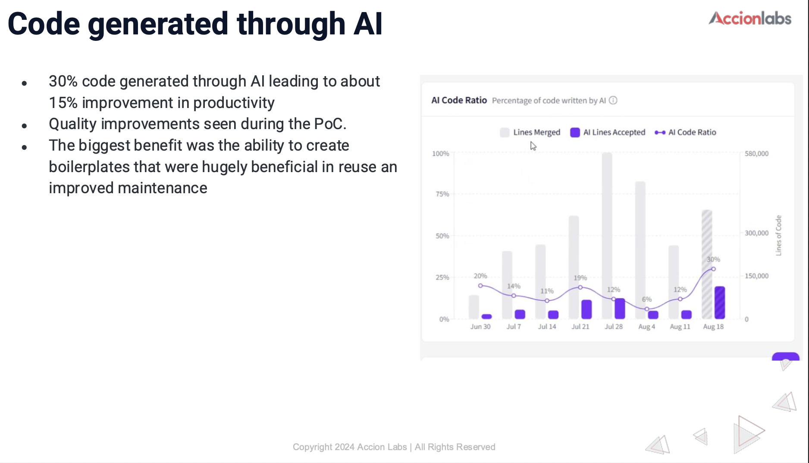
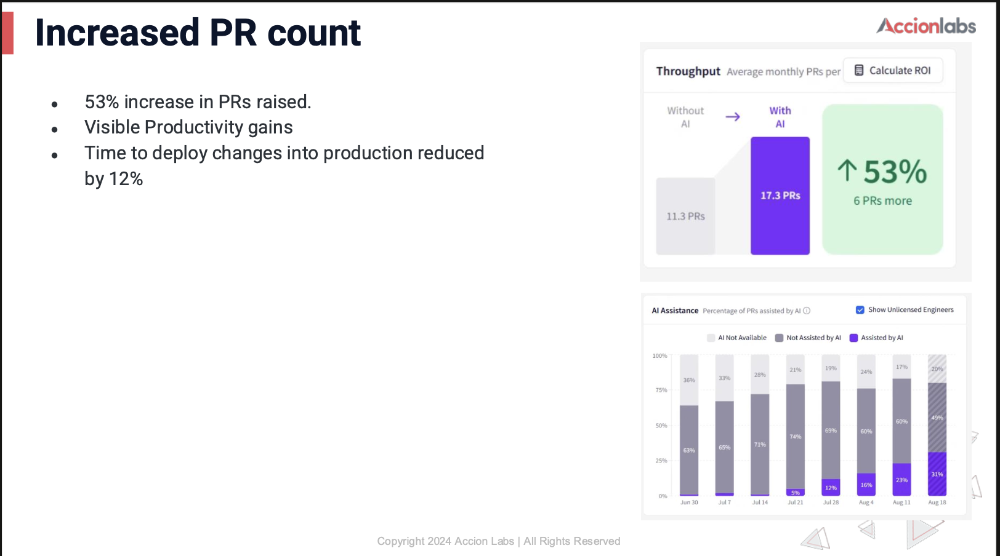
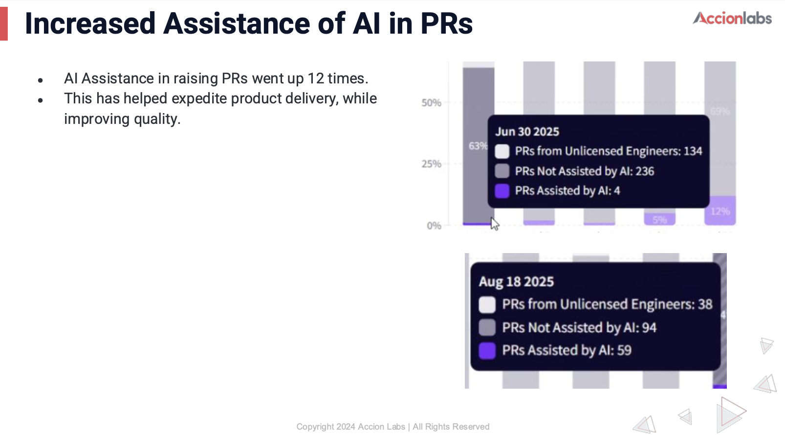
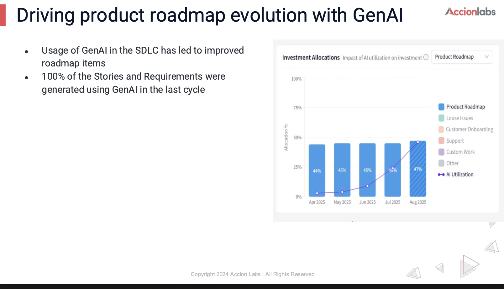
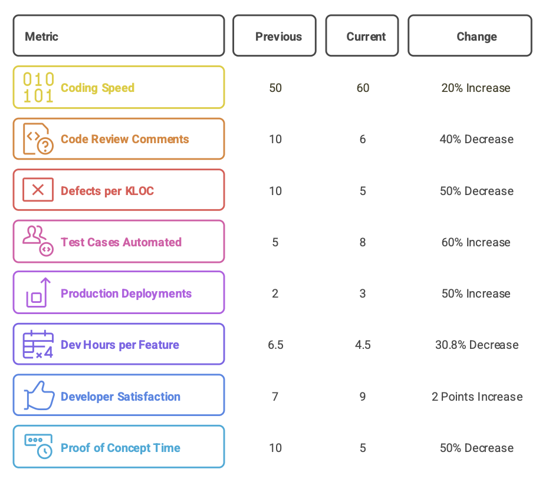
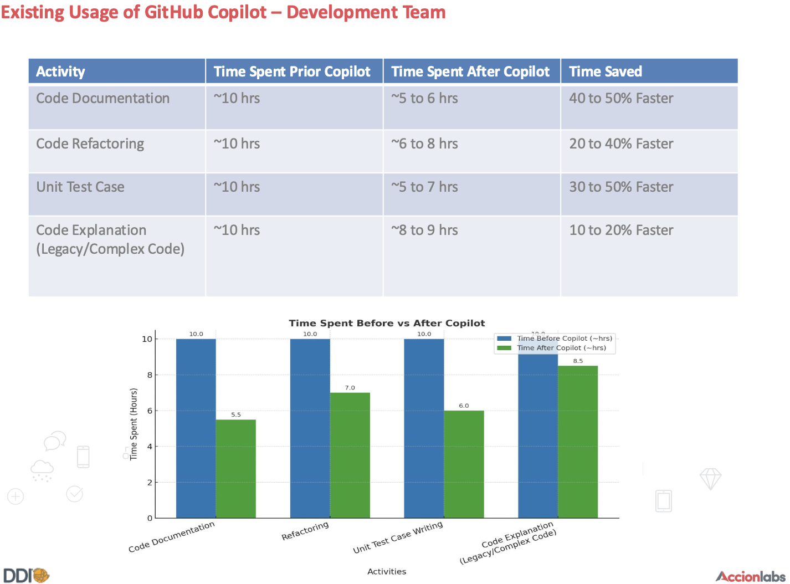

# Gen AI Adoption

## Generative AI (GenAI) in SDLC

Projects in Accionlabs have been gradually integrating GenAI across the entire SDLC, focusing on key areas that consume developer time and effort. Accionlabs has established a structured framework that guides teams through systematic implementation while ensuring quality and compliance.

This structured approach ensures that the engineering team delivers consistent quality while leveraging GenAI effectively across projects. The framework provides teams with clear guidelines while allowing flexibility for project-specific adaptations, making it easier to scale GenAI adoption across diverse client engagements while maintaining high-quality standards and responsible usage of AI.

The implementation is supported by dedicated Centers of Excellence (CoE) that provide technical guidance, quality assurance, and continuous learning opportunities. This ensures that teams stay updated with the latest GenAI developments while adhering to established quality and security standards.

### Key Focus Areas in SDLC {#key-focus-areas-in-sdlc}

    

        <h4>Requirements & Analysis</h4>
        <ul>
            <li>Automated parsing of requirement documents</li>
            <li>Test case generation from requirement specifications</li>
            <li>Traceability matrix automation</li>
            <li>Requirement validation and consistency checking</li>
        </ul>
    

    
    

        <h4>Core Development</h4>
        <ul>
            <li>Developers utilize GitHub Copilot and Cursor AI within their IDEs for code generation and optimization</li>
            <li>Language-specific support for Java, Python, HTML/CSS, and SQL query generation</li>
            <li>AI-assisted code optimization and refactoring</li>
            <li>Smart API development and debugging support</li>
        </ul>
    

    
    

        <h4>Testing & Quality Assurance</h4>
        <ul>
            <li>Automated test case generation from requirements</li>
            <li>AI-powered test data generation for comprehensive coverage</li>
            <li>Automated user data entry simulation</li>
            <li>Integration with testing frameworks like Playwright and Test Rigor</li>
        </ul>
    

    
    

        

            ⚡
            powered by Breeze.ai
        

        <h4>Architecture & Design</h4>
        <ul>
            <li>AI-assisted system design and architecture recommendations</li>
            <li>Impact analysis automation</li>
            <li>Integration planning and system interaction mapping</li>
            <li>Performance optimization suggestions</li>
        </ul>
    

### GenAI Adoption {#genai-adoption}

    

        

            
100%

            
GenAI Tools in SDLC

            
Source: SDLC integration data

        

        
        

            
41

            
Business Value Use Cases

            
Source: Business case analysis

        

        
        

            
30

            
GenAI Tools in Use

            
Source: Tool adoption metrics

        

        
        

            
2125

            
GenAI Trained

            
Source: Training program records

        

    

### GenAI Tools Portfolio {#genai-tools-portfolio}

    

        <table class="tools-table">
            <thead>
                <tr>
                    <th>Category</th>
                    <th>Tools & Platforms</th>
                    <th>Count</th>
                </tr>
            </thead>
            <tbody>
                <tr>
                    <td><strong>Development & Coding</strong></td>
                    <td>GitHub Copilot, Cursor AI, Codeium, Windsurf, Cody, Continue, Tabnine, Amazon CodeWhisperer</td>
                    <td>8</td>
                </tr>
                <tr>
                    <td><strong>Testing & Quality Assurance</strong></td>
                    <td>Playwright+AI, Test Rigor, PostBot, Testim</td>
                    <td>4</td>
                </tr>
                <tr>
                    <td><strong>Cloud & AI Platforms</strong></td>
                    <td>AWS SageMaker, Azure AI Studio, Vertex AI, OpenAI, CrewAI, Hugging Face</td>
                    <td>6</td>
                </tr>
                <tr>
                    <td><strong>Automation & Integration</strong></td>
                    <td>n8n, Jellyfish</td>
                    <td>2</td>
                </tr>
                <tr>
                    <td><strong>Content & Documentation</strong></td>
                    <td>Erasor.io, Msty</td>
                    <td>2</td>
                </tr>
                <tr>
                    <td><strong>AI Models & Assistants</strong></td>
                    <td>Qwen2, Llama 3.2, Grok2, Gemini, GPT-4o-mini, Claude Sonnet 4</td>
                    <td>6</td>
                </tr>
                <tr>
                    <td><strong>Specialized Solutions</strong></td>
                    <td>Rubrik AI, Breeze AI</td>
                    <td>2</td>
                </tr>
            </tbody>
            <tfoot>
                <tr>
                    <td><strong>Total</strong></td>
                    <td></td>
                    <td><strong>30</strong></td>
                </tr>
            </tfoot>
        </table>
    

### GenAI in Projects & Business Use Cases {#genai-in-projects--business-use-cases}

    

        

            <h4>Document & Content Processing</h4>
            

                
Parsing documents in raw word format and generating structured format with relevant Title, Headings tags

                
4

            

            

                
Content data conversion from PDF to JSON and vice versa

                
3

            

            

                
Image & Text Attribution by extracting metadata from Images / documents

                
3

            

            

                
On-the-fly Preparation of Press Release Content for Customers with in-flow recommendations

                
1

            

            

                
AI assisted content creation and context based media asset recommendation

                
1

            

            

                
Meaningful Meta description snippet generation

                
2

            

        

        
        

            <h4>AI-Powered Chatbots & Support</h4>
            

                
Self-assisted customer support

                
5

            

            

                
Post-sale customer support with recommendation of nearest and shortest delivery options

                
1

            

            

                
Customer segmentation and Personalized support

                
2

            

        

        
        

            <h4>Recommendation & Analytics</h4>
            

                
Product Selection Recommendations

                
1

            

            

                
Ticker data recommendation from Market listing pages

                
1

            

            

                
LLM Traffic Optimization (AEO/GEO) and analytics

                
1

            

        

        
        

            <h4>Testing & Automation</h4>
            

                
Test Cases Generation for API/UI automation by scanning Requirements details and acceptance criteria

                
2

            

            

                
API and UI testing Automation

                
3

            

            

                
Error classification and workflow automation

                
1

            

        

        
        

            <h4>Business Process Automation</h4>
            

                
Email to order creation

                
2

            

            

                
Vendor qualification and approval workflow automation

                
2

            

            

                
Image review, analysis and approval process

                
1

            

        

        
        

            <h4>Data</h4>
            

                
Generate EHR data and de-identify for building synthetic data for modeling

                
1

            

            

                
Legacy code migration

                
2

            

        

    

    
    

        
Top Accounts

        

            
Dell

            
Ingram Micro

            
LSAC

            
Edifecs

            
Cision

            
CBC

            
Corsearch

            
Noodle.ai

            
Syndigo

            
Caliber

            
Finvi

            
Extreme Reach

            
Magnifact

            
Sage Pub

            
Rotary

            
Xybion

            
Zuum

            
Hivemindd

            
BCI

            
Neighborly

            
Covetrus

            
Riskconnect

            
Brightquery

            
Everbridge

            
Leadventure

            
Parent Pay

            
Fish Bowl

        

    

### GenAI Effectiveness {#genai-effectiveness}

    

        

            <h4>Code Generation & Development</h4>
            <ul>
                <li><strong>30%</strong> of code now AI-generated → <strong>15%</strong> productivity boost</li>
                <li><strong>53%</strong> more Pull Requests delivered</li>
                <li><strong>12%</strong> faster deployment to production</li>
            </ul>
        

        
        

            <h4>Requirements & Planning</h4>
            <ul>
                <li><strong>100%</strong> of user stories generated with GenAI</li>
            </ul>
        

        
        

            <h4>Quality & Efficiency</h4>
            <ul>
                <li><strong>50%</strong> fewer defects in production code</li>
                <li><strong>60%</strong> more test cases automated</li>
                <li><strong>31%</strong> reduction in development time per feature</li>
            </ul>
        

        
        

            <h4>Team Impact</h4>
            <ul>
                <li>Developer satisfaction up <strong>29%</strong> (7→9 out of 10)</li>
                <li><strong>50%</strong> of support tickets resolved using AI</li>
                <li><strong>50%</strong> faster proof-of-concept development</li>
            </ul>
        

    

#### GenAI Impact Reports {#genai-impact-reports}

    

        <h3>📊 GenAI Impact Reports</h3>
        
Comprehensive analysis of GenAI adoption and effectiveness across our development processes

    

    
    

        

            

                
1 / 7

                
                
Code Generated Through AI

            

        

        
        

            

                
2 / 7

                
                
Increased PR Count

            

        

        
        

            

                
3 / 7

                
                
Improved Issue Resolution

            

        

        
        

            

                
4 / 7

                
                
Product Roadmap Evolution

            

        

        
        

            

                
5 / 7

                
                
Development Team Performance

            

        

        
        

            

                
6 / 7

                
                
GitHub Copilot Usage

            

        

        
        

            

                
7 / 7

                
                
GenAI Metrics Overview

            

        

    

    
    

        <button class="carousel-btn prev" onclick="changeSlide(-1)" title="Previous Report">❮</button>
        

            
            
            
            
            
            
            
        

        <button class="carousel-btn next" onclick="changeSlide(1)" title="Next Report">❯</button>
    

### Implementation Framework {#implementation-framework}

The implementation framework provides a structured approach to GenAI adoption across different phases of the SDLC, ensuring consistent quality and compliance while maximizing the benefits of AI-assisted development.

#### Phase 1: Assessment & Planning
- Evaluate current development processes and identify GenAI opportunities
- Define clear objectives and success metrics for GenAI integration
- Establish governance framework and compliance guidelines
- Select appropriate GenAI tools and platforms

#### Phase 2: Pilot Implementation
- Start with small-scale pilot projects to validate GenAI effectiveness
- Train development teams on GenAI tools and best practices
- Establish feedback mechanisms and continuous improvement processes
- Document lessons learned and refine implementation approach

#### Phase 3: Scaling & Optimization
- Expand GenAI adoption across multiple projects and teams
- Implement advanced GenAI capabilities and custom solutions
- Optimize workflows and processes based on performance data
- Establish knowledge sharing and best practice dissemination

#### Phase 4: Continuous Evolution
- Monitor emerging GenAI technologies and capabilities
- Continuously improve and adapt GenAI implementation strategies
- Foster innovation and experimentation with new GenAI applications
- Maintain competitive advantage through GenAI leadership

### Responsible Usage Guidelines {#responsible-usage-guidelines}

#### 1. Code Quality

- Mandatory code review for AI-generated code
- Security validation of generated components
- Performance testing of AI suggestions
- Documentation requirements

#### 2. Data Security

- No sensitive data in AI tool prompts
- Regular security audits of AI integrations
- Compliance with data protection regulations
- Version control of AI-generated assets

#### 3. Best Practices

- Clear documentation of AI usage
- Regular validation of AI outputs
- Maintaining human oversight
- Ethical consideration in AI adoption

---

*Previous: [Value-Driven Delivery ←](../value-driven-delivery/index.md)*

