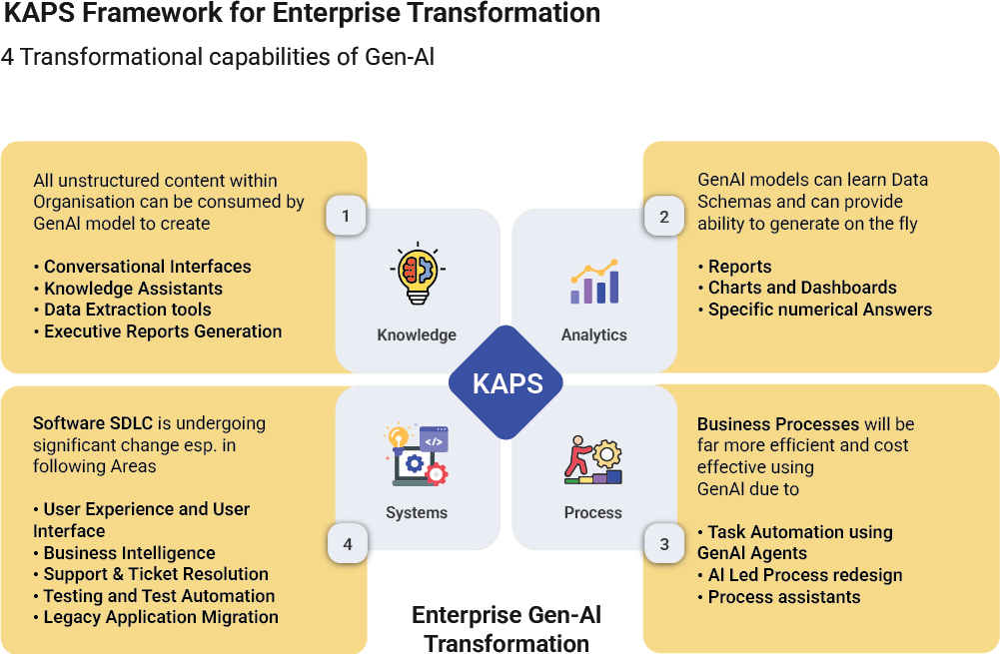

# Gen AI Adoption

## KAPS Framework

The KAPS framework provides a comprehensive approach to enterprise GenAI transformation, integrating four key pillars: Knowledge, Analytics, Process, and Systems. This holistic framework enables organizations to leverage GenAI capabilities across their entire operational spectrum - from transforming unstructured content into actionable insights, to delivering data-driven analytics, optimizing business processes, and modernizing legacy systems.

By addressing both technological and operational dimensions, KAPS helps organizations systematically identify, implement, and scale GenAI solutions that drive tangible business value. The framework's integrated approach ensures that GenAI adoption aligns with enterprise objectives while maintaining a balanced focus on innovation and practical implementation.

## Generative AI (GenAI) in SDLC

Projects in Accionlabs have been gradually integrating GenAI across the entire SDLC, focusing on key areas that consume developer time and effort. Accionlabs has established a structured framework that guides teams through systematic implementation while ensuring quality and compliance.

This structured approach ensures that the engineering team delivers consistent quality while leveraging GenAI effectively across projects. The framework provides teams with clear guidelines while allowing flexibility for project-specific adaptations, making it easier to scale GenAI adoption across diverse client engagements while maintaining high-quality standards and responsible usage of AI.

The implementation is supported by dedicated Centers of Excellence (CoE) that provide technical guidance, quality assurance, and continuous learning opportunities. This ensures that teams stay updated with the latest GenAI developments while adhering to established quality and security standards.

### Key Focus Areas in SDLC

#### Core Development

- Developers utilize GitHub Copilot and Cursor AI within their IDEs for code generation and optimization
- Language-specific support for Java, Python, HTML/CSS, and SQL query generation
- AI-assisted code optimization and refactoring
- Smart API development and debugging support

#### Testing & Quality Assurance

- Automated test case generation from requirements
- AI-powered test data generation for comprehensive coverage
- Automated user data entry simulation
- Integration with testing frameworks like Playwright and Test Rigor

#### Architecture & Design

- AI-assisted system design and architecture recommendations
- Impact analysis automation
- Integration planning and system interaction mapping
- Performance optimization suggestions

#### Requirements & Analysis

- Automated parsing of requirement documents
- Test case generation from requirement specifications
- Traceability matrix automation
- Requirement validation and consistency checking

### Implementation Framework

#### 1. Assessment & Planning

- Technology stack evaluation for GenAI compatibility
- Team readiness assessment
- Project-specific use case identification
- Risk and compliance analysis

#### 2. Tool Integration & Support

- Tool evaluation with consent and approval from client stakeholders
- IDE-specific configurations and best practices
- Security-validated development environments
- Integration with existing SDLC tools

#### 3. Capability Building

- Training on various tool usage and best practices
- Role-specific training modules and workshops
- Hands-on labs and proof-of-concept opportunities
- Weekly knowledge-sharing sessions
- Clear communication of Do's and Dont's
- Strict review of code generated for quality and correctness
- Shared prompts where common standards are expected
- Documented success patterns and learnings

### Responsible Usage Guidelines

#### 1. Code Quality

- Mandatory code review for AI-generated code
- Security validation of generated components
- Performance testing of AI suggestions
- Documentation requirements

#### 2. Data Security

- No sensitive data in AI tool prompts
- Regular security audits of AI integrations
- Compliance with data protection regulations
- Version control of AI-generated assets

#### 3. Best Practices

- Clear documentation of AI usage
- Regular validation of AI outputs
- Maintaining human oversight
- Ethical consideration in AI adoption

---

*Previous: [Best Practices ←](../best-practices/)*
