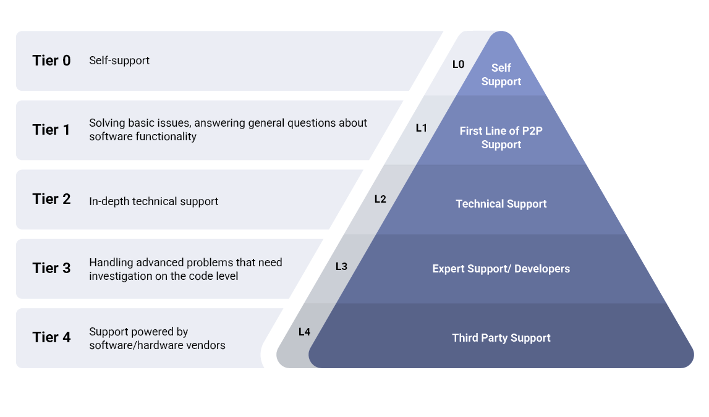

# SDLC - Managed Services

This page briefly describes managed services and the process one needs to follow.

Managed services refer to outsourcing specific IT functions or processes to a third-party service provider. These services are typically provided on a proactive, ongoing basis, and it is our responsibility to manage and maintain the client's IT infrastructure, systems, and/or applications.

## Why is Support Needed?

The digital landscape is rapidly evolving, and at its helm is technology, driving businesses towards innovative horizons. The importance of robust support cannot be overstated, as it is instrumental in steering businesses toward operational excellence and competitive differentiation. The integration of agile solutions paves the way for streamlined operations and provides a solid foundation for businesses to adapt to market dynamics swiftly.

The intricacies of modern business operations necessitate a strong backing of adept support to ensure seamless operational flows, data integrity, and a user-friendly interface for employees and customers.

## Key Reasons for Support

### Continuous Maintenance

Much like any operational facet, the application requires regular maintenance to align with changing technological and business landscapes. Maintenance ensures the Application remains resilient against bugs, performance issues, and outdated functionalities, thereby promoting a seamless operational flow.

### Bug Extermination

Bug Fixing entails identifying errors in the code, hardware, or operating system, and rectifying them without affecting the existing functionalities. This process is crucial to ensure the Application runs seamlessly and delivers the intended value.

### Capability Enhancement

Upgrading the features and functions of the Application ensures its compatibility with the evolving market environment. This includes enhancing Application platforms, hardware, compilers, and other elements influencing system workflow. Regular capability enhancement propels businesses to stay ahead of the competitive curve.

### Outdated Functionality Removal

Over time, certain functionalities become obsolete and may hinder Application efficiency. Removing such outdated functions and replacing them with modern, efficient solutions using the latest tools and technologies is crucial for maintaining Application relevance and efficiency.

### Performance Augmentation

Regular testing and issue resolution encompassing data restructuring and coding, are essential to safeguard the Application against vulnerabilities and prevent detrimental activities like hacking.

### Cost Efficiency

Effective Application support helps reduce long-term costs by preventing major issues that might require expensive fixes. Additionally, well-maintained Application enhances operational efficiency, thereby positively impacting the bottom line.

## Different Types of Support

- Application Support
- Infrastructure Support
- Managed IT Support

## Levels of Support Provided

## Communication Model

The team shall prepare and submit the following weekly Governance Reports:

- Activities of the week
- Work and deliverables completed during the period
- Status of ongoing activities
- Activities planned for the following period
- Problems or issues projected or identified and the potential ongoing time and cost impact they may have
- Alternatives and / or recommended solution(s) for identified or projected problems or issues
- Known or projected impacts

In addition to the status reports, the following is a list of key meetings that will be organized:

| Frequency | Duration | Mode | Participants | Activities |
|-----------|----------|------|--------------|------------|
| **Daily stand-up** | **15 minutes** | **Zoom** | **Accion and Operating Teams** | **Discuss the Tasks completed, In- Progress, To-Do tasks and impediments, if any.** |
| **Bi-Weekly Executive Review** | **30 minutes** | **Zoom** | **Executive Sponsor and Operating Teams** | **Presentation of status report, accomplishments, risks, key next steps, and needed actions.** |
| **Monthly Executive Touchpoint** | **60 minutes** | **Zoom** | **Executive Sponsors and Key Leaders** | **Executive Sponsors and Key Leaders.** |

## Key Performance Indicators (KPI)

Key Performance Indicators (KPIs) for application support are essential metrics used to measure the effectiveness, efficiency, and quality of support services provided to users and the organization. These KPIs help monitor performance, identify areas for improvement, and ensure that support teams meet service level agreements (SLAs). Here are some key KPIs for application support:

### First Contact Resolution Rate (FCR)
- Percentage of support requests resolved without the need for escalation or follow-up. A high FCR indicates efficient problem-solving and customer satisfaction.

### Mean Time to Resolve (MTTR)
- Average time taken to resolve support tickets or incidents from the time they are reported. A lower MTTR indicates faster issue resolution and minimized downtime.

### Ticket Backlog
- Number of open support tickets or incidents awaiting resolution. Monitoring ticket backlog helps ensure timely resolution and prevents a buildup of unresolved issues.

### Customer Satisfaction (CSAT) Score
- Measurement of customer satisfaction with the support services received. CSAT surveys can be conducted periodically to gather user feedback and identify areas for improvement.

### Service Level Agreement (SLA) Compliance
- Percentage of support tickets or incidents resolved within agreed-upon SLA timelines. SLA compliance ensures that support services meet performance expectations and contractual obligations.

### Incident Volume Trends
- Analysis of trends in support ticket or incident volumes over time. Identifying patterns and trends helps anticipate support needs, allocate resources efficiently, and proactively address recurring issues.

### Training Completion Rate
- Percentage of support team members who have completed required training or certifications. Monitoring training completion helps ensure that support staff have the necessary skills and knowledge to perform their roles effectively.

## Best Practices

### Proactive Monitoring and Maintenance
Support teams monitor systems and networks proactively to detect potential issues before they escalate into major problems. Addressing issues early, minimizes downtime and prevents disruptions to business operations.

### Process Improvement Recommendations
Support teams often have insights into recurring issues or inefficiencies within existing processes. They can provide recommendations for process improvements or automation to streamline workflows, increase efficiency, and reduce the likelihood of future issues.

### Product and Service Enhancement Suggestions
Based on customer feedback and support interactions, support teams gather valuable insights into areas where products or services could be improved. They also relay this feedback to relevant teams within the organization, such as product development or quality assurance, to drive continuous improvement.

### Cross-Functional Collaboration
Support services act as a bridge between different departments within the organization, facilitating collaboration and knowledge sharing. For example, they coordinate with development teams to address bugs or with sales teams to provide technical insights during customer interactions.

### Customization and Personalization
Support teams offer personalized assistance tailored to individual customers' unique needs and preferences. This may involve configuring settings, providing custom solutions, or offering recommendations based on the customer's specific requirements.

### Escalation Management
Support services efficiently manage escalations to higher support tiers or specialized teams within the organization. By ensuring that issues are escalated promptly and with appropriate context, support teams help maintain service quality and customer satisfaction.

---

*Previous: [SDLC - Enhancements & Support](../sdlc-enhancements-support/index.md)* | *Next: [Value-Driven Delivery](../value-driven-delivery/index.md)*
