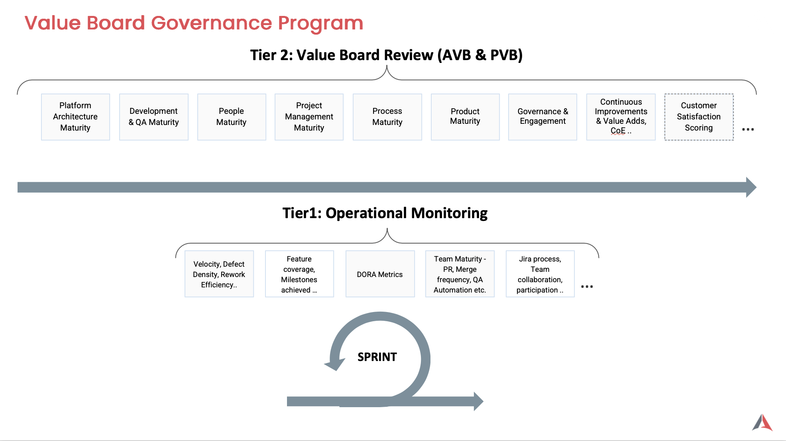
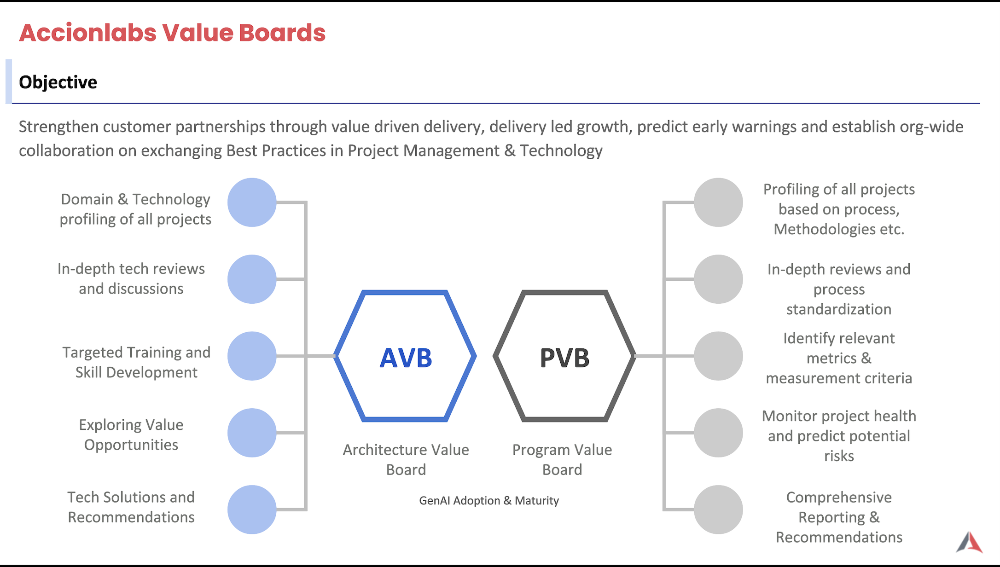

# Delivery Governance

The Delivery Governance framework encompasses our comprehensive approach to ensuring quality, compliance, and strategic alignment across all delivery activities. This section provides detailed guidance on governance frameworks and value board processes.

## 🏛️ Value Board Governance Framework

While regular operations are monitored and measured by the delivery team, **Value Board** acts as the org-wide program management body that aims to review projects across all accounts in different aspects aligned to Accion's 5P principles.

The Value Board serves as the strategic oversight mechanism that transcends individual project boundaries, providing a holistic view of organizational performance and value delivery. It ensures that all delivery activities align with Accion's core principles while maintaining the highest standards of quality and efficiency.

    
    

        Value Board Governance Framework - Organizational Program Management Structure
    

## 🦅 Value Board Review Streams

The Value Board operates through two specialized review streams, each focusing on distinct areas of excellence. This dual-stream approach ensures comprehensive coverage of both program management and technical architecture aspects, creating a balanced governance structure that addresses the full spectrum of delivery challenges.

    
    

        Architecture Value Board (AVB) and Program Value Board (PVB) - Dual Review Stream Framework
    

### 📊 Program Value Board (PVB)
**Focus: Program and Delivery Excellence**

The PVB serves as the cornerstone for program management excellence, ensuring strategic oversight and operational efficiency across all delivery activities. This review stream is responsible for maintaining the highest standards of program execution while driving continuous improvement in delivery processes.

**Key Responsibilities:**
- Strategic program oversight across all accounts
- Delivery excellence and operational efficiency
- Value measurement and performance optimization
- Cross-functional program coordination
- Quality assurance and compliance monitoring
- Risk management and mitigation strategies
- Resource allocation and capacity planning
- Stakeholder communication and alignment

**Governance Activities:**
- Regular program health assessments
- Performance metrics review and analysis
- Best practice identification and implementation
- Process improvement initiatives
- Team capability development programs

[**→ Explore Program Value Board**](../program-value-board/process-metrics.md)

### 🏗️ Architecture Value Board (AVB)  
**Focus: Innovation and Technology Excellence**

The AVB drives technological advancement and architectural innovation, ensuring that all technical decisions align with long-term strategic objectives while maintaining the highest standards of technical excellence. This review stream focuses on creating robust, scalable, and future-ready technical foundations.

**Key Responsibilities:**
- Technical architecture review and governance
- Innovation strategy and technology roadmaps
- Technology excellence and best practices
- Emerging technology evaluation and adoption
- Technical standards and architectural alignment
- Technology risk assessment and mitigation
- Performance optimization and scalability planning
- Security and compliance framework development

**Governance Activities:**
- Architecture review board sessions
- Technology stack evaluation and recommendations
- Innovation pipeline management
- Technical debt assessment and remediation
- Emerging technology pilot programs

[**→ Explore Architecture Value Board**](../architecture-value-board/tools-technologies.md)

### 🤖 GenAI Adoption - Maturity Review

#### Cross-Stream Governance: Technology & Program Excellence

GenAI Adoption represents a maturity review that flows through both Value Board review streams, ensuring comprehensive evaluation from both technical and program management perspectives. This cross-stream review process addresses the transformative impact of GenAI across all delivery dimensions.

**PVB Review Focus:**
- GenAI integration in program management processes
- Value measurement and ROI assessment
- Change management and adoption strategies
- Team capability development and training
- Risk assessment and mitigation planning
- Stakeholder alignment and communication

**AVB Review Focus:**
- GenAI technology architecture and infrastructure
- Technical implementation and integration patterns
- Security, compliance, and governance frameworks
- Performance optimization and scalability
- Technology stack evaluation and recommendations
- Innovation pipeline and emerging capabilities

**Maturity Assessment Areas:**
- **Technology Maturity**: Infrastructure readiness, integration capabilities, security frameworks, SDLC tools integration
- **Process Maturity**: Workflow integration, automation levels, quality assurance
- **People Maturity**: Skill development, adoption rates, change management
- **Value Maturity**: ROI measurement, business impact, strategic alignment

[**→ Explore GenAI Adoption Maturity**](../delivery-execution/genai-adoption/index.md)
