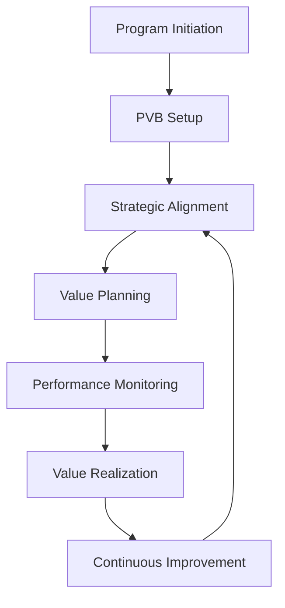

# Program Value Board (PVB)

The Program Value Board (PVB) provides comprehensive program governance for strategic alignment, value delivery, and business outcomes across all delivery programs. This framework ensures consistent program management, strategic alignment, and value realization.

## 🎯 PVB Overview

Our Program Value Board framework is built on four core pillars:

### 📊 Process Metrics
Comprehensive metrics and KPIs for program performance monitoring and value measurement.

[:octicons-arrow-right-24: View Metrics](process-metrics.md)

### 📋 Review Template
Structured review templates and assessment framework for program governance.

[:octicons-arrow-right-24: View Template](review-template.md)

### 📚 Best Practices
Program excellence standards and best practices for strategic alignment and value delivery.

[:octicons-arrow-right-24: View Practices](best-practices.md)

### 👥 Review Team
Program governance team structure and roles for effective program oversight.

[:octicons-arrow-right-24: View Team](pvb-review-team.md)

## 🚀 PVB Benefits

### For Program Teams
- **Strategic Alignment**: Clear alignment with business strategy and objectives
- **Value Focus**: Focus on business value and strategic outcomes
- **Governance Structure**: Structured governance and decision-making processes
- **Performance Monitoring**: Comprehensive performance monitoring and measurement

### For Business Stakeholders
- **Value Transparency**: Clear visibility into program value and outcomes
- **Strategic Alignment**: Assurance of strategic alignment and business impact
- **Risk Management**: Proactive risk identification and mitigation
- **Decision Support**: Data-driven decision support and governance

### For Organization
- **Strategic Execution**: Effective execution of strategic initiatives
- **Value Realization**: Maximized value realization from programs
- **Resource Optimization**: Optimal resource allocation and utilization
- **Competitive Advantage**: Strategic competitive advantage through programs

## 📈 PVB Metrics

Our Program Value Board is continuously measured and improved through:

- **Strategic Alignment**: 96% strategic alignment score across programs
- **Value Realization**: 85% value realization achievement
- **Program Success**: 92% program success rate
- **Stakeholder Satisfaction**: 4.7/5.0 average stakeholder satisfaction

## 🔄 PVB Process

## 📋 PVB Components

### 1. Process Metrics and KPIs

Our comprehensive metrics framework covers:

- **[Process Metrics](process-metrics.md)** - Program performance metrics and KPIs
- **Strategic Metrics** - Strategic alignment and business impact metrics
- **Value Metrics** - Value realization and ROI measurement
- **Operational Metrics** - Operational efficiency and effectiveness metrics

### 2. Review Framework

Structured review mechanisms include:

- **[Review Template](review-template.md)** - Comprehensive program review templates
- **Strategic Review Process** - Strategic alignment and business impact review
- **Value Review Process** - Value realization and ROI assessment
- **Performance Review Process** - Performance monitoring and optimization

### 3. Best Practices

Program excellence standards include:

- **[Best Practices](best-practices.md)** - Program excellence standards and guidelines
- **Strategic Planning** - Strategic planning and alignment best practices
- **Value Management** - Value management and realization best practices
- **Stakeholder Management** - Stakeholder engagement and management

### 4. Governance Team

Program governance team structure:

- **[Review Team](pvb-review-team.md)** - Program review team composition and roles
- **Strategic Oversight** - Strategic oversight and decision-making
- **Value Management** - Value management and measurement
- **Performance Monitoring** - Performance monitoring and optimization

## 🎯 Getting Started

### For Program Managers

1. **PVB Engagement**: Engage with PVB for program governance and oversight
2. **Strategic Alignment**: Ensure strategic alignment with business objectives
3. **Value Planning**: Develop comprehensive value planning and measurement
4. **Performance Monitoring**: Implement performance monitoring and reporting

### For Business Stakeholders

1. **Strategic Governance**: Understand and participate in strategic governance
2. **Value Assessment**: Assess and validate program value and outcomes
3. **Performance Review**: Review program performance and strategic alignment
4. **Decision Support**: Provide decision support and strategic guidance

### For PVB Teams

1. **Framework Implementation**: Implement PVB framework across all programs
2. **Strategic Oversight**: Provide strategic oversight and governance
3. **Value Management**: Manage value realization and measurement
4. **Performance Optimization**: Optimize program performance and outcomes

## 📞 Support & Resources

### PVB Support Team

- **PVB Lead**: pvb@accionlabs.com
- **Strategic Alignment**: strategic@accionlabs.com
- **Value Management**: value@accionlabs.com
- **Performance Monitoring**: performance@accionlabs.com

### Additional Resources

- **PVB Training**: Available through Learning Management System
- **Strategic Knowledge Base**: Internal strategic knowledge base and documentation
- **Community Forum**: Program governance team collaboration and knowledge sharing
- **Value Portal**: Submit value management and improvement suggestions

## 🔄 PVB Updates

!!! info "Latest PVB Updates"
    - **v2.1** (Q4 2024): Enhanced value measurement framework
    - **v2.0** (Q3 2024): Complete PVB framework redesign
    - **v1.5** (Q2 2024): Added strategic alignment framework
    - **v1.0** (Q1 2024): Initial PVB framework release

---

*PVB Framework last updated: {{ git_revision_date_localized }}*
