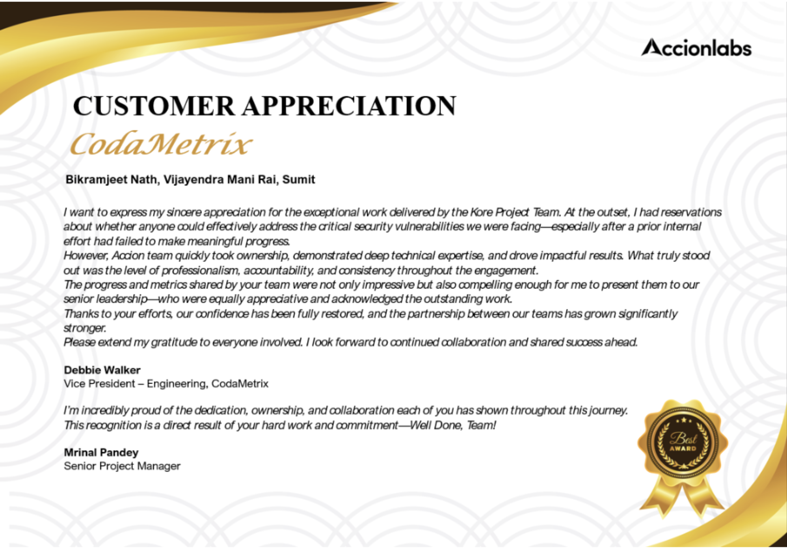
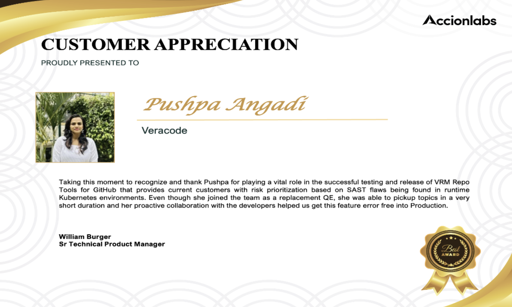

# Rewards & Recognitions

## Overview

At Accionlabs, we believe in celebrating excellence and acknowledging the outstanding contributions of our team members. Our Rewards & Recognitions program showcases the exceptional achievements and client appreciation received by our teams.

These awards represent direct recognition from our clients, highlighting exceptional service delivery, technical excellence, and the significant impact our team members have made on their projects.

## 🏆 Customer Appreciation Awards & Team Recognition

    

        

            

                
                

                    <h4>Azira - Customer Appreciation</h4>
                    
Team recognition for engineering excellence and dedicated support

                

            

            
            

                
                

                    <h4>CodaMetrix - Customer Appreciation</h4>
                    
Kore Project Team recognition for security excellence

                

            

            
            

                
                

                    <h4>ABS - Customer Appreciation</h4>
                    
Individual excellence recognition for Ganesh Ghuge

                

            

            
            

                
                

                    <h4>Team Marvel Award - LeadVenture PSM</h4>
                    
Performance enhancement excellence recognition

                

            

            
            

                
                

                    <h4>Team Marvel Award - LeadVenture Ignition</h4>
                    
Platform development excellence recognition

                

            

            
            

                
                

                    <h4>Veracode - Customer Appreciation</h4>
                    
IT Operations excellence recognition for Mabub

                

            

            
            

                
                

                    <h4>Magnifact - Customer Appreciation</h4>
                    
GenAI implementation excellence recognition

                

            

            
            

                
                

                    <h4>Azira - Customer Appreciation</h4>
                    
Individual excellence recognition for Mrinal Pandey

                

            

            
            

                
                

                    <h4>Neighbourly Software - Customer Appreciation</h4>
                    
Team excellence and project recovery recognition

                

            

            
            

                
                

                    <h4>Veracode - Customer Appreciation</h4>
                    
QE excellence recognition for Pushpa Angadi

                

            

            
            

                
                

                    <h4>Rotary - Customer Appreciation</h4>
                    
Multi-team collaboration excellence recognition

                

            

        

        
        

            <button class="carousel-btn prev-btn" onclick="changeSlide(-1)">
                ‹
            </button>
            <button class="carousel-btn next-btn" onclick="changeSlide(1)">
                ›
            </button>
        

        
        

            
            
            
            
            
            
            
            
            
            
            
        

        
        

            1 / 11
            <button class="fullscreen-btn" onclick="toggleFullscreen()">⛶</button>
        

    

## 🌟 Recognition Impact

Our recognition program showcases:

- **Client Satisfaction**: Direct appreciation from our valued clients
- **Technical Excellence**: Recognition for outstanding technical contributions
- **Team Collaboration**: Celebrating exceptional teamwork and partnership
- **Innovation**: Acknowledgment of creative solutions and implementations
- **Leadership**: Honoring exceptional guidance and mentorship

---

*These awards reflect our collective commitment to delivering exceptional value and building lasting partnerships with our clients.*