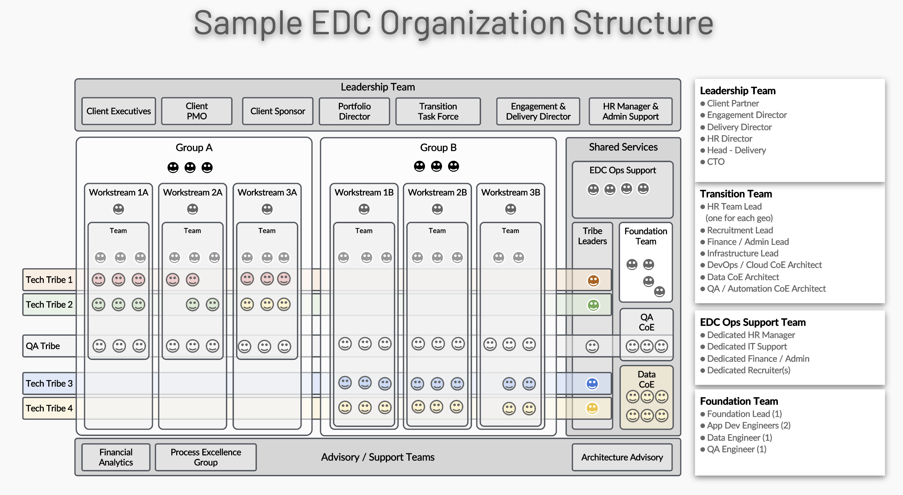
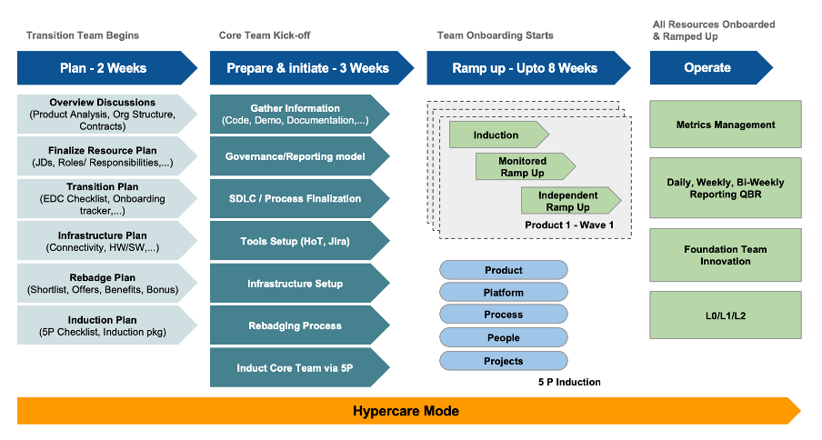
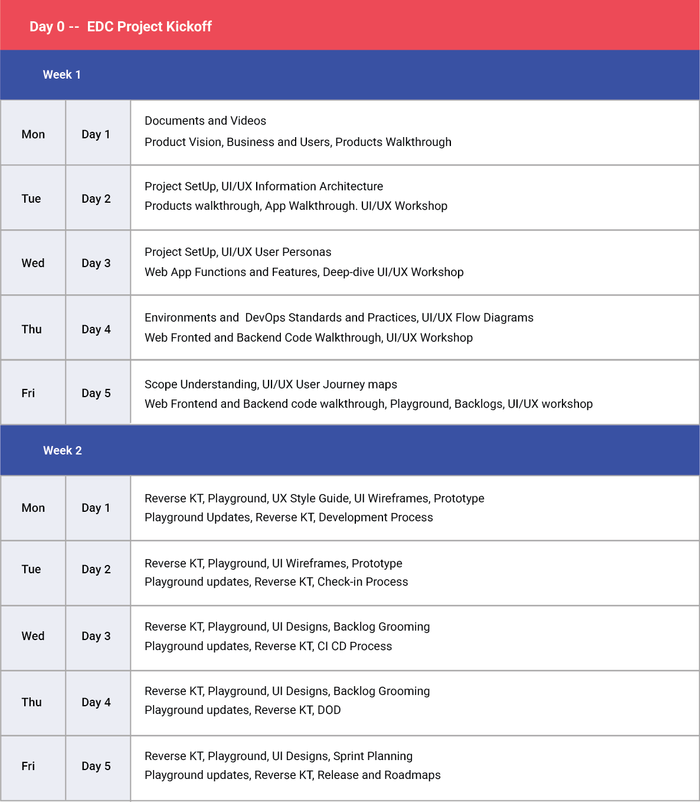
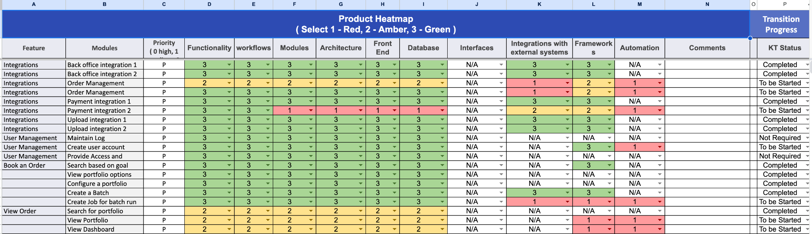

# Transition

## Transition Planning Approach and Methodology

### Transition Methodology Overview

This document describes Accion's methodology and approach to transitioning work from a range of customers' internally managed and vendor-managed teams to an integrated Accion-managed extended delivery center (EDC) composed of product engineering teams at Accionlabs.

### Transition Process Design Principles

Accion's transition process for setting up an extended delivery center (EDC) is primarily guided by the following key principles:

### Low Touch Induction

Accion's transition methodology emphasizes that delivery teams must completely own the delivery process. The low touch approach minimizes dependence on the existing vendor or the client's product organization/technology teams. This is achieved by a combination of training the trainer, self-managed and self-discovery, and progressive induction.

### Progressive Induction - Train the Trainer

The transition process is broken down into phases that incrementally induct Accion's teams. The process starts with a leadership team and a transition team responsible for the overall program, followed by core delivery teams for each work stream, which work closely with the corresponding product owners and technical architects to create a detailed induction guide and delivery plan. The core team then inducts and trains the rest of the delivery team, ensures full ownership of the delivery process, and minimizes the dependence on existing vendor resources.

### Think Ahead, Plan Ahead

The transition methodology is based on a proactive plan that outlines the activities, outcomes, and participants for each transition phase. The methodology also defines the checklists, benchmarks, and metrics that provide the guardrails to highlight any deviations from the plan to allow Accion as well as the client to respond with the requisite actions and ensure a successful transition.

### Seed Teams with Existing Accion Leaders

To ensure that Accion's culture of outcome and action, rapid response, and team spirit is ingrained into the transition process, Accion ensures that a large part of the key leadership, including core delivery leaders, consists of existing Accion engineers. These leaders are experienced with Accion's transition and delivery process and ensure that the methodology is executed accurately and efficiently.

Accion executes the progressive induction by following

**Accionlabs Induction Framework (5P Model)** This methodology incorporates the five key aspects of induction: Product, Platform, People, Process, and Program across four levels: Accion, Client, Project, and Role. This tested and proven induction methodology ensures that each incremental team member of the progressive induction process works exactly as planned with minimal dependency on the individual's experience with the transition process. This also ensures adherence to the think ahead, plan ahead principle.

### Hypercare Governance Mode

For the first 90-120 days or until the last product completes the monitored ramp-up phase, Accion will operate in a Hypercare governance mode. Under this mode, there will be a daily leadership catch-up for 30 days and a weekly catchup for the remainder of 90 days. The goal of the Hypercare phase is to review resource onboarding, induction/training, progress of transition, and resolve any blockers or issues. Hypercare meetings are held at the product level and partnership levels.

- **Focus on controlling the downtime and dips**
  - System uptime & critical SLAs
  - Focus on risks & impact areas for business

- **Daily scrum for core product teams at the start and by the end of the day - Kanban**
  - Key issues & resolution
  - Team ramp-up
  - Delivery metrics
  - Work intake process progress
  - Risk management

- **Daily reporting to client & Accion leadership**
  - Product level breakdown with status on transition, team ramp-up, and ongoing delivery
  - Highlight blockers/issues, risks & mitigation plans

- **Weekly meeting with client & Accion leadership**
  - Engagement review
  - Recruitment status review
  - Schedule and financials review
  - Risk management

## Phase-wise Transition Plan

Accion's transition process comprises several detailed phases designed to ensure a smooth and efficient transition. This comprehensive process includes the following phases:

1. Prepare
2. Plan
3. Initiate
4. Monitored Ramp Up
5. Independent Ramp Up
6. Operationalize

*Phase-wise Transition Plan - Comprehensive Transition Methodology Framework*

## 📊 Sample Transition Plan Document

    

        <h3 style="color: #333; margin-bottom: 10px;">📊 Sample Transition Plan Document</h3>
        
Comprehensive transition plan document showcasing the detailed methodology and approach

    

    
    

        
📋 Sample Transition Plan Document Preview

        <iframe 
            src="../../assets/documents/Transition-plan.pdf" 
            width="100%" 
            height="900px" 
            style="border: 1px solid #ddd; border-radius: 5px; box-shadow: 0 2px 4px rgba(0,0,0,0.1); max-width: 100%;" 
            title="Sample Transition Plan Document Preview"
            frameborder="0">
            
Your browser does not support PDFs. 
            <a href="../../assets/documents/Transition-plan.pdf" target="_blank">Download the sample PDF</a> instead.

        </iframe>
        

            💡 <em>Above shows the sample transition plan document structure and methodology</em>
        

    

## Sprint 0

Sprint 0 is typically planned and defined in projects where all the above transition activities occur within 2-4 weeks. Sprint 0 is planned for 2 weeks or longer depending on the project's complexity, technical understanding etc. For smaller projects, Sprint 0 can be completed in 3-5 days.

The following table shows a sample sprint 0 plan:

## Product Heatmap

The product heatmap method is an effective method to make the product development landscape along with the knowledge of the individual modules immediately understandable to both technical and non-technical stakeholders. It also provides a standardized way to assess different aspects of the product, ensuring consistency in evaluation across teams and components. This approach also helps in maintaining transparency across the organization and facilitates better decision-making at all levels of product development.

**Data Collection Methods:**

1. **Component-wise Assessment:** As shown in the image, break down the product into key dimensions like Feature, Functionality, Workflows, Architecture, Front End, Database, Interfaces, Integrations, and Automation. This granular approach ensures no aspect of the product is overlooked.

2. **Scoring System:** Implement a clear 3-point scoring system (similar to Red-Amber-Green system):
   - **3 (Green):** Fully complete
   - **2 (Amber):** Partially complete/needs clarification
   - **1 (Red):** Not Started

3. **Priority Tagging:** Features are marked with priority indicators to help teams focus on critical components first.

