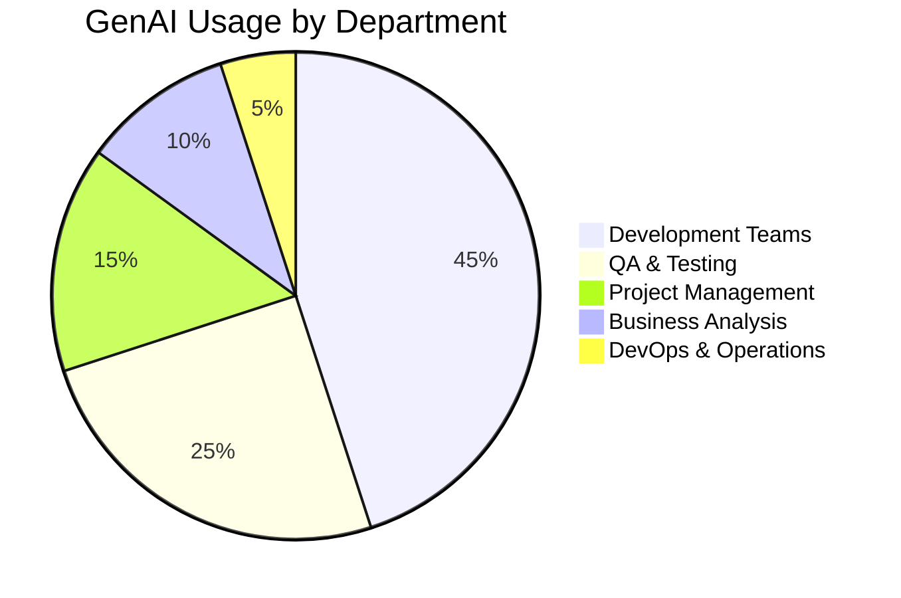
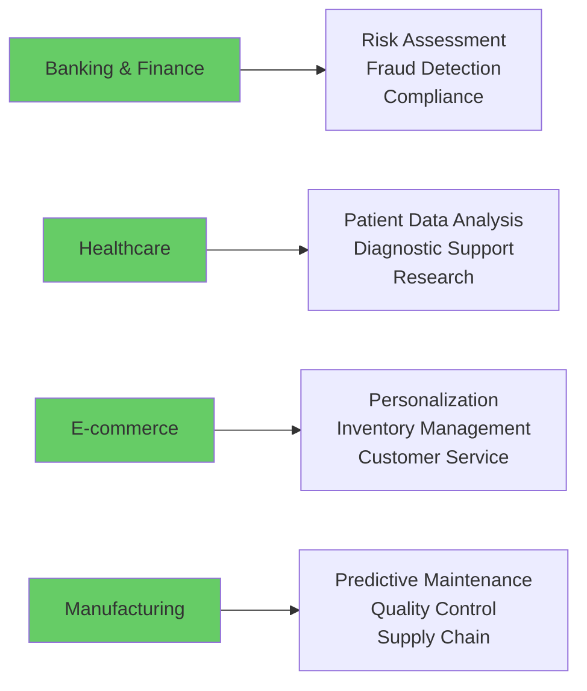
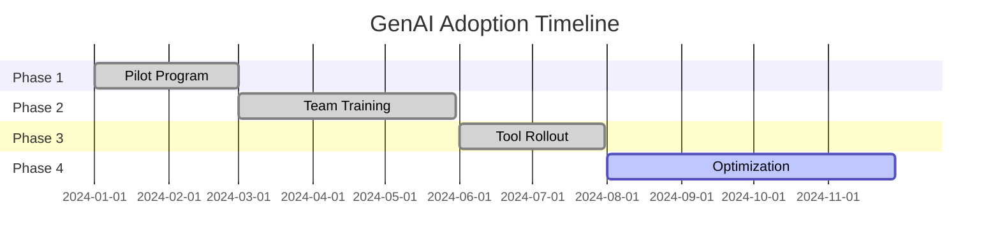

# GenAI Statistics Report

## 📊 Executive Summary

This report provides comprehensive insights into GenAI adoption, implementation, and impact across AccionLabs organization. The data is collected from 109 active projects and 30 client accounts.

**Report Period**: Q4 2024  
**Last Updated**: {{ git_revision_date_localized }}  
**Data Source**: Project delivery teams, development metrics, and client feedback

## 🎯 Key Performance Indicators

### Overall GenAI Adoption

30%

GenAI Solutions

Active GenAI implementations

45

Projects Using GenAI

Out of 109 total projects

78%

Team Adoption Rate

Teams actively using GenAI tools

4.2/5.0

Satisfaction Score

Average team satisfaction with GenAI

## 🚀 Implementation Statistics

### GenAI Tools & Platforms

Microsoft Copilot

85% Adoption

GitHub Copilot

72% Adoption

ChatGPT/OpenAI

68% Adoption

Claude (Anthropic)

45% Adoption

Custom AI Solutions

35% Adoption

### Usage by Department

## 📈 Productivity Impact

### Development Efficiency

35%

Code Generation

Increase in development speed

28%

Bug Reduction

Fewer defects in code reviews

42%

Documentation

Faster documentation creation

31%

Testing Automation

Improved test coverage

### Time Savings by Activity

Code Review

40% Time Saved

Documentation

55% Time Saved

Testing

35% Time Saved

Project Planning

25% Time Saved

Troubleshooting

45% Time Saved

## 🎯 Use Cases & Applications

### Primary Use Cases

Code Generation & Review

90% of Teams

Documentation & Comments

75% of Teams

Test Case Generation

65% of Teams

Bug Analysis & Fixes

70% of Teams

Requirements Analysis

55% of Teams

### Industry-Specific Applications

## 💰 Cost-Benefit Analysis

### Investment & ROI

$2.1M

Total Investment

GenAI tools and training

$8.5M

Cost Savings

Productivity gains

305%

ROI

Return on investment

18 months

Payback Period

Time to recover investment

### Monthly Cost Breakdown

Tool Licenses

$45K/month

Training & Development

$18K/month

Infrastructure

$12K/month

## 📊 Quality Metrics

### Code Quality Impact

Code Review Time

40% Reduction

Bug Detection Rate

65% Improvement

Test Coverage

35% Increase

Documentation Quality

50% Improvement

## 🎓 Training & Adoption

### Training Statistics

450

Team Members Trained

GenAI fundamentals

85%

Training Completion

Course completion rate

4.6/5.0

Training Satisfaction

Average rating

12

Certified Experts

Advanced GenAI skills

### Adoption Timeline

## 🚨 Challenges & Mitigation

### Current Challenges

Data Privacy Concerns

70% Addressed

Tool Integration

85% Resolved

Skill Gap

60% Addressed

Cost Management

80% Optimized

## 🎯 Future Roadmap

### Q1 2025 Goals

🔄

Advanced AI Integration

30% Complete

🔄

Custom AI Models

45% Complete

⏳

AI Governance Framework

15% Complete

### Long-term Vision (2025-2026)

- **AI-First Development**: 100% of projects using GenAI tools
- **Custom AI Solutions**: 50% of clients with custom AI implementations
- **AI Governance**: Comprehensive framework for AI ethics and compliance
- **Advanced Analytics**: Predictive analytics and AI-driven insights
- **Market Leadership**: Position as GenAI implementation experts

## 📋 Recommendations

### Immediate Actions (Next 30 Days)

1. **Expand Training Programs**: Increase advanced GenAI training sessions
2. **Tool Standardization**: Establish preferred GenAI tool stack
3. **Best Practice Sharing**: Create internal GenAI knowledge base
4. **Client Education**: Develop GenAI value proposition for clients

### Strategic Initiatives (Next 6 Months)

1. **AI Center of Excellence**: Establish dedicated AI team
2. **Custom AI Solutions**: Develop proprietary AI capabilities
3. **Partnership Expansion**: Forge strategic AI partnerships
4. **Market Positioning**: Establish thought leadership in GenAI

---

## 📞 Contact Information

**GenAI Team**: genai@accionlabs.com  
**Training Coordinator**: training@accionlabs.com  
**Technical Support**: ai-support@accionlabs.com

*Report generated automatically from organizational data sources*
